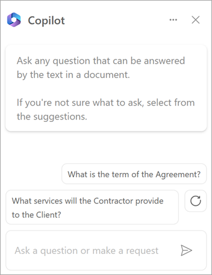

# Overview of Microsoft Syntex in Copilot (Preview)

Microsoft Syntex is now integrated with Microsoft 365 Copilot to bring the power of assistive AI into your organization's intelligent document processing.

Syntex in Copilot analyzes the text of a selected file in a SharePoint document library and generates a set of questions you can ask about the information in the file. The questions can be used to quickly identify the type of document, generate a summary of information in the document, and identify key points or other important information. You can also ask your own questions, such as "When does this contract expire?" or "What is the fee schedule for this project?"

## To use Syntex in Copilot

1. From a SharePoint document library, select a document.

2. On the ribbon, select **Copilot**.

    

3. On the **Copilot** panel, you can:

    - Enter a question in the text box.

       

    - Or in the text box, select the starter prompt to see suggested actions tailored to the specific file, such as to classify the file, summarize the file, extract key information, or detect sensitive information.

       

> [!NOTE] 
> For security reasons, Syntex in Copilot won't process files stamped with "Confidential" or "Highly Confidential" sensitivity labels.

## Current limitations

- Syntex in Copilot currently works on only Word (.docx) and PowerPoint (.pptx) file types.

- Syntex in Copilot is currently only available to customers in the United States, and currently only understands instructions in English. More languages and locales will be added in the future.

- Syntex in Copilot works on a single selected file at a time, and it only processes the first 4,000 tokens (approximately six pages).

- Syntex in Copilot doesn't save the context of your session, but you can copy the information if you want to save it. 

> [!IMPORTANT] 
> It's important that you review any content the AI generates for you to make sure it has accurately produced what you wanted.

