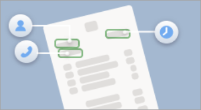

# Overview of Microsoft Syntex

 

> [!VIDEO https://www.microsoft.com/videoplayer/embed/RW15yuU] 

 

Microsoft Syntex is a content understanding, processing, and compliance service that uses intelligent document processing, content artificial intelligence (AI), and advanced machine learning to automatically and thoughtfully find, organize, and classify documents in your SharePoint libraries, Microsoft Teams, OneDrive for Business, and Exchange.

With Syntex, you can automate your content-based processes—capturing the information in your business documents and transforming that information into working knowledge for your organization. Rather than clicking and sorting through hundreds or thousands of files, Syntex extracts, analyzes, and categorizes the data for you.

You can dive deeper into your content to truly understand it, and you can turn the information into meaningful insights that your organization can use to make informed business decisions.

## Explore scenarios and use cases

:::row:::
   :::column span="":::
       
   :::column-end:::
   :::column span="3":::
      Syntex can help your organization automate business processes, improve search accuracy, and manage compliance risk.

      With content AI services and capabilities, you can build content understanding and classification directly into the content management flow.
   :::column-end:::
:::row-end:::

[Learn more about scenarios and use case for Microsoft Syntex.](adoption-scenarios.md)

## Syntex services

### Content assembly

:::row:::
   :::column span="3":::
      With Syntex, you can automatically generate standard repetitive business documents, such as contracts, statements of work, service agreements, letters of consent, and correspondence. You can do all these tasks quicker, more consistently, and with fewer errors in Syntex.
   :::column-end:::
   :::column span="":::
      
   :::column-end:::
:::row-end:::

You create *modern templates* based on the business documents you use most. You then use those templates to automatically generate new documents using SharePoint lists or user entries as a data source.

[Learn more about how to generate documents using content assembly.](content-assembly.md)

### Prebuilt document processing

:::row:::
   :::column span="":::
       
   :::column-end:::
   :::column span="3":::
      Use a [prebuilt model](prebuilt-overview.md) to save time processing and extracting information from [contracts](prebuilt-model-contract.md), [invoices](prebuilt-model-invoice.md), or [receipts](prebuilt-model-receipt.md). Prebuilt models are pretrained to recognize common business documents and the structured information in the documents.
   :::column-end:::
:::row-end:::

Instead of having to create a new document processing model from scratch, you can use a prebuilt model to jumpstart your document project.

[Learn more about prebuilt models in Microsoft Syntex.](prebuilt-overview.md)

### Structured and freeform document processing

:::row:::
   :::column span="":::
      
   :::column-end:::
   :::column span="3":::
      Use a [structured model](form-processing-overview.md) to automatically identify field and table values. It works best for structured or semi-structured documents, such as forms and invoices. Use a [freeform model](freeform-document-processing-overview.md) to automatically extract information from unstructured and freeform documents, such as letters and contracts where the information can appear anywhere in the document.
   :::column-end:::
:::row-end:::

Both structured and freeform models use Microsoft Power Apps AI Builder to create and train models within Syntex.

[Learn more about structured and freeform models in Microsoft Syntex.](form-processing-overview.md)

### Unstructured document processing

:::row:::
   :::column span="":::
       
   :::column-end:::
   :::column span="3":::
      Use an [unstructured model](document-understanding-overview.md) to automatically classify documents and extract information from them. It works best for documents that vary in composition, such as letters or contracts. This model type supports the widest range of file types.
   :::column-end:::
:::row-end:::

[Learn more about unstructured models in Microsoft Syntex.](document-understanding-overview.md)

### Image tagging

:::row:::
   :::column span="3":::
      Use image tagging in Syntex to find and manage images in SharePoint document libraries. Syntex automatically tags images with descriptive keywords using AI. These keywords are stored in a managed metadata column, making it easier to search, sort, filter, and manage the images.
   :::column-end:::
   :::column span="":::
       
   :::column-end:::
:::row-end:::

[Learn more about image tagging in Microsoft Syntex.](image-tagging-overview.md)

### Optical character recognition

:::row:::
   :::column span="":::
      
   :::column-end:::
   :::column span="3":::
      The optical character recognition (OCR) service in Syntex lets you extract printed or handwritten text from images. Syntex automatically scans the image files, extracts the relevant text, and makes the text from the images available for search and indexing. This lets you quickly and accurately find the keywords and phrases you're looking for.
   :::column-end:::
:::row-end:::

[Learn more about using the OCR service in Microsoft Syntex.](ocr-overview.md)

## Other features

### Annotations

:::row:::
   :::column span="3":::
      Use the annotations feature in Syntex to add notes, comment, and collaborate with others on your content in document libraries. You can use annotations without modifying the original files, so the original records are preserved.
   :::column-end:::
   :::column span="":::
      
   :::column-end:::
:::row-end:::

[Learn more about using annotations in Microsoft Syntex.](annotations.md)

### Content query

:::row:::
   :::column span="":::
      
   :::column-end:::
   :::column span="3":::
      The content query feature in Syntex lets you perform specific metadata-based queries on SharePoint document libraries.

      You can make faster, more precise queries based on specific metadata column values, rather than just searching for keywords.    
   :::column-end:::
:::row-end:::

This feature is useful when you have a specific piece of information you want to search for, such as when a document was last modified, a specific person associated with a file, or a specific file type.

[Learn more about how to search for metadata in document libraries in Microsoft Syntex.](metadata-search.md)

### Content processing

:::row:::
   :::column span="3":::
      Syntex lets you build simple rules-driven actions in document libraries based on metadata. From a document library, you can create rules to automate tasks such as sending a notification when metadata changes in a file, when a new file is created in the library, or when files are moved or copied based on metadata extracted by Syntex models. 
   :::column-end:::
   :::column span="":::
      
   :::column-end:::
:::row-end:::

[Learn more about content processing rules in Microsoft Syntex.](content-processing-overview.md)

### Content compliance

:::row:::
   :::column span="":::
      
   :::column-end:::
   :::column span="3":::
      Understanding your content allows for better compliance control and increases management and governance options for all your data. When content is properly tagged and labeled, you have better control over your data and can follow regulations more easily. Syntex helps you ensure compliance by using retention labels and sensitivity labels to manage your documents.
   :::column-end:::
:::row-end:::

Learn more about how to apply [retention labels](apply-a-retention-label-to-a-model.md) and [sensitivity labels](apply-a-sensitivity-label-to-a-model.md) to models in Microsoft Syntex.

### Premium taxonomy services

:::row:::
   :::column span="3":::
      Having one or more Syntex licenses in your organization enables the following additional term store features for admins:  
   :::column-end:::
   :::column span="":::
      
   :::column-end:::
:::row-end:::

- [SKOS-based term set import](import-term-set-skos.md), which lets you import a term set using a SKOS-based format.

- [Pushing enterprise content types to a hub site](push-content-type-to-hub.md), which also adds them to the associated sites and any newly created lists or libraries.

- [Term store reports](term-store-analytics.md), which provides you with insights into published term sets and their use across your organization.

<!---  
> [!div class="nextstepaction"]
> [Learn more about model types in Microsoft Syntex](model-types-overview.md)
--->
