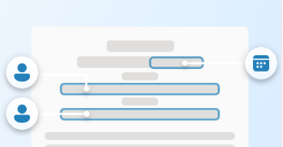
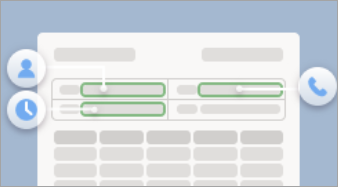

# Overview of Microsoft Syntex

 

> [!VIDEO https://www.microsoft.com/videoplayer/embed/RW15yuU] 

 

Microsoft Syntex is a content understanding, processing, and compliance service that uses intelligent document processing, content artificial intelligence (AI), and advanced machine learning to automatically and thoughtfully find, organize, and classify documents in your SharePoint libraries.

With Syntex, you can automate your content-based processes—capturing the information in your business documents and transforming that information into working knowledge for your organization. Rather than clicking and sorting through hundreds or thousands of files, Syntex extracts, analyzes, and categorizes the data for you.

You can dive deeper into your content to truly understand it, and you can turn the information into meaningful insights that your organization can use to make informed business decisions.

## Scenarios and use cases

:::row:::
   :::column span="3":::
      Syntex can help your organization automate business processes, improve search accuracy, and manage compliance risk.

      With content AI services and capabilities, you can build content understanding and classification directly into the content management flow.
   :::column-end:::
   :::column span="":::
       
   :::column-end:::
:::row-end:::

[Learn more about how to use Syntex to streamline processes in your organization.](adoption-scenarios.md)

## Models

:::row:::
   :::column span="":::
       
   :::column-end:::
   :::column span="3":::
      Understanding your content with Syntex begins with models. Models let you identify and classify documents that are uploaded to your SharePoint document libraries, and then to extract the information you need from each file.

      In Syntex, you can build [custom models](model-types-overview.md) or you can use [prebuilt models](prebuilt-overview.md). 
   :::column-end:::
:::row-end:::

The type of model you choose will depend on the types of files you use, the format and structure of the files, the information you want to extract, and where you want to apply the model.

### Custom models

You build custom models to understand the layout of your files from example documents. The models learn to look for the data you need to extract from similar documents. Custom models include:

- [Unstructured document processing](document-understanding-overview.md)
- [Freeform document processing](freeform-document-processing-overview.md)
- [Structured document processing](form-processing-overview.md)

| Unstructured document processing  | Freeform document processing  | Structured document processing  |
| ------------- | ------------- | ------------- |
|   |  |   |
| Use this custom model to automatically classify documents and extract information from them. Use the patterns of the text in example documents to train the model. Best for Office files and automatic classification of files.  [Learn more about unstructured models.](document-understanding-overview.md) | Use this custom model to automatically extract information from unstructured documents. Use the patterns of the text or the layout in example documents to train the model. Best for a mix of both text and layout needs.  [Learn more about freeform models.](freeform-document-processing-overview.md) |  Use this custom model to automatically identify field and table values from structured or semi-structured documents like forms. Best for most languages and files that include form layouts or tables.  [Learn more about structured models.](form-processing-overview.md) |

### Prebuilt models

If you don't need to build a custom model, you can use a [prebuilt model](prebuilt-overview.md). This type of model is pretrained to extract predefined entities from common business files. Prebuilt models include:

- [Contract processing](prebuilt-model-contract.md)
- [Invoice processing](prebuilt-model-invoice.md)
- [Receipt processing](prebuilt-model-receipt.md)

| Contract processing | Invoice processing | Receipt processing | 
| ------------- | ------------- | ------------- |
| |  |  |
| Use this prebuilt model to save time processing contracts. Automatically extract key information specific to contract documents.  [Learn more about contract models.](prebuilt-model-contract.md) | Use this prebuilt model to save time processing invoices. Automatically extract key information specific to invoices.  [Learn more about invoice models.](prebuilt-model-invoice.md) | Use this prebuilt model to save time processing receipts. Automatically extract key information specific to expenses.  [Learn more about receipt models.](prebuilt-model-receipt.md) | 

[Learn more about custom and prebuilt models in Microsoft Syntex.](model-types-overview.md)

## Content assembly

:::row:::
   :::column span="":::
       
   :::column-end:::
   :::column span="3":::
      With Syntex, you can create *modern templates* based on the business documents you use most.

      You can then use those templates to automatically generate new documents using SharePoint lists or user entries as a data source.
   :::column-end:::
:::row-end:::

 This process lets you automatically generate standard repetitive business documents, such as contracts, statements of work, service agreements, letters of consent, and correspondence. You can do all these tasks quicker, more consistently, and with fewer errors in Syntex.

[Learn more about how to generate documents using content assembly.](content-assembly.md)

## Content query

:::row:::
   :::column span="3":::
      The content query feature in Syntex lets you perform specific metadata-based queries on SharePoint document libraries.

      You can make faster, more precise queries based on specific metadata column values, rather than just searching for keywords.    
   :::column-end:::
   :::column span="":::
      
   :::column-end:::
:::row-end:::

This feature is useful when you have a specific piece of information you want to search for, such as when a document was last modified, a specific person associated with a file, or a specific file type.

[Learn more about how to search for metadata in document libraries in Microsoft Syntex.](metadata-search.md)

## Annotations

:::row:::
   :::column span="":::
       
   :::column-end:::
   :::column span="3":::
      Use the annotations feature in Syntex to add notes, comment, and collaborate with others on your content in document libraries. You can use annotations without modifying the original files, so the original records are preserved.
   :::column-end:::
:::row-end:::

[Learn more about using annotations in Microsoft Syntex.](annotations.md)

## Image tagging

:::row:::
   :::column span="3":::
      Use image tagging in Syntex to find and manage images in SharePoint document libraries. Syntex automatically tags images with descriptive keywords using AI. These keywords are stored in a managed metadata column, making it easier to search, sort, filter, and manage the images.
   :::column-end:::
   :::column span="":::
       
   :::column-end:::
:::row-end:::

[Learn more about image tagging in Microsoft Syntex.](image-tagging.md)

## Optical character recognition

:::row:::
   :::column span="":::
       
   :::column-end:::
   :::column span="3":::
      The optical character recognition (OCR) service in Syntex lets you extract printed or handwritten text from images. Syntex automatically scans the image files, extracts the relevant text, and makes the text from the images available for search and indexing. This lets you quickly and accurately find the keywords and phrases you're looking for.
   :::column-end:::
:::row-end:::

[Learn more about using the OCR service in Microsoft Syntex.](ocr.md)

## Content compliance

:::row:::
   :::column span="3":::
      Understanding your content allows for better compliance control and increases management and governance options for all your data. When content is properly tagged and labeled, you have better control over your data and can follow regulations more easily. Syntex helps you ensure compliance by using retention labels and sensitivity labels to manage your documents.
   :::column-end:::
   :::column span="":::
       
   :::column-end:::
:::row-end:::

Learn more about how to apply [retention labels](apply-a-retention-label-to-a-model.md) and [sensitivity labels](apply-a-sensitivity-label-to-a-model.md) to models in Microsoft Syntex.

## Content processing

:::row:::
   :::column span="":::
       
   :::column-end:::
   :::column span="3":::
      Syntex lets you build simple rules-driven actions in document libraries based on metadata. From a document library, you can create rules to automate tasks such as sending a notification when metadata changes in a file, when a new file is created in the library, or when files are moved or copied based on metadata extracted by Syntex models.
   :::column-end:::
:::row-end:::

[Learn more about content processing rules in Microsoft Syntex.](content-processing-overview.md)

## Premium taxonomy services

:::row:::
   :::column span="":::
      
   :::column-end:::
   :::column span="3":::
      Having one or more Syntex licenses in your organization enables the following additional term store features for admins:  
             
   :::column-end:::
:::row-end:::

- [SKOS-based term set import](import-term-set-skos.md), which lets you import a term set using a SKOS-based format.

- [Pushing enterprise content types to a hub site](push-content-type-to-hub.md), which also adds them to the associated sites and any newly created lists or libraries.

- [Term store reports](term-store-analytics.md), which provides you insights into published term sets and their use across your organization.

<!---  
> [!div class="nextstepaction"]
> [Learn more about model types in Microsoft Syntex](model-types-overview.md)
--->
