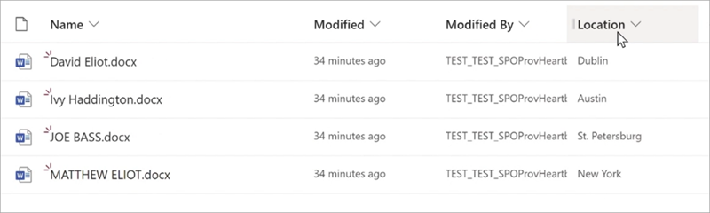

# Find and manage terms using taxonomy tagging in Microsoft Syntex

Before you can use taxonomy tagging, you need to enable it in a document library. There are two methods you can use to do this:

- [Use an existing taxonomy column](#use-an-existing-taxonomy-column)
- [Create a new taxonomy column](#create-a-new-taxonomy-column)

## Use an existing taxonomy column

If a taxonomy column already exists in your library, use these steps to enable taxonomy tagging:

1. On the **Taxonomy** column, select **Column settings** > **Edit**.

2. On the **Edit column** panel, in the **Automatically tag documents with terms** section, toggle the switch to **Yes**.

     
 
3. Once enabled, any new documents uploaded to the library or existing documents edited in the library are processed to tag the configured term set.

## Create a new taxonomy column

If you don't have a taxonomy column in your library, use these steps to create one:

1. From a document library, select **Column settings** > **Add a column**.

2. Select **Managed metadata**, and then select **Next**.

3. On the **Create a column** panel, name the column and select a term set or term, and then select **Save**.

     

4. Once the taxonomy column is created, any new documents uploaded or existing documents edited in the library are processed to tag the configured term set or term.
