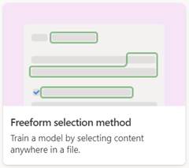

# Train your custom model in Microsoft Syntex

**Applies to:**  &ensp; &#10003; All custom models &ensp; 

The steps to train your model depends on the type of model you are using. 

|Model type  |Use the steps in this article to train  |
|---------|---------|---------|
|**Unstructured document processing**  |[Train your unstructured document processing model](create-a-classifier.md)   |
|**Freeform document processing**  |[Train your freeform document processing model](train-freeform-document-processing-model.md)       |
|**Structured document processing**   |[Train your structured document processing model](create-a-form-processing-model.md)     |

[:::image type="content" source="../media/content-understanding/layout-method-tile-2.png" alt-text="Tile for layout method.":::](create-a-form-processing-model.md)

|Model type  |Use these steps to train  |
|---------|---------|---------|
|**Unstructured document processing** [:::image type="content" source="../media/content-understanding/teaching-method-tile-2.png" alt-text="Tile for teaching method.":::](create-a-classifier.md) |[Train your unstructured document processing model](create-a-classifier.md)   |
|**Freeform document processing**        |
|**Structured document processing**[:::image type="content" source="../media/content-understanding/layout-method-tile-2.png" alt-text="Tile for layout method.":::](create-a-form-processing-model.md)   |[Train your structured document processing model](create-a-form-processing-model.md)     |

## See also

[Overview of model types in Microsoft Syntex](model-types-overview.md)
