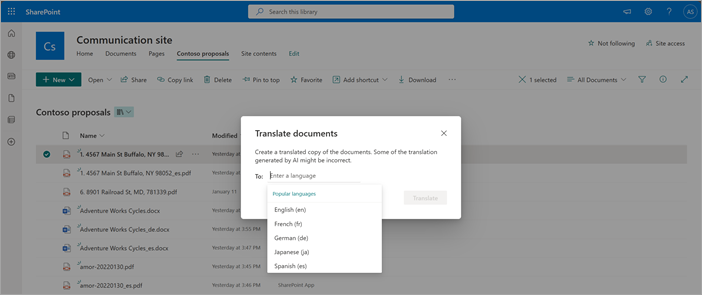

# Overview of document translation in Microsoft Syntex

Microsoft Syntex lets you easily create a translated copy of a selected file or a set of files in a SharePoint document library. You can translate a file, while preserving the original format and structure of the file. Translation is available for all supported languages and dialects.

This feature lets you translate files of different types either manually or automatically by creating a rule. You can use custom glossaries and models to improve the quality and consistency of your translations.

You can also use the translation feature for translating video transcripts and closed captioning files. For more information, see [Transcript translations in Stream for SharePoint](https://prod.support.services.microsoft.com/office/microsoft-syntex-pay-as-you-go-transcript-translations-in-stream-for-sharepoint-2e34ad1b-e213-47ed-a806-5cc0d88751de).

## Requirements and limitations

### Supported file types

Document translation is available for the following file types: .csv, .docx, .htm, .html, .markdown, .md, .msg, .pdf, .pptx, .txt, and .xlsx. For legacy file types .doc, .rtf, .xls, .ods, .ppt, and .odp, the translated copy is created in the modern equivalent (.docx, .xlsx, or .pptx).

### Supported file size

The maximum file size for documents to be translated is limited to 40 MB.

### Supported languages

Translation in Syntex is available for [all supported languages and dialects](/azure/ai-services/translator/language-support?source=recommendations#translation).

### Current release notes

- Text on an image within a document isn't translated.

- Password-protected files aren't translated.

- On-demand translation on folders will be available in a future release.

### Frequently asked questions

For answers to frequently asked questions about document translation, see [Document Translation: FAQ](/azure/ai-services/translator/document-translation/faq#document-translation-faq).