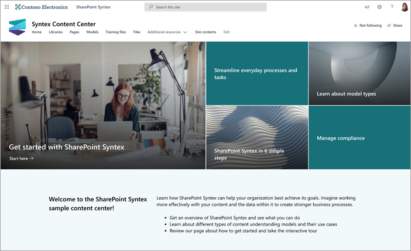
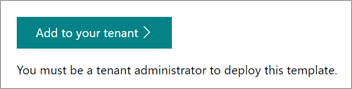
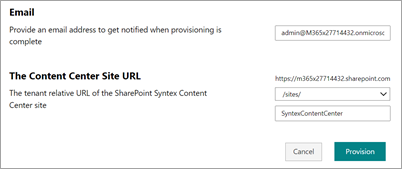

# Use the content center site template for Microsoft Syntex

> [!NOTE]
>  The content center site template is provided in the SharePoint look book service, which is no longer being updated. Some of the information in this template might not reflect the current Syntex features.

The Microsoft Syntex content center site is a ready-to-deploy instructional SharePoint site template designed to help you better understand Syntex capabilities.

You'll be introduced to the tools and information you’ll need to create and train your own models. You'll then be able to use this site as a central content repository or as the control center for managing your own Syntex models.

In this site, models can be trained and evaluated using your own content. However, to apply the models to libraries, a license for Syntex is required.  

## Provision the site

The content center site can be provisioned from the [SharePoint look book service](https://lookbook.microsoft.com/).

> [!NOTE]
> You must be a global administrator or SharePoint administrator in Microsoft 365 to provision the site.

1. From the main page of the [SharePoint look book](https://lookbook.microsoft.com/), on the **View the designs** menu, select **Syntex** > **Syntex content center**.

2. On the **Content center** page, select **Add to your tenant**.

    

3. Enter your email address (for a notification of when your site is ready to use), the site URL you want to use, and the title you want to use for your site. 

    

4. Select **Provision**, and in a short time your site will be ready for you to use. You’ll get an email (sent to the email address you provided) indicating that your request to provision the content center site template is completed.

5. Select **Open site**, and you’ll see your content center site. From here, you can explore the site and learn more about Syntex. 

For more information about provisioning from the SharePoint look book service, see [Provision a new learning pathways solution](/office365/customlearning/custom_provision).

## Explore the site

The content center site includes prepopulated pages that walk you through the steps to begin using Syntex in your organization. 

### Get started with Syntex

Get an introduction to Syntex and learn how you can use it for your organization. Watch a video that gives you an overview of Syntex, and find training to help you get started.

### Learn about model types

Learn about three types of models, and see how you can use them to resolve business issues for search, business processes, compliance, and more.

### Take an interactive tour to create a model

See how to build a model in the models library, and then enable a pretrained sample model.

### Syntex in six simple steps

Begin with a content center, and then learn step-by-step how to create models to identify, classify, and extract the information you need.

### Streamline everyday processes and tasks

Learn how to use Syntex to take what is manual and turn it into something automated and streamlined for your organization.

### Manage compliance

Implement steps to reduce risks and ensure the data and information your organization captures is used in a secure and thoughtful way.

### View model activity

See how content is used to illustrate model activity and to provide more information about how your models are being used.

### Find additional resources

Discover additional resources and scenarios to help you learn more about Syntex.

## See also

[Accelerate your solution using site templates for Syntex](site-templates.md)