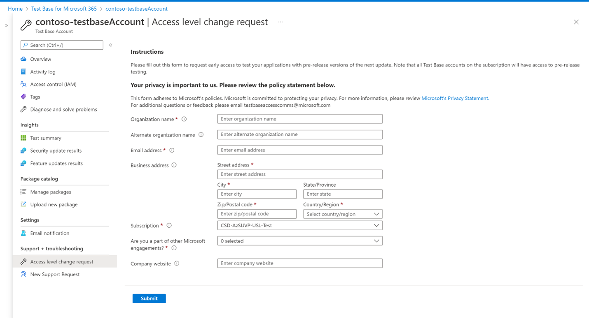

# Request to change access level 

We're now making access to pre-release Windows update content more available. Once your request for access to pre-release updates is approved, your uploaded packages will automatically get scheduled to be tested against the pre-release Windows updates for the OS versions selected during onboarding. 

To request access, select the "Access level change request" option in the left navigation bar and fill out all the details for your organization and submit the request. You'll be notified on the registered email address once your request is approved. Once approved, when a new pre-release build is available, your packages will automatically get tested against the new update for the versions selected. 

> [!div class="mx-imgBorder"]
> 
