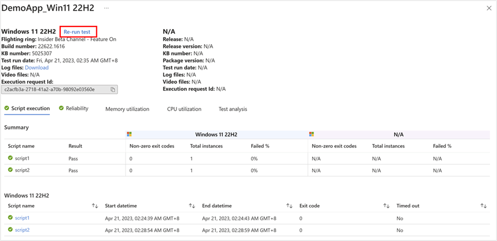

# Test against Windows new features

If you’re seeking further validation of your eco-system solution(s) against Windows new features, or hesitating whether to deploy the latest Windows feature or the next version of security solution to your organization, Test Base provides you a way to automatically test your applications against preview builds in Windows Insider program (More about [Windows Insider](https://www.microsoft.com/windowsinsider/about-windows-insider-program)).

This section shows you how to set up your own scheduled tests against preview features in Windows insider channel.

## Prepare your package

1.  **Define content:** Depending on your package type, you may select below instructions:
-   [Creating and Testing Binary Files on Test Base](testapplication.md)
-   [Test your Intune application on Test Base](testintuneapplication.md)
-   [Uploading a pre-built zip package](uploadapplication.md)
2.  **Configure test:** Both *Out-of-Box* test and *Functional* test are supported. Selecting *Out-of-Box* will leverage the officially suggested test flow and automatically generate install / uninstall / launch / close test scripts for you; *Functional* tests will allow you more flexibility to set up your own test flow. You may also select both.

3.  **Edit package:** Edit test scripts and test flow as you need.
    > [!Note] 
    > All your tests would be directly launched against the latest Windows OS with new features. No need to add any additional test script for system feature enablement. Thus, feature update testing would be more economical for you if you only want to validate potential compatibility issues against Windows new features since you won’t spend time in update/upgrade validation.

## Sign-up for scheduled tests against preview Windows builds

Scheduled tests against preview Windows builds are set in the **Test matrix** step. By selecting **Feature update**, your package would be tested against preview builds flight to your indicated insider channel.

> [!div class="mx-imgBorder"]
> 

To set up for feature updates, you must specify the target product and its preview channel from “*Insider Channel*” dropdown list.

> [!div class="mx-imgBorder"]
> 

Your selection will register your application for automatic test runs against the latest feature updates of your selected product channel and all future new updates in the latest Windows Insider Preview Builds of your selection.

> [!Note]
> - Check in [Flight Hub](/windows-insider/flight-hub/) for more details on the Windows Insider Preview builds.
> - Windows 11, version 23H2 shares the same servicing branch as Windows 11, version 22H2. New features are firstly flight to insider audience via a simple update with enablement package(eKB) (See in [Windows client roadmap update](https://techcommunity.microsoft.com/t5/windows-it-pro-blog/windows-client-roadmap-update-july-2023/ba-p/3871736)). Testing against these new features will soon be supported also in Test Base Feature Update.

You may also set your current OS in “*OS baseline for Insight*”. We would provide you with more test insights by regression analysis of your as-is OS environment and the latest target OS.

> [!div class="mx-imgBorder"]
> 

-   If the OS you’re looking for didn’t show up in our current supported product list, feel free to [Let us know your request](https://forms.office.com/r/ZeGihXBXHk), or contact us via [testbasepreview@microsoft.com](mailto:testbasepreview@microsoft.com).

## Check Feature update test results

A test run will be executed after the package passes the validation. For all new feature updates in your selected insider channel, an automated run will be scheduled.

You can view the results of the test run under the **Test summary** page by clicking the link on the package name.

> [!div class="mx-imgBorder"]
> 

You may use the release number / release version / KB number to map with the update version pushed to your organization. You will not only get the detailed script execution results with test logs but also compare regressively with previous month’s execution result to deep dive into any further performance risks. In case you might need to reproduce the failure and see in detail the execution process in video, you may click on **Re-run test**.

> [!div class="mx-imgBorder"]
> 

