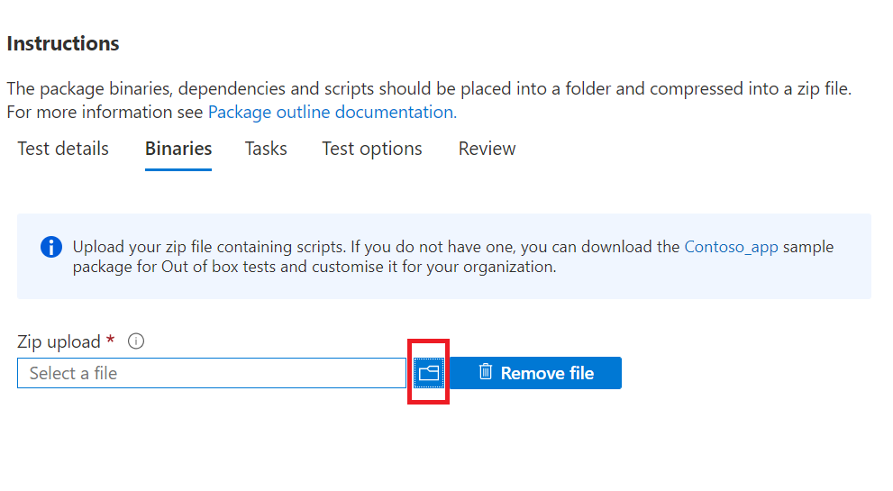

# Step 3: Upload your binaries, dependencies, and scripts

On this tab, you will upload a single zip package containing your binaries, dependencies and scripts used to run your test suite.

## Upload package zip file



  - Uploaded dependencies can include test frameworks, scripting engines or data that will be accessed to run your application or test cases. For example, you can upload Selenium and a webdriver installer to help run browser-based tests.
  - It is best practice to ensure your script activities are kept modular i.e. 
    - The ```Install``` script only performs install operations.
    - The ```Launch``` script only launches the application.
    - The ```Close``` script only closes the application.
    - The optional ```Uninstall``` script only uninstalls the application.

**Currently, the portal only supports PowerShell scripts.**


## Next steps 

Advance to the next article to go onto Step 4: **Set your Test Tasks**.
> [!div class="nextstepaction"]
> [Go back](uploadApplication.md)
> [!div class="nextstepaction"]
> [Next step](testtask.md)

