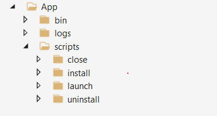

# Build a package

A package is a .zip file containing your application binary and test scripts, which is the prerequisite to use Test Base. This QuickStart will guide you to build your first package, with which you can perform Out-of-box testing on your application.

- *An **Out-of-Box (OOB)** test performs an install, launch, close, and uninstall of your application. After the install, the launch-close routine is repeated 30 times before a single uninstall is run. The OOB test provides you with standardized telemetry on your package to compare across Windows builds.*

Optionally, you can download our [sample package](https://aka.ms/testbase-sample-package) to reference and begin with.

## Create a folder structure

In your local computer, create a folder structure as follows:



These folders are used:

- **App\bin**: save the application and dependency binaries.
- **App\scripts**: save scripts to install, launch, close and uninstall your application.
- **App\logs**: scripts should output logs to this folder, then you can download and analyze logs after test is finished.

## Copy binary file(s)

Copy your application installation files to **App\bin**. If your application has dependencies, they need to be installed first. Also, copy the dependency installation files to **App\bin**.


## Add PowerShell scripts

To perform OOB test, you will need to add PowerShell scripts to install, launch, close, and uninstall your application.

> [!NOTE]
> *In OOB test, install, launch, and close scripts are required, while uninstall script is optional*.

The script should be added to the folder as follows:


A script usually includes the following behaviors:

- **Run the commands to install/launch/close/uninstall the application**. E.g., if your application is an MSI file, run [msiexec](/windows-server/administration/windows-commands/msiexec) to install it.
- **Check the result of install/launch/close/uninstall operation**, return zero exit code if the result is expected. Test Base will mark a script run as failure if it returns a non-zero exit code.
- **Save enough logs**, save proper logs for future use.

Please refer to the following examples. You can simply copy them to your files and make changes accordingly.

**Example of install script (App\scripts\install\job.ps1)**:

```powershell
        push-location $PSScriptRoot
        $exit_code = 0
        $script_name = $myinvocation.mycommand.name
        $log_dir = "$PSScriptRoot\..\..\logs"
        $log_file = "$log_dir\$script_name.log"

        if(-not (test-path -path $log_dir )) {
            new-item -itemtype directory -path $log_dir
        }

        Function log {
           Param ([string]$log_string)
           write-host $log_string
           add-content $log_file -value $log_string
        }

        log("Installing TestBaseM365 Digital Clock")
        push-location "..\..\bin"
        if ([Environment]::Is64BitProcess) {
            $installer_name = "TestBaseM365DigitalClock.msi"
        }
        else {
            $installer_name = "TestBaseM365DigitalClock.msi"
        }
        $arguments = "/i "+$installer_name+" /quiet /L*v "+"$log_dir"+"\atp-client-installation.log"

        $installer = Start-Process msiexec.exe $arguments -wait -passthru
        pop-location

        if ($installer.exitcode -eq 0) {
            log("Installation succesful as $($installer.exitcode)")
        }
        else {
            log("Error: Installation failed as $($installer.exitcode)")
            $exit_code = $installer.exitcode
        }

        log("Installation script finished as $exit_code")
        pop-location
        exit $exit_code
```

**Example of launch script (App\scripts\launch\job.ps1)**:

```powershell
        push-location $PSScriptRoot
        $exit_code = 0
        $script_name = $myinvocation.mycommand.name
        $log_dir = "$PSScriptRoot\..\..\logs"
        $log_file = "$log_dir\$script_name.log"

        if(-not (test-path -path $log_dir )) {
            new-item -itemtype directory -path $log_dir
        }

        Function log {
           Param ([string]$log_string)
           write-host $log_string
           add-content $log_file -value $log_string
        }

        log("Launch TestBaseM365 Digital Clock")

        $PROCESS_NAME = "DigitalClock"
        $exePath = "C:\Program Files\Test Base M365\DigitalClock\DigitalClock.exe"

        Start-Process -FilePath $exePath

         if (Get-Process -Name $PROCESS_NAME) {
                log("Launch successfully $PROCESS_NAME...")
                $exit_code = 0
         }
         else {
            log("Not launched $PROCESS_NAME...")
            $exit_code = 1
         }

        log("Launch script finished as $exit_code")
        pop-location
        exit $exit_code
```

## Compress to zip file

After scripts and binaries are prepared, you proceed to compress the folder to a zip file. Right click on the App folder, select **Compress to ZIP file**.


## Verify your package locally (optional)

After building the zip package, you can upload it to your Test Base account.

However, it's best practice to run the test locally to ensure the scripts work properly before uploading. A local test can quickly identify issues and speed up your uploading process. To verify locally follow the steps below:

1. Prepare a VM (Virtual Machine)

   We recommend using a virtual machine for this local test since a clean Windows environment is currently needed for each test. It's easy to create a Windows VM on Azure ([Quickstart: Windows virtual machine](/azure/virtual-machines/windows/quick-create-portal)), you can select a proper Windows version (image) for your test, e.g., *Windows 10 Pro, version 21H2.*<br>

2. Copy your package to the VM

   There are many ways to copy your package file to the VM. If you're using an Azure VM, you can choose to:

     - Copy file directly in your Remote Desktop connection.
     - Use Azure file share ([Quickstart: Create and manage Azure file](/azure/storage/files/storage-files-quick-create-use-windows))

   You can create a specific folder for this test and copy the package file under this folder. e.g., *C:\TestBase*.

3. Test the package

   Open Windows PowerShell, switch to the directory containing the package, e.g., `cd C:\TestBase`, and start to run your tests on the package:

   1. Extract the package file.

      ```powershell
      Expand-Archive -LiteralPath C:\TestBase\App.zip -DestinationPath C:\TestBase
      ```

   2. Run install script.

      ```powershell
      C:\TestBase\App\scripts\install\job.ps1
      ```

   3. Restart the VM if necessary.

   4. Run launch script.

      ```powershell
      C:\TestBase\App\scripts\launch\job.ps1
      ```

   5. Run close script.

      ```powershell
      C:\TestBase\App\scripts\close\job.ps1
      ```

   6. Run uninstall script (if you have one).

      ```powershell
      C:\TestBase\App\scripts\uninstall\job.ps1
      ```

After each step, you can check if there are any issues in your script. If all scripts run as expected, your package is ready to be uploaded to your Test Base account.

## Next steps

[Upload a package](uploadApplication.md)
