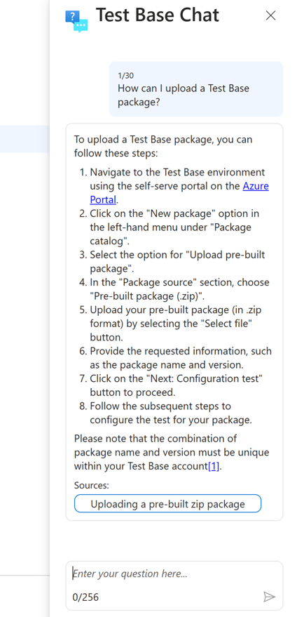

# Test Base Chat

[!INCLUDE [test-base-deprecation](./includes/test-base-deprecation.md)]

Test Base Chat, a new feature applying the power of AI, serves as your personal support guide throughout your use of Test Base. Tired of manually searching through documentation or the web to find answers to your application testing questions? Simply initiate a conversation with Test Base Chat anywhere within Test Base to pose your queries. You'll receive tailored step-by-step guidance, complete with links to relevant pages in our [Test Base for Microsoft 365 documentation](./index.yml). This feature is designed to save you time and eliminate any inconvenience.

You can open the **Test Base Chat** pane via the icon at the right-hand bottom.

> [!div class="mx-imgBorder"]
> 

## Privacy

Test Base Chat is built on Microsoft's comprehensive approach to security, compliance, and privacy. Your data (including prompts, responses, and the business data Test Base Chat uses to formulate its response) isn't used to train the foundation large language models (LLMs) that Test Base Chat uses.

## Current limitations

- The content of the chat pane isn't saved, so Test Base Chat won't be able to refer to previous interactions there.
- Test Base Chat is only supported up to 30 promoted inquiries for one Test Base user in 24 hours.
- Test Base Chat is supported in English only. More languages and locales will be added in the future.

## Keep in mind...

The features described here use an AI system that creates responses based on a prompt. As it's a new system, it may create things you didn't expect. If you find its content to be unexpected or offensive, please send us feedback so we can make it better. Because content generated via AI draws from the [Test Base for Microsoft 365 documentation](./index.yml), it may contain inaccuracies or sensitive material. Use your own judgment and double check the facts before making decisions or taking action based on the responses. 

We're constantly working to improve our technology to proactively address issues in line with our [responsible AI principles](https://www.microsoft.com/ai/our-approach?activetab=pivot1:primaryr5). 

