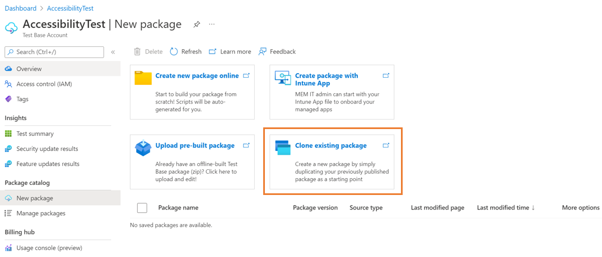
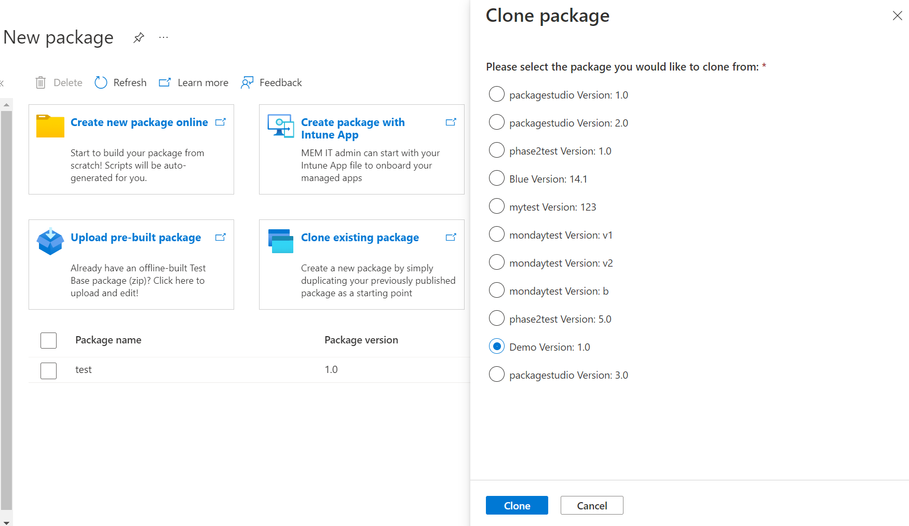
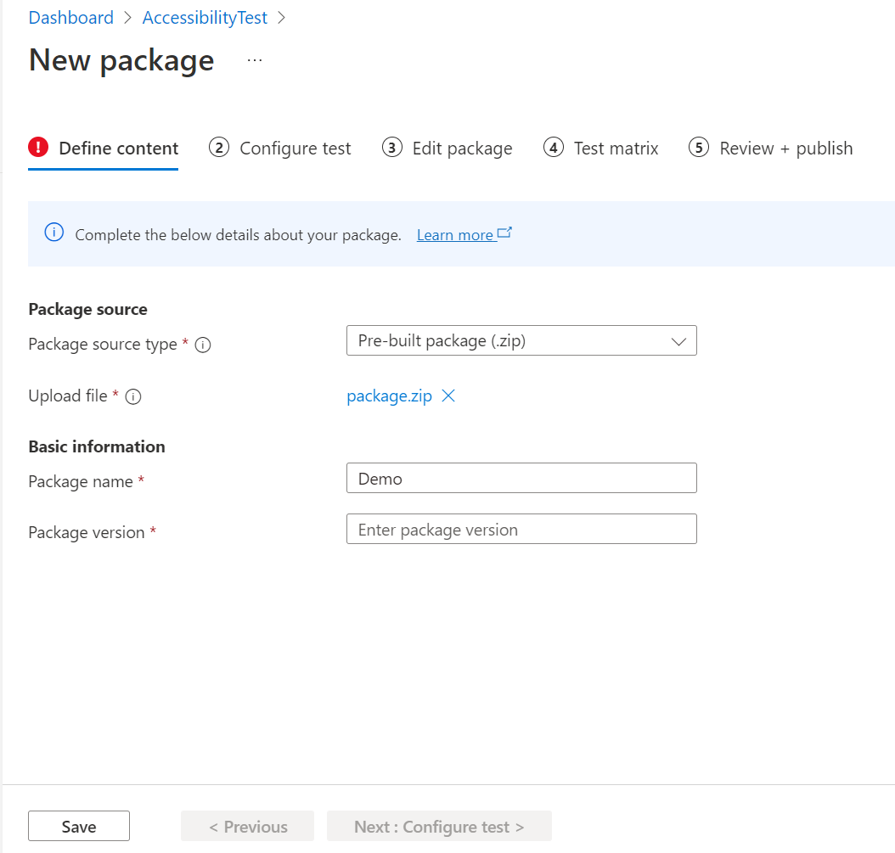
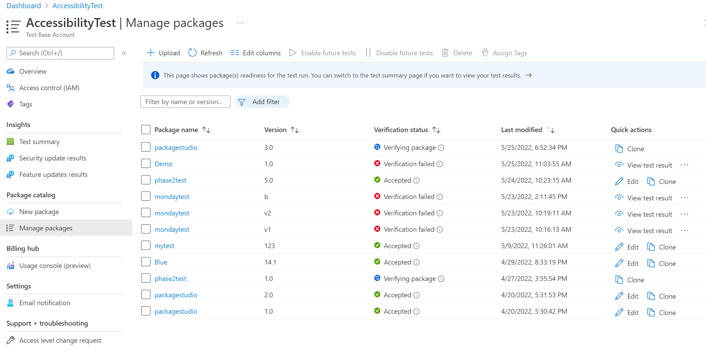
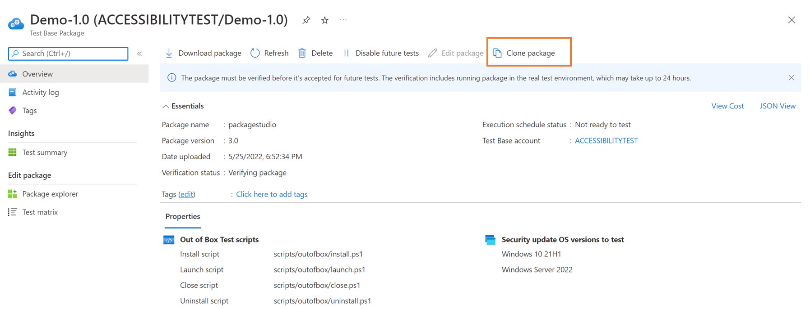

# Clone an existing package

In this section, you'll learn how to create a new package by duplicating your previously published package as a starting point. There are multiple entrances on Test Base portal for you to start the clone package journey.

> [!IMPORTANT]
> To use the clone package function, you need to have at least one successfully uploaded package on Test Base. 

## Starting from the New package page

> [!div class="mx-imgBorder"]
> 

1. On the **New package** page, you can select on the **Clone existing package**. Then select one package from the existing package list and click on **'Clone'**. 

   > [!div class="mx-imgBorder"]
   > 

2. You'll be directed to the New package creation steps with all information and configuration pre-populated as same as the package you cloned. The only information you must have to change is the **Package version** under the **Basic information** section. 

   > [!NOTE]
   > The combination of package name and version must be unique within your Test Base account. 

   > [!div class="mx-imgBorder"]
   > 

3. You're able to:

   - preview all pre-populated package setting information duplicating from the clone package. 
   - make any changes from step 1 to step 4 (See Uploading pre-built zip package for more detailed instruction). 
   - review and publish to Test Base. 

## Starting from the Manage packages page

On the **Manage packages** page, you can clone a package by selecting on the **'Clone'** icon under the Quick actions column. 

> [!div class="mx-imgBorder"]
> 

Or you can go to the **Package overview** page of the specific package you’ve selected from the **Manage packages** page and select on the **Clone package** icon in the top action menu.

> [!div class="mx-imgBorder"]
> 

