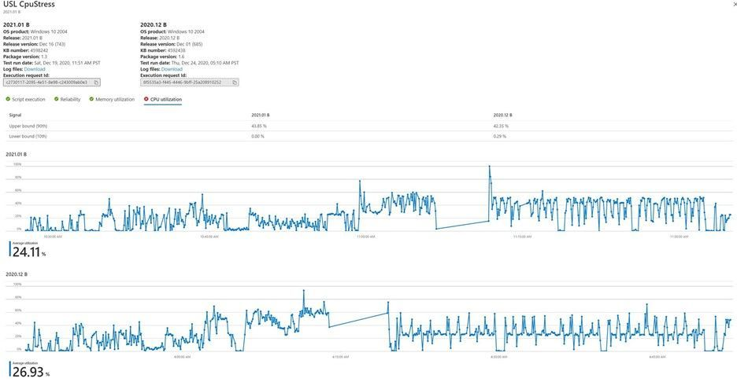

# Intelligent CPU regression analysis

[!INCLUDE [test-base-deprecation](./includes/test-base-deprecation.md)]

CPU utilization can indicate whether an application is affected by an operating system update. 

Test Base for Microsoft 365 provides software developers with an insight into CPU performance regressions which occur when their application is running on different versions of an upcoming Windows Operating System (OS) update. 

These CPU regressions enable developers to detect and resolve application issues (and potential failures) before the OS update is deployed broadly, thus preventing a bad experience for the end user.

### How CPU regression analysis works ###

As a Test Base user, you can upload your application's binaries (in a single .zip file), along with associated test scripts and select the Windows OS version against which you would like to test your application on the Test Base portal on Azure. 

The Test Base service then runs the test scripts and performs the **CPU Regression Analysis**. 

The service checks if the CPU utilization for the application on the pre-release version of the update for the target OS is in line with the CPU utilization for the released version of the OS. 

CPU utilization is not a 100% like-for-like comparison because the processes running on the two versions of the OS may or may not be an exact match due to differing OS versions; however, the analysis performed by Test Base can show you whether CPU utilization for your application is impacted by an upcoming OS update and specifically which processes have regressed from previous test runs.

In the snapshot below, there are two OS releases against which the CPU utilizations are compared for the same application. 
-   The CPU utilization tab shows the upper and lower bounds of utilization for both releases at 90th and 10th percentiles respectively. 
-   The graphs show the time series of CPU utilization along with the average utilization. 

Customers can now use the functionality to determine if their application's CPU utilization is impacted by OS updates and specifically which processes have regressed from their previous execution.

### Relevant Process Identification ###

Here, we discuss how to identify regressed processes in the application. 

Analyzing performance regression requires tracking different kinds of performance counters for every process running on a virtual machine during the test run. 

Such analysis captures a lot of variables for a lot of processes for a given application. Not all processes are associated with a run or application. To work around this challenge, a mutual information ranking algorithm using probability and information theory is applied to figure out which processes are most relevant for a given application. 

An application can be considered one type of discrete random variable while a process is considered another kind of discrete random variable. The association of the two random variables is measured using conditional probabilities for relevance. 

Processes are then displayed in the order of their relevance for each application. You can also favorite a subset of processes that can be monitored, by default, along with relevant processes for CPU regression analysis. Once a regression is detected, you can download the Windows Performance Analyzer toolkit and analyze reasons for CPU performance regressions. 

The Windows Performance Analyzer takes event trace log (ETL) as inputs and these .etl files are available in the log files downloadable for test runs on the portal. If you would like to know more about debugging CPU performance, see the Windows Performance Analyzer documentation.

