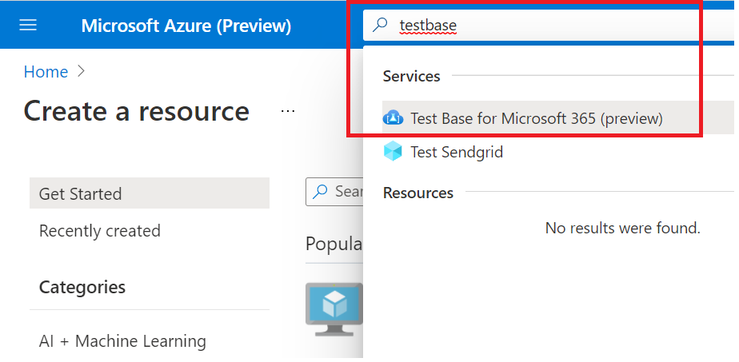
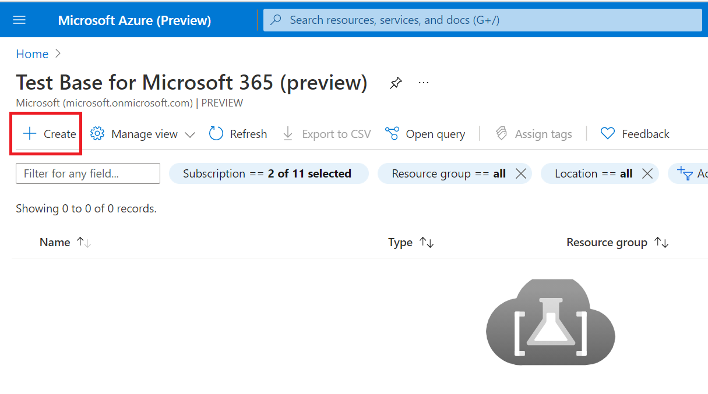
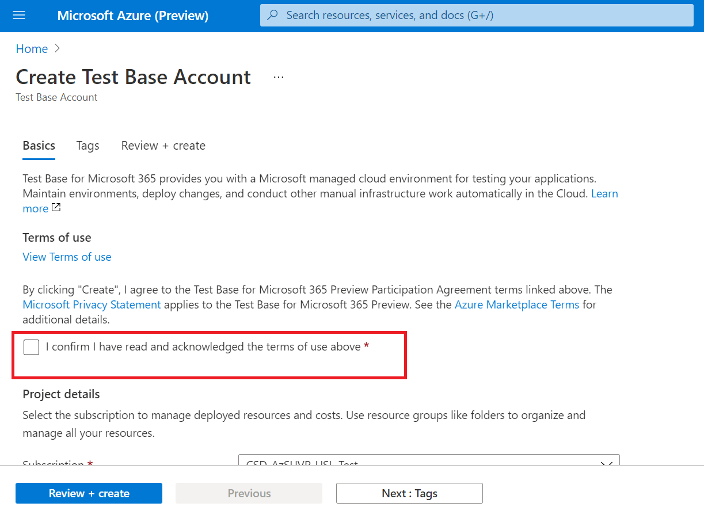
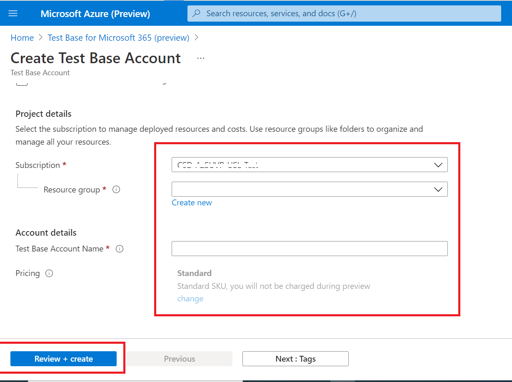

# Step 1: Create a Test Base Account

If you don't have an Azure subscription, create a [free account](https://azure.microsoft.com/en-us/free/) before you begin.
 
1. Search for **'Test Base'** in the Azure portal.



2. Click **'Add'** to create a Test Base account.



3.  Read through the ```Terms of Use``` then select the checkbox to confirm your satisfaction with the ```Terms of Use```.



4.  Fill in the correct information under the following requirements: 
    -   Subscription: Resource Group
    -   Instance Details: Name.

**Currently, Test Base only supports Standard Pricing tier.**



5.  Finally, click on ```Review + Create``` to validate and enable your newly created account.

## Next steps

Advance to the next article to get started with Step 2: **Learn how upload your package.**
> [!div class="nextstepaction"]
> [Next step](uploadApplication.md)

<!---
Add button for next page
-->
