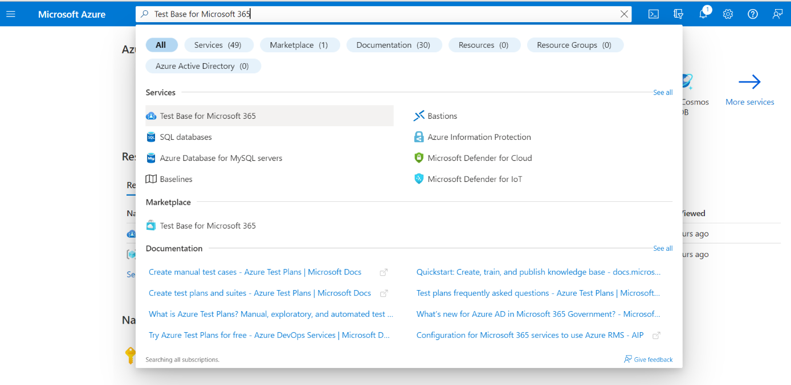
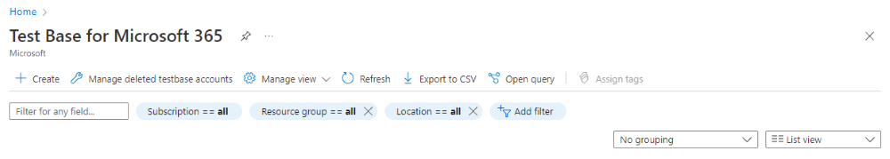
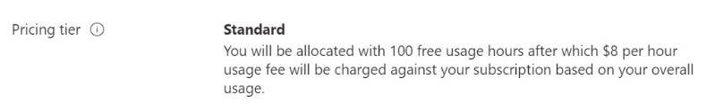
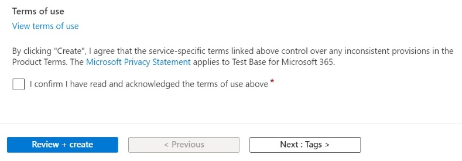
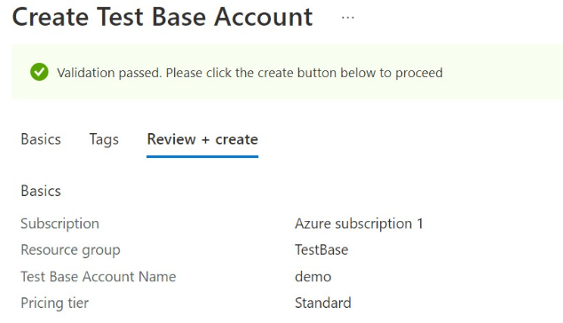
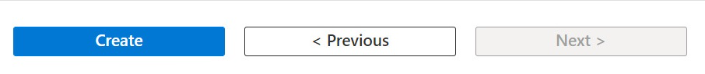
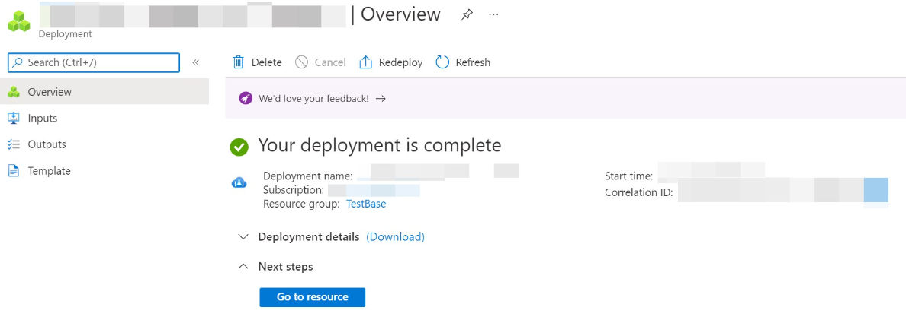

# Creating a Test Base Account

To create a **Test Base** account, perform the steps that follow. 

> [!IMPORTANT]
> You'll need a subscription to register for a **Test Base** account. If you don’t have an Azure subscription, see **Subscriptions** on the [Azure home](https://ms.portal.azure.com/#home) page to learn how to create one. 

## To create a Test Base account
 
1. On the home page of the [Azure portal](https://ms.portal.azure.com/#home), search the **Test Base for Microsoft 365** in the Azure marketplace to display the controls for creating a **Test Base** account. 

   > [!div class="mx-imgBorder"]
   > 

2. In the controls field of the **Test Base for Microsoft 365** page, select the **Create** button as that follows to open the **Create Test Base Account** page. 

   > [!div class="mx-imgBorder"]
   > 

3. On the **Create Test Base Account** page, add your information to the following required input fields on the **Create Test Base Account** page: 

   - **Subscription**—from the drop-down list, locate your Azure subscription ID and select it. 
   - **Resource group**—create a new Resource group by selecting **Create new** and specifying a chosen name in the **Name** input text box that displays. Select **OK** when done. If you already have a **Resource group**, locate its name in the drop-down list and select it. 
   - **Test Base account**—under **Account Details**, as shown in the figure that follows, specify a chosen name for your **Test Base** account by typing it in the input text field. 

   > [!NOTE]
   > You must provide input for all required fields (*). 

   > [!div class="mx-imgBorder"]
   > 

   > [!NOTE]
   > As of April 2022, **Test Base** supports the **Standard** pricing tier only. The **Pricing tier** determines the resource and hourly service cost that is charged to your Azure subscription. 

   > [!div class="mx-imgBorder"]
   > 

4. Read the **Terms of Use**. If the terms are acceptable, select the checkbox to confirm that you have read and accept the terms of use. 

   > [!div class="mx-imgBorder"]
   > 

5. In the lower sector of the **Create Test Base Account** page, select **Review + create** to validate the input data you specified. 

   If the validation process succeeds, you can review your input data configuration in the **Create Test Base Account** page. 

   > [!div class="mx-imgBorder"]
   > 

6. Select the **Create** button that is shown in the lower sector of the previous **Create Test Base Account** page. 

   > [!div class="mx-imgBorder"]
   > 

7. On your user **Deployment** page, select **Go to resource** to open your new **Test Base** account Overview page and begin your exploration, configuration, and journey of **Test Base**. 

   > [!div class="mx-imgBorder"]
   > 

