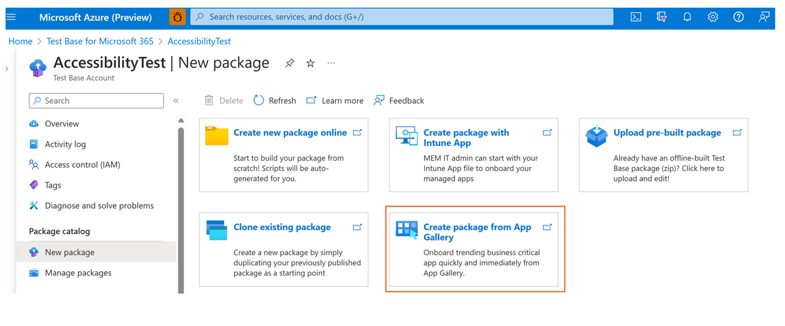
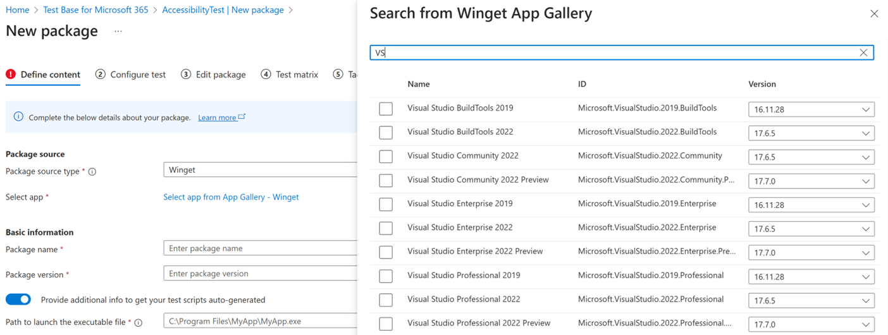
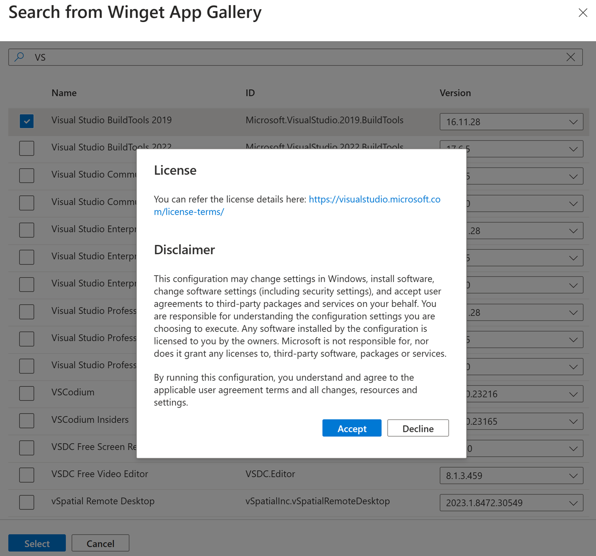
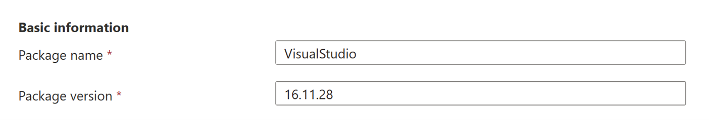
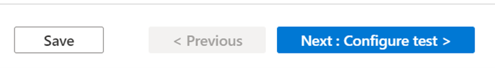
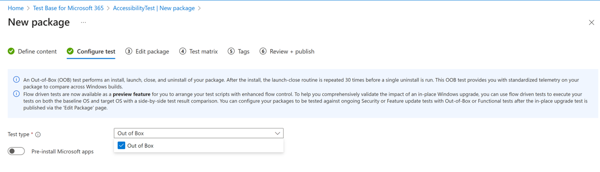

# Create Package from App Gallery #
This section provides the steps necessary to onboard a package from App Gallery onto Test Base. 
> [!IMPORTANT]
> If you do not have a Test Base account, you will need to create one before proceeding, as described in Creating a Test Base Account. 

In the [Azure portal](https://portal.azure.com/), go to the **Test
Base** account for which you will be creating and uploading your package
and perform the steps that follow.

In the left-hand menu under **Package catalog**, select the **New
package**. Then click the card '**Create package from App Gallery**'.

> [!div class="mx-imgBorder"]
> 

**Step 1. Define content**

1.  In the **Package source** section, click on 'Select app from App Gallery - Winget' then there will be a slide bar pop-up on the right hand side.

    > [!div class="mx-imgBorder"]
    > 

2.  Then you can either scroll down or search for the applications which you'd like to test. You can also select the version of specific app in the Version drop down.

3.  Once you select the app by checking the box and clicking on the select button, there's a pop-up notification displaying the app license and disclaimer.

    > [!div class="mx-imgBorder"]
    > 

4.  By clicking on the 'Accept' button, the app will be auto uploaded while the package name and package version will be auto-populated.
    You can also modify the package name and version as needed.

    > [!div class="mx-imgBorder"]
    > 

    > [!Note]
    > The combination of package name and version must be unique within your Test Base account.

5.  After all the requested information is specified, you can proceed to the next phase by clicking the **Next: Configure test** button.

    > [!div class="mx-imgBorder"]
    > 

**Step 2. Configure test**

1.  For now, only **Out of Box (OOB)** **test** is supported for the Winget package:

    > An **Out of Box (OOB)** **test** performs an install, launch, close,
    > and uninstall of your package. After the install, the launch-close
    > routine is repeated 30 times before a single uninstall is run. The OOB
    > test provides you with standardized telemetry on your package to
    > compare across Windows builds.
    >
    > [!div class="mx-imgBorder"]
    > 

2.  Once all required information is filled out, you can proceed to step 3 by
    clicking the Next button at the bottom.

For next steps, please refer to the [Creating and Testing Binary Files on Test Base \| Microsoft Learn](testapplication.md).
