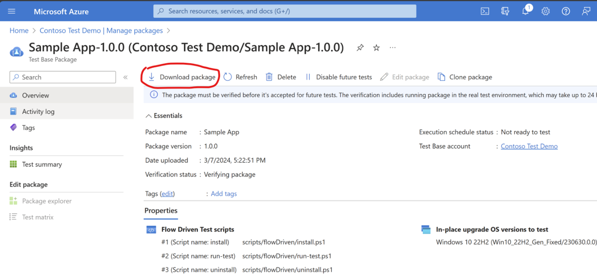
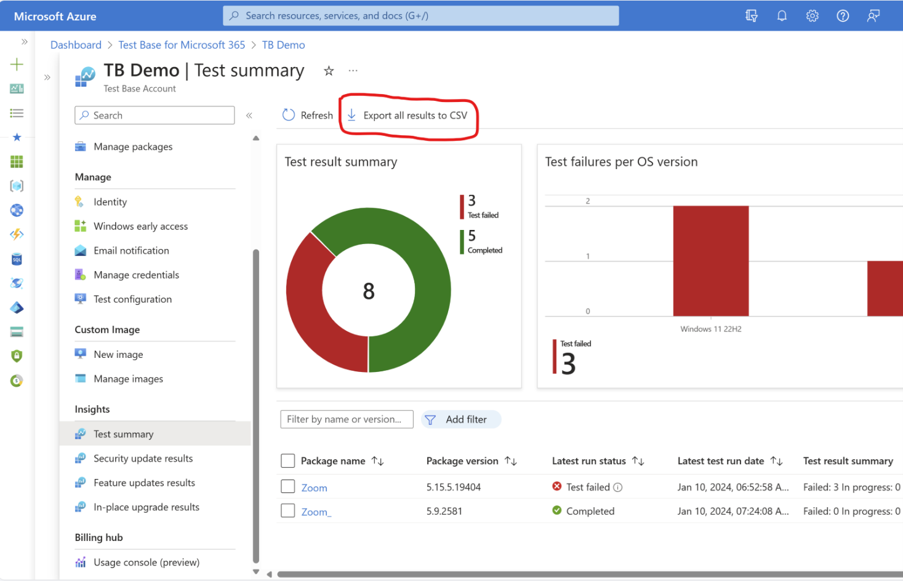
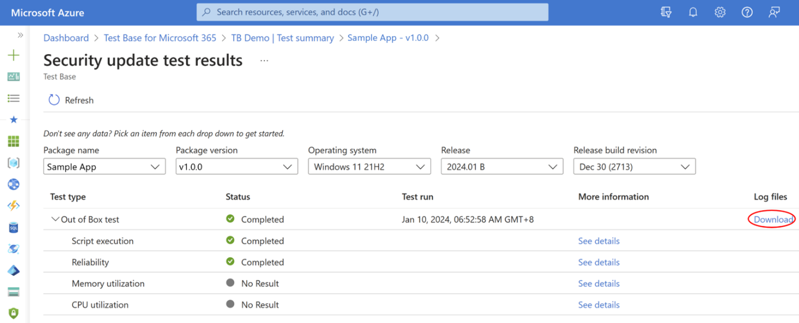
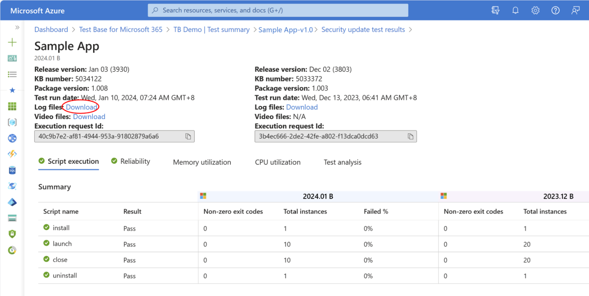

# Export your data

Should you wish to retain automation test scripts or download test results for future reference? Here is the guidance to export data from your existing account. If further guidance is needed, don't hesitate to let us know by [submit a support request](https://aka.ms/TestBaseSupport).

## Export your packages and scripts 

To download your application packages and test scripts, please access your Test Base account and select **Manage packages > Select the application you want to export > Download package.**

> [!div class="mx-imgBorder"]
> 

## Export your test results

To export a test result summary, you may go to **Test summary > Export all results to CSV**. (Note: In-place upgrade results summary export is not supported by default, please [submit a request](https://aka.ms/TestBaseSupport) if needed.) 

> [!div class="mx-imgBorder"]
> 

For more detailed test execution logs, **Select the package from Test Summary page > Select desired Windows version > Download Log files**: 

> [!div class="mx-imgBorder"]
> 

You may also click **See details** and **Download** log files and test execution videos from test detail page. (Note: Videos are reserved for seven days after test completion.) 

> [!div class="mx-imgBorder"]
> 

More details about how to analyze downloaded reports, refer to [Downloading and Analyzing Test Result Files | Microsoft Learn](download-analyze-test-result-files.md). 

## Export your usage records 

To download your billing usage records, go to **Billing hub > Usage Console > Export all results to CSV**.

> [!div class="mx-imgBorder"]
> 
