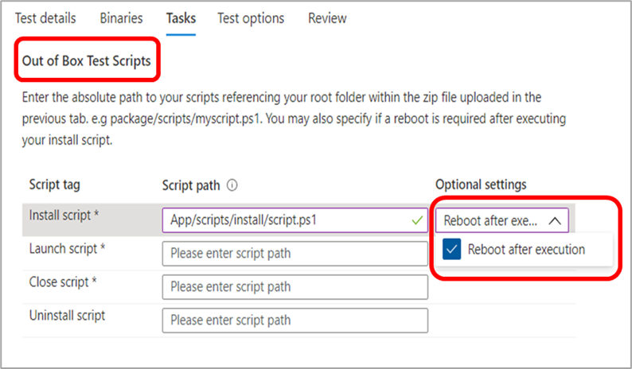
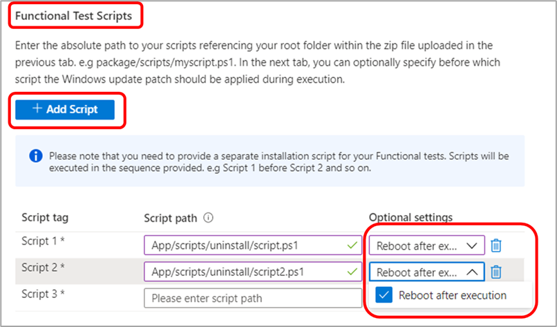

# Test Base FAQ

**Q: How do we submit our packages to the Test Base team?**

**A:** Submit your packages directly to the Test Base environment using our self-serve portal.

To submit your application package, navigate to the [Azure Portal](https://www.aka.ms/testbaseportal "Test Base Homepage") and upload a zipped folder containing your application's binaries, dependencies, and test scripts via the self-serve Test Base portal dashboard.

See the onboarding user guide for more information or contact our team at <testbasepreview@microsoft.com> for assistance and more information.

**Q: What are Out-of-box (OOB) tests?**

**A:** Out-of-box (OOB) tests are standardized, default test runs where application packages are installed, launched and closed thirty (30) times, and then uninstalled.

The packages created for Test Base will have the following test scripts: install, launch, close, and optionally the uninstall script.

The Out-of-box (OOB) tests provide you with standardized telemetry on your application to compare across Windows builds.

**Q: Can we submit tests outside of the Out-of-box tests (install, launch, close, uninstall test scripts)?**

**A:** Yes, customers can also upload application packages for **functional tests** via the self-serve portal dashboard.
**Functional tests** are tests that enable customers to execute their scripts to run custom functionality on their application.

**Q: How long does KB installation take?**

**A:** The KB installation time can vary, the KB installation happens in between the install and launch scripts for OOB tests.

## Testing

**Q: Do you support functional tests?**

**A:** Yes, Test Base supports functional tests. Functional tests are tests that enable our customers to execute their scripts to run custom functionality on their application.

To submit your application package for functional testing, upload the zipped folder containing your application's binaries, dependencies, and test scripts via our self-serve portal dashboard.

See the onboarding user guide for more information or contact our team at <testbasepreview@microsoft.com> for assistance and more information.

**Q: How does Test Base handle our test data?**

**A:** Test Base securely collects and manages your test data on the Azure environment.

**Q: Can Test Base support our automated tests?**

**A:** Yes, Test Base supports automated tests, however, we do not support manual tests at this time due to service capabilities.

**Q: What languages and frameworks of automated tests do you support?**

**A:** We support all languages and frameworks. We invoke all scripts through PowerShell.

You will also need to provide (upload) the dependent binaries of the required framework.

**Q: How soon does Test Base provide test results?**

**A:** For each test that we run against the pre-release builds, we will provide results within 48 hours on your [Azure Portal](https://www.aka.ms/testbaseportal "Test Base Homepage") dashboard.

**Q: Can you reboot after installation?**

**A:** Yes, our process supports rebooting after installation. Be sure to select this option from the "Optional settings" drop list when setting your **Tasks** on the onboarding portal.

For Out-of-box (OOB) tests, you can specify whether a reboot is needed for the _Install script._

While for functional tests, you can specify whether a reboot is required for each script that is added.

**Q: What Windows versions do you support?**

**A:** We currently support Windows 10 clients, Windows Server 2016, Windows Server 2016 Core version, Windows Server 2019, and Windows Server 2019 Core version.

**Q: What is the difference between Security Update tests and Feature Update tests?**

**A:** For Security update tests, we test against the **<ins>monthly pre-release security updates</ins>** on Windows, which is focused on keeping our users always secure and protected. For the Feature update tests, we test against the **<ins>bi-annual pre-release feature updates</ins>** which introduce new features and capabilities on Windows.

## Debugging options

**Q: Do we get access to the Virtual Machines (VMs) in case of failures? What does Test Base share?**

**A:** For the service to be compliant and the pre-release updates be secure, only Microsoft has access to the VMs. However, customers can view test results and other test metrics on their portal dashboard, including crash and hang signals, reliability metrics, memory and CPU utilization etc. We also generate and provide logs of test runs on the dashboard for download and further analysis.

We can also provide memory dumps for crash debugging as needed.

**Q: If there are issues found during the testing, what are the next steps to resolve these issues?**

**A:** The Test Base team will perform an initial triage process to determine the root cause of the error, and then depending on our findings, we will route to the customer or internal teams within Microsoft for debugging.

We always work closely with our customers in joint remediation to resolve any issues.

**Q: Does Microsoft hold the release of the security patch until the issue is resolved? What alternate resolutions are available?**

**A:** The goal of Test Base is to ensure our joint end customers do not face any issues. We will work hard with Software Vendors to address any issues before the release, but in case the fix is not feasible we have other resolutions such as shims and blocks.

## Miscellaneous

**Q: How will the service work with an on-prem server?**

**A:** We currently do not provide support for on-prem servers. However, if the server is exposing HTTP endpoint, we can connect to it over the internet.

**Q: Who hosts the VMs?**

**A:** Microsoft provisions the VM for this service, taking the load of doing so from the customer.

**Q: Does this service support web, mobile, or desktop applications?**

**A:** Currently, our focus is on desktop applications, however, we have plans to onboard web applications in the future, but we do not support mobile applications at this time.

**Q: What is the difference between Test Base and SUVP?**

**A:** The biggest difference between Test Base and SUVP is that our partners onboard their applications onto the Test Base Azure environment for validation runs against pre-release updates instead of carrying out the tests themselves.

In addition to pre-release security updates testing, we support pre-release feature updates testing on our platform. We have many other types of updates and OS testing on our roadmap.

**Q: Is there a cost associated with the service?**

**A:** Effective 1 March 2022, you'll be provided with 100 free hours (valued at $800) expiring in 6 months under your subscription for your validation needs. After the free hours get consumed (or expired before used), you'll automatically be metered at $8 per hour against your usage.

**Q: How can I provide feedback about Test Base?**

**A:** To share your feedback about Test Base, select the **Feedback** icon at the bottom left of the portal. Include a screenshot with your submission to help Microsoft better understand your feedback.

You can also submit product suggestions and upvote other ideas at <testbasepreview@microsoft.com>.
