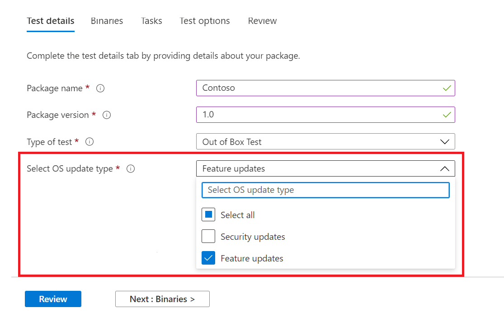
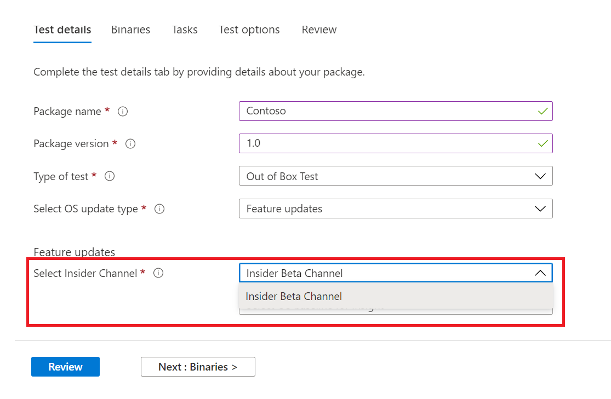
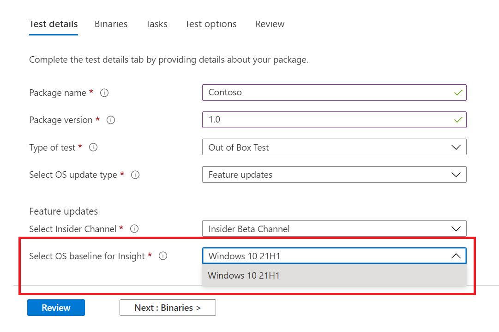
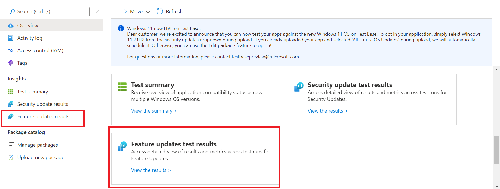

# Windows Feature update validation

Do you need insights on how your applications will perform with the next release of Windows 10 or Windows 11 - without you maintaining an environment to validate new Windows features? 

Do you want to run your validation tests against Windows Insider Program builds in our Azure environment?

**Feature update** validation on Test Base for M365 can help you achieve all these and more!

Check out the step-by-step outline below to find out how to access this new capability in Test Base for M365 service.

To get started with ```Feature update validation``` in Test Base for M365, upload your applications (and related files) through the self-service onboarding portal. 

Highlighted below are the steps to take as you fill out the **Test details**:

1. Select **Feature Update** as your OS update type:



2. Choose the Windows Insider Channel against which you want your application validated.  



3. Select an in-market release of Windows 10 or Windows 11 as the baseline for your test (and resulting insights!) and provide the other details required to onboard your package successfully.



4. To view the results from the validation of your application against pre-released Windows 10 feature updates, visit the ```Feature Updates Test Results```.




## Next steps

Advance to the next article to get started with understanding Memory regression analysis.
> [!div class="nextstepaction"]
> [Next step](memory.md)

<!---
Add button for next page
-->
