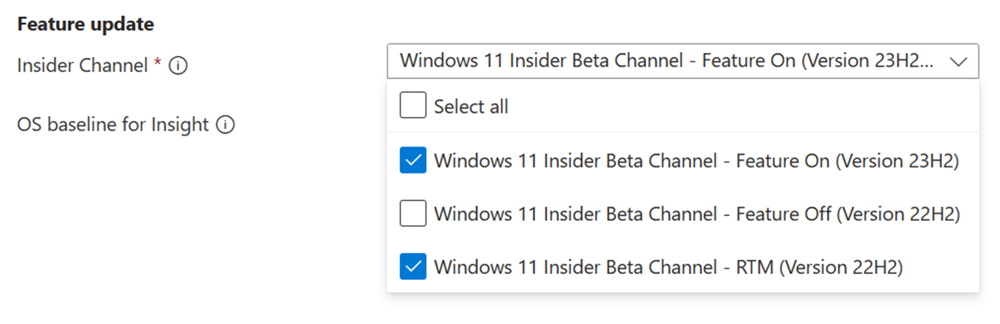

# Windows Feature update validation

Do you need insights on how your applications will perform with the latest Windows features - prior to it being available in the market and without you maintaining an environment? 

Do you want to run your validation tests against Windows Insider Program builds in our Azure environment? 

**Feature update** validation on Test Base for Microsoft 365 can help you achieve all these and more! 

Check out the step-by-step outline below to find out how to access this new capability in Test Base for Microsoft 365 service. 

To get started with Feature update validation in Test Base for Microsoft 365, upload your applications (and related files) through the self-service onboarding portal. 

Highlighted below are the steps to take as you fill out the **Test Matrix**: 

To set up for feature updates, you must specify the target product and its preview channel from "Insider Channel" dropdown list. 

Your selection will register your application for automatic test runs against the latest feature updates of your selected product channel and all future new updates in the latest Windows Insider Preview Builds of your selection. 

You may also set your current OS in "OS baseline for Insight". We would provide you with more test insights by regression analysis of your as-is OS environment and the latest target OS. 

 

To check more details on the Windows Insider Preview builds, refer to [Flight Hub - Windows Insider Program | Microsoft Docs](/../../../../MicrosoftDocs/windows-insider/tree/public/wip/flight-hub/index.md).

## Next steps

Advance to the next article to get started with understanding Memory regression analysis.
> [!div class="nextstepaction"]
> [Next step](memory.md)

<!---
Add button for next page
-->
