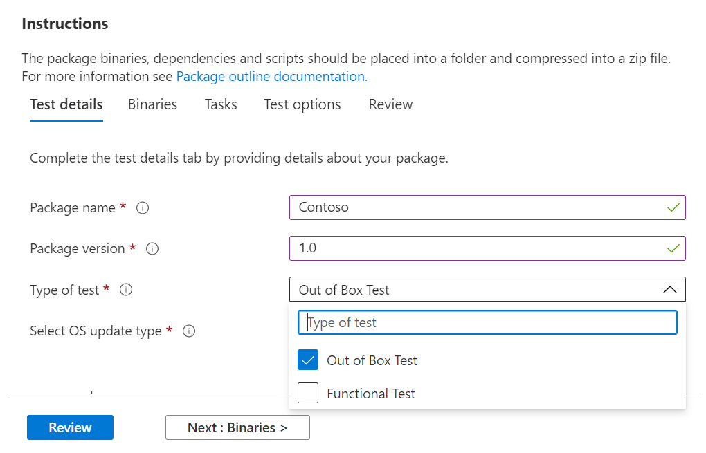
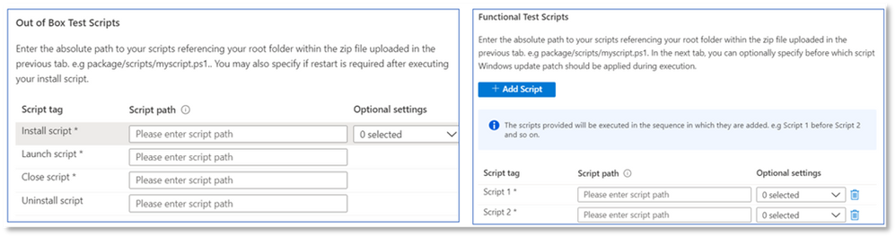
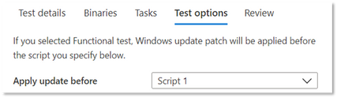

# Functional testing

As a software publisher, you can now perform custom functional tests, using the test framework of your choice - via the self-serve Test Base for Microsoft 365 portal. 

When we initially launched the service, we offered the Out-of-box tests, which is a pre-defined set of tests driven through standardized scripting. However, this couldn't achieve full test coverage for many Independent Software Vendors (ISVs). 

Hence, in response to your feedback, we're providing our ISVs with the ability to upload automated functional tests.

To use this feature, follow the steps below:

1. Upload your files (binaries, dependencies and scripts) as a single .zip package.
2. Choose if you want to reboot the test Virtual Machines (VMs) at various points of execution.
3. Manage available options for your scripts.
4. Choose when to apply the Windows update on the VM during execution.

Detailed descriptions of the above steps are highlighted below:

**Upload a functional test package**

To get started, navigate to the Upload page, select Upload new application under Application catalog on the left-side navigation menu of the Test Base for M365 portal in Azure. From there:

Tab 1 - Enter basic information. Provide the name and version of your application. In the Type of test option, select ```Functional tests```. 

*The Out-of-Box (OOB) option is required by default.*




Tab 2 - Upload the components of your package by uploading a zip file with your entire test (binaries, dependencies, scripts etc). 

See aka.ms/usl-package-outline for details. (Note: Both the Out-of-Box test scripts and the Functional test contents should be placed into the same zip file). Currently, the file size is limited to 2 GB.

Tab 3 - Configure the Out-of-Box and Functional test tasks. Here, choose the path(s) to the PowerShell scripts that will install, launch, close, and uninstall your application (for Out-of-Box) and the path(s) to all your custom scripts to perform your functional test. **(Note: A script to uninstall your application is optional).**

Currently, you can upload 1 to 8 scripts for your functional tests. (Kindly comment on this post if you need more scripts!)



(Optional) You can configure a restart after installation. Some applications require a restart after installation. 

Select ```Reboot After Execution``` for the specific Script in the Tasks tab if you would like a restart to be conducted after the execution of that script.

Tab 4 - Choose when the Windows update gets installed: The application of the Windows Update patch is done before any script of your choice. It's recommended that you install a Windows update after the application's installation to closely mimic your real-world application use scenarios.



Tab 5 - Review and create the package. Once you have completed the steps listed above, select ```Create``` to finish the uploading process.

Once your package has been created, you can check the verification status of your package.

We run an initial test to install, launch, close, and uninstall your application. It allows us to verify that your package can install on our service error-free.

The verification process could take up to 24 hours. Once verification is complete, you can see the status in the ```Manage packages``` menu, which would be one of two entries:

1. Verification succeeds: The package will be automatically tested against pre-release Windows updates for the OS builds you selected.
or
2. Verification fails: You'll need to investigate the reasons for the failure, fix the issue, and reupload your package.

You'll also be notified of either outcome via the notification icon in the Azure portal.
