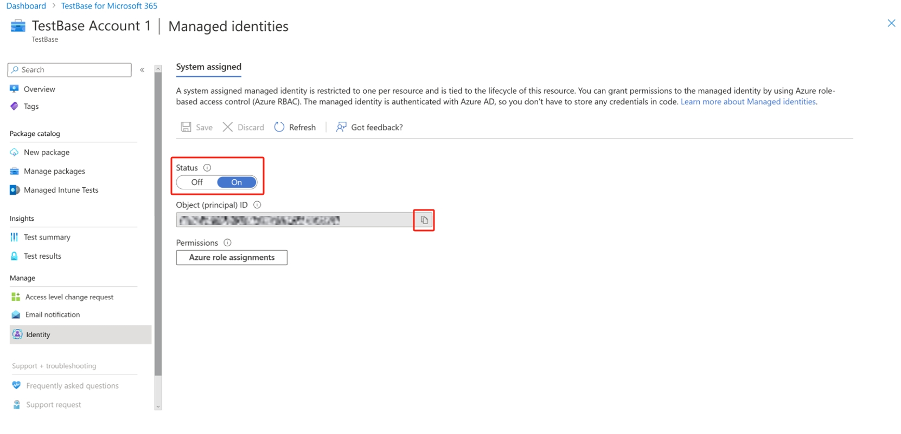
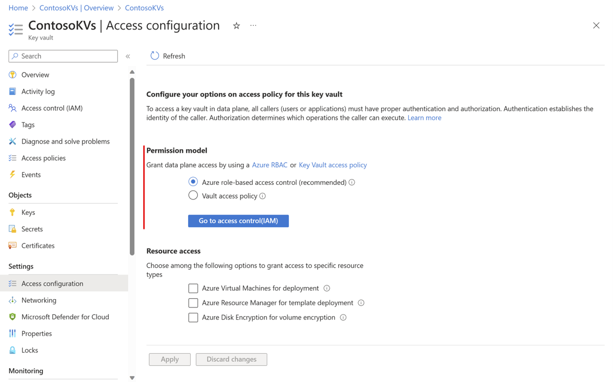
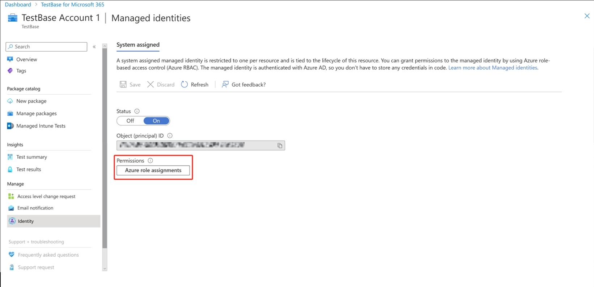
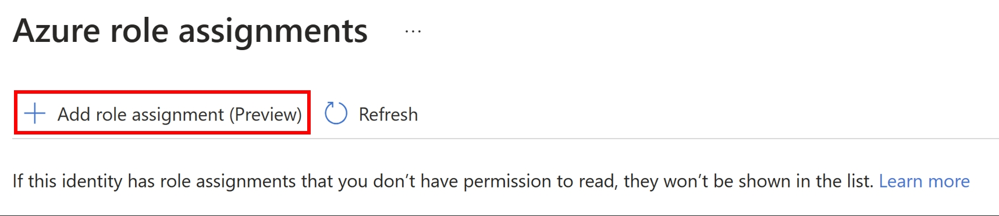
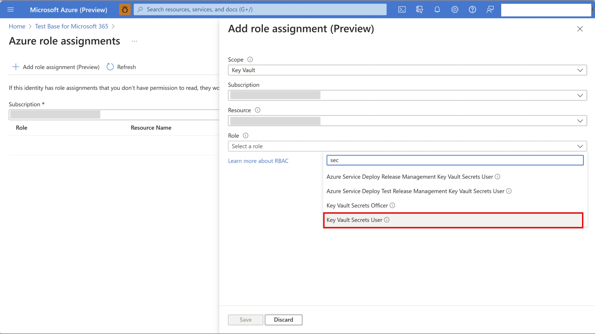
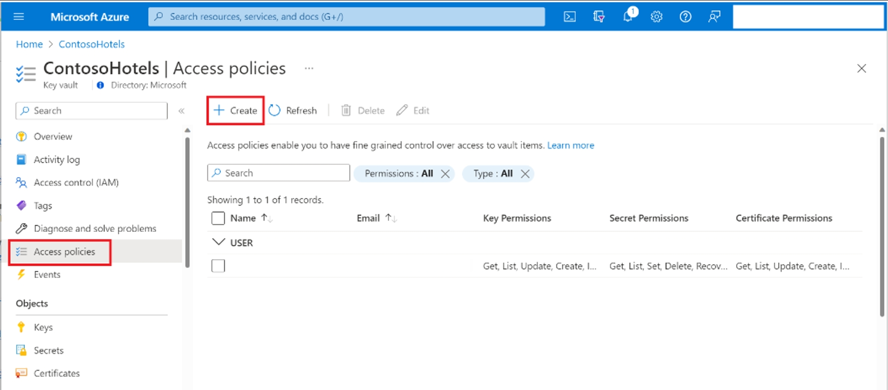
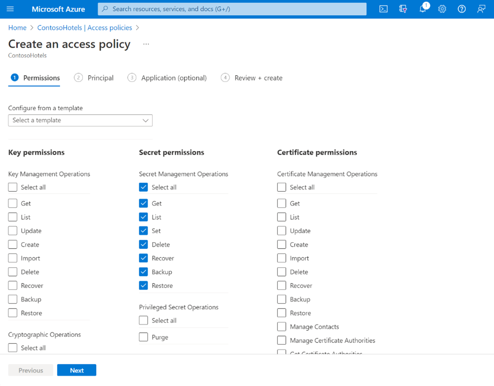
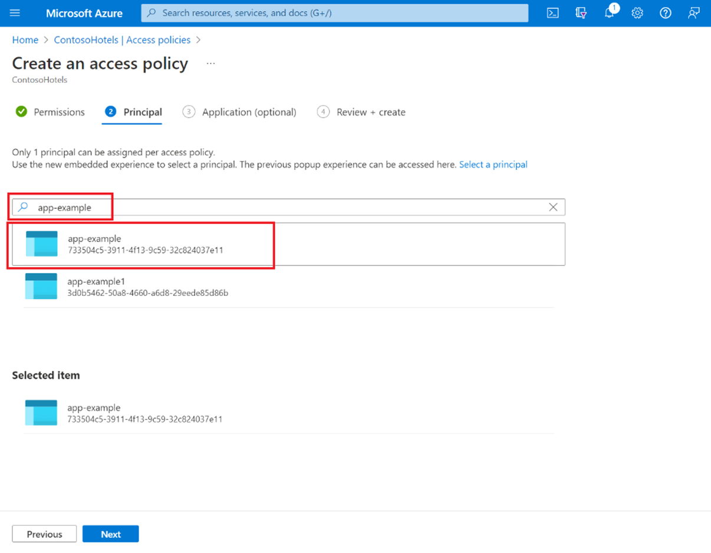
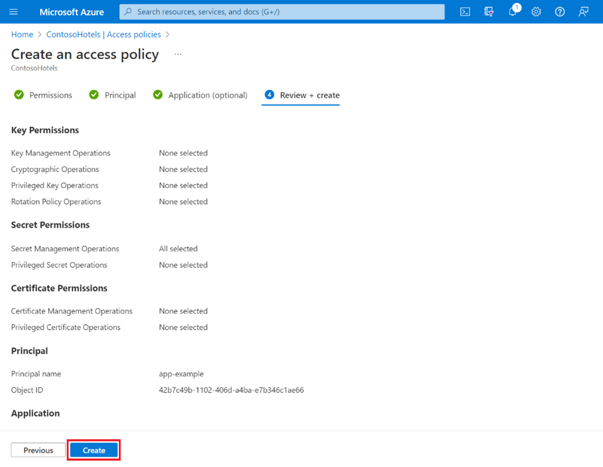

# Grant Test Base managed identities to your Key Vault account

[!INCLUDE [test-base-deprecation](./includes/test-base-deprecation.md)]

This article includes step-by-step guidance to grant Test Base access to your key vault secrets so that you can authorize Test Base access to other platforms during your compatibility tests in a secure way.

**In this article,**

- [Prerequisite](#Prerequisite)
- [Grant Test Base managed identities to your Key Vault account](#GrantTestBaseAccess)

**Relevant links**

- [Importing Intune Credential in Test Base](https://aka.ms/testbase-doc-IntuneEnrollment)

### Prerequisite

- Resource group and Subscription are already known for your project.
- Test Base Account and Azure Key Vault Accounts are created.

*Reference*

1. [*Creating a Test Base Account | Microsoft Learn*](createaccount.md)
2. [*Creating an Azure Key Vault Account*](/azure/key-vault/general/quick-create-portal)

### Grant Test Base managed identities to your Key Vault account

1. Turn on **System assigned** identity in Test Base: Go to **Manage** \> **Identity** \> **System assigned** to enable managed identity in Test Base

> [!div class="mx-imgBorder"]
> 

2. Click on the copy button () to copy Test Base system assigned **Object ID**
3. Assign Key Vault access to Test Base:

    Before assigning Key Vault access, please check your Key Vault configuration: Go to **Settings** \> **Access configuration**.
    > [!div class="mx-imgBorder"]
    > 
    Depending on your permission model, please select below guidance:

    > a. [Grant Key Vault access to Test Base **when your Permission model is Azure role-based access control**.](#KeyVaultRBAC)  
    > b. [Grant Key Vault access to Test Base **when your Permission model is Vault access policy**.](#KeyVaultAccessPolicy)

    1. Grant Key Vault access to Test Base **when your Permission model is Azure role-based access control**.

        Reference: [Grant a user access to Azure resources using the Azure portal - Azure RBAC | Microsoft Learn](/azure/role-based-access-control/quickstart-assign-role-user-portal)

        1). Open your Test Base account, select **Manage** \> **Identity** \> **Azure role assignments**.
        > [!div class="mx-imgBorder"]
        > 
        2). Click on **Add role assignment**.
        > [!div class="mx-imgBorder"]
        > 
        3). Set Scope as **Key Vault**. Select Subscription and Resource. Select the Role as **Key Vault Secrets User**.
        > [!div class="mx-imgBorder"]
        > 
        4). Repeat step b-c and select the Role as **Key Vault Reader**.

    2. Grant Key Vault access to Test Base **when your Permission model is Vault access policy**.

        Reference: [Assign an Azure Key Vault access policy (CLI) | Microsoft Learn](/azure/key-vault/general/assign-access-policy?tabs=azure-portal)

        1). Select **Access policies** , then select **Create**
        > [!div class="mx-imgBorder"]
        > 
        2). **Select all** permissions under **Secret** permissions
        > [!div class="mx-imgBorder"]
        > 
        3). Under the **Principal** selection pane, paste **Test Base Object ID**
        > [!div class="mx-imgBorder"]
        > 
        4). Click **Next** to continue.

        5). Review the access policy changes and select **Create** to save the access policy
        > [!div class="mx-imgBorder"]
        > 