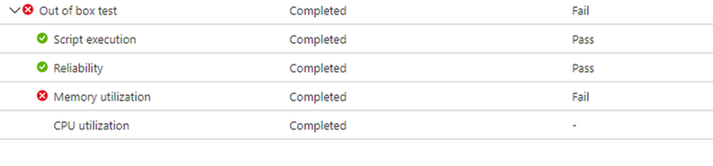
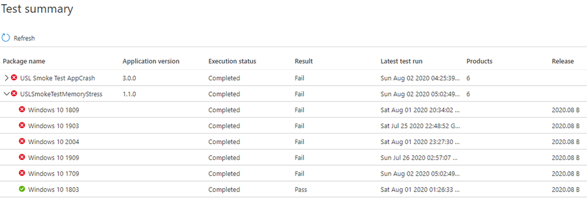
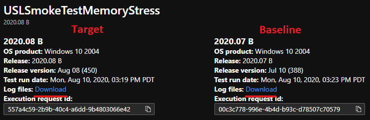

# Memory Regression Analysis

Test Base helps you more clearly notice significant memory usage increases in the test VMs running your apps. Performance metrics, such as memory usage, can be indicative of overall application health and we believe this addition will greatly help keep your apps performing optimally.

Read on for more details or watch this video for a quick walk-through of the latest improvements. 

For more information on Test Base for Microsoft 365's ability to help with regression analysis, see Regression results based on process reliability.

<b>Looking closer at memory regressions</b>

The Test Base for Microsoft 365 dashboard shows the memory consumed by your application on a new pre-released Windows update and compares it with the memory used by the last released Windows update. 

With this month’s enhancements, memory regression analysis is now featured in your favorited processes. Applications can contain multiple processes and you can manually select your favorite processes through the Reliability tab. Our service will then identify memory regressions in these favorited processes while comparing test runs across different Windows update releases. If a regression is detected, details about the regression are easily available.

Now let's look at this feature in detail and discuss how you can troubleshoot memory regressions using Windows Performance Analyzer.

The failure signal caused by a memory regression is shown in the Test Base for Microsoft 365 dashboard on the Test results page under Memory Utilization:




Failure for the application due to higher memory consumption, will also be displayed as ```Fail``` on the Test Summary page:



By providing the failure signals upfront, our goal is to clearly flag potential issues that can disrupt and impact the end user experience for your application. 

You can then download the log files and use the Windows Performance Analyzer, or your preferred toolkit, to investigate further. You can also work jointly with the Test Base for Microsoft 365 team on remediating the issue and help prevent issues impacting end users.

Memory signals are captured in the Memory Utilization tab in the Test Base for Microsoft 365 service for all test runs. The example below shows a recent test run with the onboarded application “Smoke Test Memory Stress” against the pre-release August 2020 security update. (This application was written by our team to illustrate memory regressions.)


In this example, the favorite process “USLTestMemoryStress.exe” process consumed an average of approximately 100 MB on the pre-release August update compared to the released July update, hence the Test Base for Microsoft 365 identified a regression. 

The other processes—shown here as “USLTestMemoryStress_Aux1.exe” and “USLTestMemoryStress_Aux2.exe”—also belong to the same application, but consumed approximately the same amount of memory for the two releases so they "passed" and were considered healthy.

The regression on the main process was determined to be “statistically significant” so the service communicated and highlighted this difference to the user. If the comparison wasn't statistically significant, it wouldn't be highlighted. Memory utilization can be noisy, so we use statistical models to distinguish, across builds and releases, meaningful differences from inconsequential differences. 

A comparison may rarely be flagged when there's no true difference (a false positive), but this is a necessary tradeoff to improve the likelihood of correctly identifying regressions (or true positives.)

The next step is to understand what caused the memory regression. You can download the zip files for both executions from the Download log files option, as shown below. 

These zip files contain the results of your test run, including script results and memory and CPU performance data that is included in the ETL file.



You can download and unzip the logs for the two test runs, then locate the ETL file within each folder and rename them as target.etl (for the test that run on the pre-release update) and baseline.etl (for the test that run on last released update) to simplify exploration and navigation.
 
## Next steps

Advance to the next article to get started with understanding intelligent CPU regression analysis.
> [!div class="nextstepaction"]
> [Next step](cpu.md)

<!---
Add button for next page
-->
