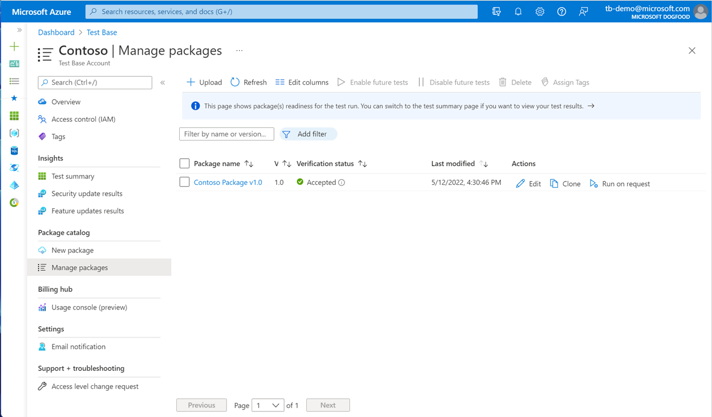
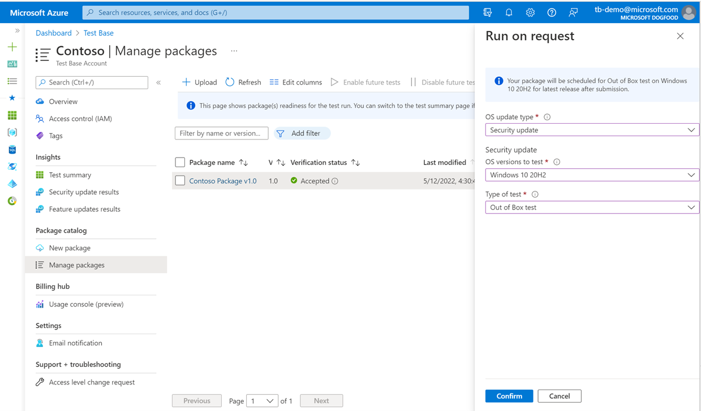
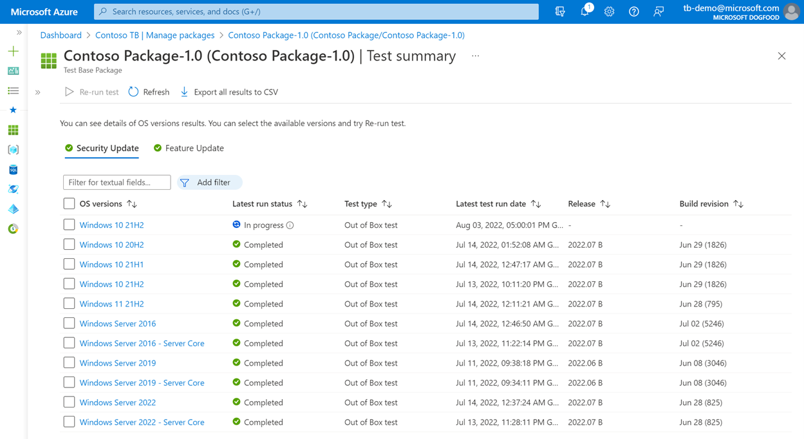

# Run your test on-demand

> [!NOTE]
> Test Base now provides the option to kickoff a test with an on-demand approach.

## Run as request under Manage packages

For an active package, you can access the run-on-request feature from the Manage packages page.

> [!div class="mx-imgBorder"]
> 

By specifying the OS update type and Windows product which are pre-defined with the package, you can kick off the test on demand which immediately gets scheduled for the current monthly churn of Windows updates.

> [!div class="mx-imgBorder"]
> 

You don’t need the test to be executed with its automatic cadence before you can use the feature. You can now decide which product and when to be tested.

> [!div class="mx-imgBorder"]
> 

> [!NOTE]
> Please be remind that only active packages will have Run on request button enabled. Make sure you Enable the package for future tests if you would like to opt-in the package for this feature.