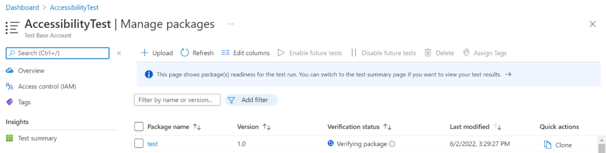
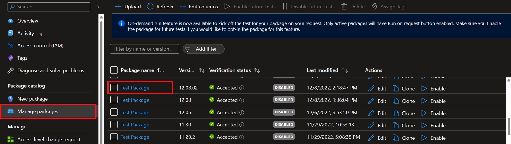
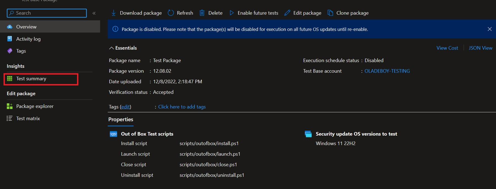
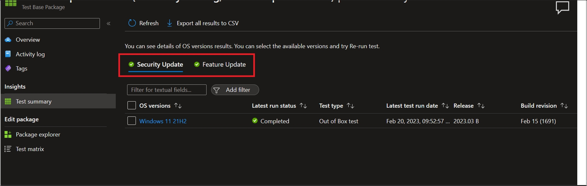

# Package Validation 

[!INCLUDE [test-base-deprecation](./includes/test-base-deprecation.md)]

## Package Validation

When a [new package](buildpackage.md) is created or onboarded to Test Base, a validation run is triggered. The purpose of the validation run is to check the package and make sure it's ready for testing. 
Packages that are undergoing verification are marked with "Verifying package" status.

To see the verification status of your package, you can click the "Manage Package" menu 
> [!div class="mx-imgBorder"]
> 

## Package Verification Stages

1.	**Sanity Check**: Test Base attempts to validate that the scripts path provided is correct and exists in your package.
Follow the [guideline here](contentguideline.md) to understand how to build a package for Test Base
2.	**Malware Scan**: Test Base also scans the package to check for the presence of virus, malware, or any malicious content.
3.	**Verification Run**: If the package passes the first and second stage of validation, Test base triggers a verification run. During the verification run, Test Base runs the scripts provided on our VM (virtual machines).

## Package Verification Status

1.	**Verifying package**: The package is getting verified through the different stages of verification.
2.	**Verification failed**: The package has failed one of the verification checks. You can click the view result button to see the result/ reason for failure.
3.	**Verification taking too long**: The package verification process is inconclusive or taking longer than expected. You can upload a new package or open a support ticket for help.
4.	**Accepted**: The package passed all verification checks and is now accepted for future tests.

> [!div class="mx-imgBorder"]
> 

## Package Validation Result

As soon as the package validation is completed, you should receive a mail notification with some details about the package validation.

To see validation results of your Security Update test, follow the step below.
1.	Click on Manage packages, and select the package
> [!div class="mx-imgBorder"]
>

2.	On the package summary page, click "Test Summary"
> [!div class="mx-imgBorder"]
> 

3.	Click on the Security Update / Feature Update tab
> [!div class="mx-imgBorder"]
> 

## Package Validation Details

When you upload a package, Test Base makes some decision based on the test types and products selected during package onboarding to perform package validation.

1. If a customer selects only Security Update, Test Base triggers package validation against the most recent product selected. After successful package validation and if package is Accepted, Test Base will proceed to schedule the package for baseline runs if the customer had selected more than one product. 
As an example, if a customer selects Windows 11 22H2, Windows 11 21H2 and Windows 10 22H2. Test Base triggers the validation run against "Windows 11 22H2". If the package gets accepted, a baseline run will be triggered against the next 2 products.

2. If the customer selects only Feature Update as test type, the validation scheduling process is a little different.
Test Base triggers a validation run against the selected Feature Update (The customer can see the results in "Feature Update test Results"). When the package is accepted, a baseline line run is triggered against n - 1 product  with latest security update. 
For example, if a customer selects Windows 11 22H2 Feature Update, the baseline runs will be Windows 11 21H2 with the latest security updates.
