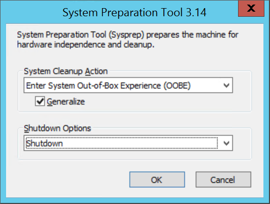

# How to prepare a Windows VHD for Test Base

Before you upload a Windows virtual machine (VM) from on-premises to Test Base, you need to prepare the virtual hard disk (VHD) first.
Test Base only supports generation 2 VMs that use the VHD file format and have a fixed-size disk.
The maximum size for the OS VHD on a generation 2 VM is 128 GiB on Test Base.

Test Base supports these Windows versions:

- Windows 10 21H2 or later
- Windows 11 21H2 or later
- Windows Server 2016 or later

You can convert a VHDX file to VHD, or convert a dynamically expanding disk to a fixed-size disk, but you cannot change the generation of a VM. You need to enable Hyper-V features on the host for VHD related operations.

You cannot shrink the physical size of a VHD. If the total size of the volumes in the VHD exceeds the maximum OS VHD size (128 GiB) on Test Base, you need to recreate the VM in a smaller VHD or shrink the volumes in the VM before converting it to VHD.

You need to follow the configuration steps below to make sure that the VM VHD is compatible with Test Base.

## Step 1. Run the *AzureConfig.ps1* script for easy configuration

To make the configuration steps easier we prepared a configuration script, you can download **[AzureConfig.ps1](https://github.com/microsoft/testbase/blob/main/CustomImage/AzureConfig.ps1)** and run the script as an administrator in PowerShell on the VM. You may need to configure PowerShell execution policy before running the script. Run `Set-ExecutionPolicy -ExecutionPolicy Bypass -Scope CurrentUser` to bypass signing checks for the current user.

After the script finishes, restart the computer.
The **ChkDsk** will run during the system boot. Make sure the report shows a clean and healthy disk.
The **Step-SetLocalPolicy** will set the local policy to disable the legal notice and allow storage of password and credentials for network authentication.

## Step 2. Install Windows updates

To prevent an accidental reboot during the VM provisioning, it is recommended to install all Windows updates and restart the VM before migrating it to Test Base.

If you also need to generalize the OS (Sysprep), you need to update Windows and restart the VM before running the Sysprep command.

## Step 3. Decide when to use Sysprep

System Preparation Tool (`sysprep.exe`) is a process that resets a Windows installation.
Sysprep removes all personal data and resets several components.

You usually run `sysprep.exe` to create a template that you can use to deploy several other VMs with a specific configuration.
The template is called a *generalized image*.

If you want to create only one VM from one disk, you do not need to use Sysprep.
You can create the VM from a *specialized image* instead.

Note that Sysprep requires the drives to be fully decrypted before running.
If you have enabled encryption on the VM, disable it before running Sysprep. The `AzureConfig.ps1` script should disable BitLocker for all volumes.

### Generalize a VHD

Follow these steps to generalize a VM VHD. After these steps, turn off the VM and do not turn it back on until you finish uploading the VHD.

1. Sign in to the Windows VM.
1. Run PowerShell as an administrator.
1. Delete the panther directory (`C:\Windows\Panther`).
1. Change the directory to `$env:windir\System32\sysprep`. Then run `sysprep.exe`.
1. In the **System Preparation Tool** dialog box, select **Enter System Out-of-Box Experience (OOBE)** and check **Generalize**.

   

1. In **Shutdown Options**, select **Shutdown**.
1. Select **OK**.
1. When Sysprep finishes, shut down the VM. If the generalization succeeds, the VM will be shut down automatically. Do not use **Restart** to shut down the VM.

You can also use the following PowerShell script to generalize the VM VHD. Run the script as an administrator in PowerShell.

```powershell
Remove-Item "$($env:windir)\Panther" -Recurse -Force

Push-Location "$($env:windir)\System32\sysprep"

.\sysprep.exe /generalize /shutdown /oobe

Pop-Location
```

The VHD is now generalized.

### Install Azure Virtual Machine Agent for *specialized image*

To create a VM from a *specialized image*, you need to install the `Azure Virtual Machine Agent` on the VM.

Install the [Azure Virtual Machine Agent](https://go.microsoft.com/fwlink/?LinkID=394789) on the VM. Then you can enable VM extensions after the agent installation.
The VM extensions provide most of the critical functionality that Test Base needs.

You can also install the agent by running this PowerShell script as an administrator.

```powershell
$installerName = "WindowsAzureVmAgent.msi"
$installerPath = "$PWD\$installerName"
if (Test-Path $installerPath) {
    Remove-Item $installerPath -Force 
}

$installerDownloadLink = "https://go.microsoft.com/fwlink/?LinkID=394789"
Invoke-WebRequest -Uri $installerDownloadLink -OutFile $installerPath

$logPath = "$PWD\$installerName.log"
Start-Process "msiexec.exe" -ArgumentList "/i `"$installerPath`" /qn /L*v `"$logPath`"" -PassThru -Wait
```

## Step 4. Convert and resize the virtual disk to a fixed size VHD

Use this method to convert and resize the virtual disk for Test Base:

1. Back up the VM before you start the conversion or resize process.
1. Make sure that the Windows VHD works correctly on the local server. Fix any errors in the VM before you try to convert or upload it to Test Base.
1. Convert the virtual disk type to `Fixed`.
1. Resize the virtual disk to meet Test Base requirements:

   1. Disks in Azure must have a virtual size aligned to 1 MiB. If the VHD is not a multiple of 1 MiB, you need to resize the disk. Disks that are not multiples of 1 MiB cause errors when you create images from the uploaded VHD. Use the PowerShell `Get-VHD` cmdlet to show "Size", which must be a multiple of 1 MiB in Azure, and "FileSize", which will be equal to "Size" plus 512 bytes for the VHD footer.

      ```powershell
      $vhd = Get-VHD -Path C:\Test\TestBaseVM.vhd
      $vhd.Size % 1MB
      0
      $vhd.FileSize - $vhd.Size
      512
      ```

   2. The maximum size for the OS VHD on Test Base is 128 GiB.

### Use PowerShell to convert and resize the disk

You can use the `Convert-VHD` and `Resize-VHD` PowerShell cmdlets to convert the virtual disk on the VM host for Test Base. Run this PowerShell script as an administrator. Replace `<PathToVHD>` with the path to the VHD that you want to upload.

```powershell
$vhdFilePath = "<PathToVHD>"
$vhdFileItem = Get-Item $vhdFilePath
$fixedSizeVHDFilePath = $vhdFileItem.Directory.FullName + "\" + $vhdFileItem.BaseName + '-Fixed.vhd'

Convert-VHD -Path $vhdFilePath -DestinationPath $fixedSizeVHDFilePath -VHDType Fixed

$fixedSizeVHD = Get-VHD -Path $fixedSizeVHDFilePath
if ((($fixedSizeVHD.Size % 1MB) -ne 0) -or (($fixedSizeVHD.FileSize - $fixedSizeVHD.Size) -ne 512)) {
    $originalSize = $fixedSizeVHD.Size
    [UInt64]$originalMB = $originalSize / 1MB
    $resizedBytes = ($originalMB + 1) * 1024 * 1024
    Resize-VHD -Path $fixedSizeVHDFilePath -SizeBytes $resizedBytes
}
```

After the script finishes, you will see a new VHD file with `-Fixed` at the end of its name in the same folder as the original VHD file.
The new VHD file is converted and resized to be compatible with Test Base. It is a `Fixed` VHD type and has a size of 1 MiB alignment.
