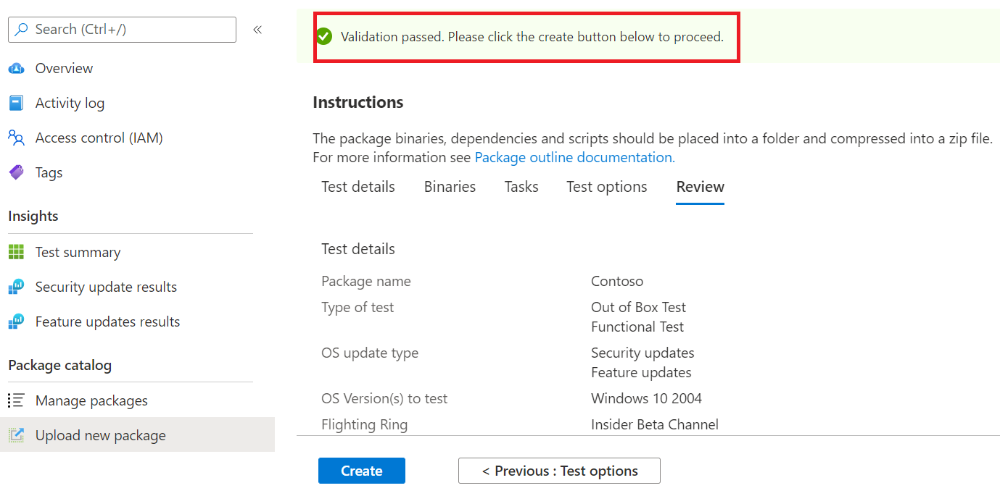

# Step 6: Review your selections to create your package.

1.	On this tab, the service displays your test details and runs a quick completeness check. 

    A ```Validation passed``` or ```Validation failed``` message shows whether you can proceed to next steps or not.

2.	Review your test details and if satisfied, click on the ```Create``` button. 


## Validate package details



3.	This will onboard your package to the Test Base environment. If your package is successfully created, an automated test which verifys whether your package can be successfully executed on Azure will be triggered.


> [!Note]
> You will get a notification from the Azure portal to notify you on the success or failure of the package verification. 
>
> Please note that the process can take up to 24 hours, so it is likely your webpage will timeout if you are not active on it and hence, the notification will not inform you of the completion of this on-demand run. 

  - Peradventure this happens, you can view the status of your package on the ```Manage packages``` tab.


  - For succesful tests, their results can be seen via the ```Test Summary```, ```Security Updates Results``` and ```Feature Updates Results``` pages at scheduled intervals, often starting a few days after your upload.
  
  - While failed tests, require you to upload a new package. 
  
    You can download the ```test logs``` for further analysis from the ‘```Security update results``` and ```Feature updates results``` pages.

  - If you experience repeated test failures, please reach out to testbasepreview@microsoft.com with details of your error. 

## Next steps

Discover our Content Guidelines via the link below.
> [!div class="nextstepaction"]
> [Next step](contentguideline.md)
