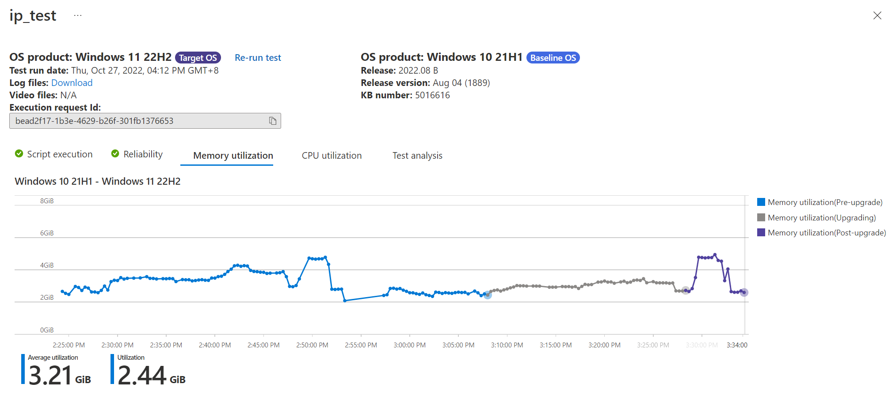
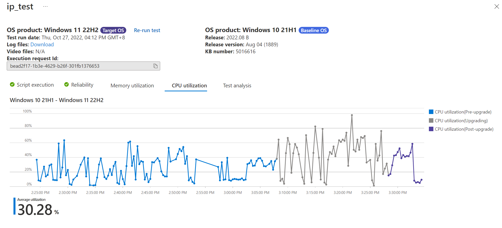

# Test your application with in-place upgrade
 > [!NOTE]
 > This guide will provide instruction on how to test your application with in-place upgrade feature

### Expanded Testing Matrix with in-place upgrade
Evaluate your app readiness for Windows 11 by testing via in-place upgrade to simulate the real enterprise update experience. You can get a comprehensive Windows 11 update readiness assessment with side-by-side comparison against Windows 10 baseline.

Check below to learn how to set up your apps for the Windows 11 upgrade readiness test with a customizable flow for testing activities before and after the upgrade.
 > [!div class="mx-imgBorder"]
 > 
### Onboard package for in-place upgrade
You can now onboard a package with baseline OS and target OS defined via the new Flow Driven test type to validate if the application works before and after the upgrade on the same VM.

#### Step 1: Enable in-place upgrade by choosing Flow driven test in Config test step
You should be able to find a new testing option “Flow driven test” with clear preview note on the top info box explaining the purpose of the new feature when creating new package via either Create new package online, Create package with Intune App or Upload pre-build package.
 > [!div class="mx-imgBorder"]  
 > 

 > [!div class="mx-imgBorder"]  
 > 
 > [!IMPORTANT]
 > When Flow Driven selected, other test type will be disabled by default to avoid overcomplicating the script setup process.
 
 #### Step 2: Define test scripts
 In the Edit package page, user should be able to see 2 pre-generated test scripts (install/uninstall) under the folder of flowDriven with Flow driven tag followed by sequence order number. User should be able to add new script using the existing menu.
 > [!div class="mx-imgBorder"]  
 > 

#### Step 3: Add test script to the test flow
Click on the ellipse icon beside the test script should pop up function menu with option to add the script to Flow driven test list with an increased number (up to 8 scripts can be added and assigned with the tag)
 > [!div class="mx-imgBorder"]  
 > 

#### Step 4: Define test flow
Click on the flow driven test panel to define test flow.
 > [!div class="mx-imgBorder"]  
 >   
 > Drag each row to reorder the scripts, opting in or out the check boxes to define if you’d like to have the script run before the upgrade, after the upgrade or both.
 > [!div class="mx-imgBorder"]  
 > 

#### Step 5: Review the test plan
Check the automatically generated In-place Upgrade Test Flow plan to see if the sequence of the test script execution matches your expectation. 
 > [!div class="mx-imgBorder"]  
 >     
 > Take above flow definition as example, the app will be installed on base line OS before upgrade, followed by the regression test and stayed install for the upgrade to happen, once upgraded, the regression test will be executed as the 3rd step and finally verify the uninstall only after the upgrade on the Target OS as defined.

#### Step 6: Define baseline and target OS
Once package edit is finished. Proceed to the Test matrix should see the OS update type being default to In-place upgrade. User should be able to define the supported baseline OS version (in market Windows 10) and security update baseline based on their environment/update status. Target OS currently is limited to in market Windows 11.
 > [!div class="mx-imgBorder"]  
 > 

#### Step 7: Review + publish
Once  configuration is completed. You should be able to review the overall configuration and publish.
 > [!div class="mx-imgBorder"]  
 > 

### Review the test result
You should be able to check the review the test results once validation run passed and actual test completed.

#### Step 1: Check the package under the Test summary
The created package should be listed under the Test summary tab.
 > [!div class="mx-imgBorder"]  
 > 

#### Step 2: Check the test run summary under the Test summary drill down page
Click the package to enter the dedicated Test summary page with In-place upgrade as the header of the summary tab. Corresponding test runs should be named with baseline OS – target OS as below:
 > [!div class="mx-imgBorder"]  
 > 

#### Step 3: Check the test run history under the In-place upgrade test results page
Click on the OS versions link to drill down to the new In-place upgrade test results page which can also be accessed through the left navigation panel. Validate the top filter functions works to quickly switch between different in-place upgrade test runs on the package. 
 > [!div class="mx-imgBorder"]  
 > 

### Review the test detail
You should be able to review the test detail to get a comprehensive assessment of the upgrade test impact.

#### Step 1: Script execution tab
Click on the Script execution tab, user should be able to see the script execution result side by side for the application’s test scripts before (on the baseline OS) and after the upgrade (on the target OS). 
 > [!div class="mx-imgBorder"]  
 >   
 > If a script is scheduled to be run both pre and post upgrade, the overall script status should be passed only if both pre and post upgrade script executions are successful.  
 > **Re-run test** button should be enabled to allow user to rerun the test as needed in case of infrastructure failure.

#### Step 2: Memory utilization tab
Click on the Memory utilization tab should show the memory regression curve color coded by pre-upgrade, upgrading and post upgrade.
> [!div class="mx-imgBorder"]  
> 

#### Step 3: CPU utilization tab
Click on the CPU utilization tab should show the CPU regression curve color coded by pre-upgrade, upgrading and post upgrade.
> [!div class="mx-imgBorder"]  
> 

 

 
