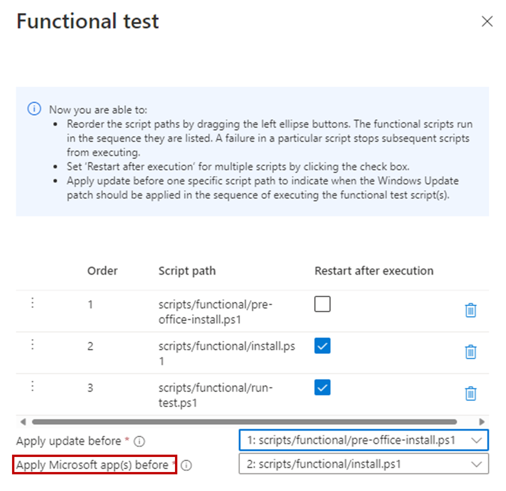
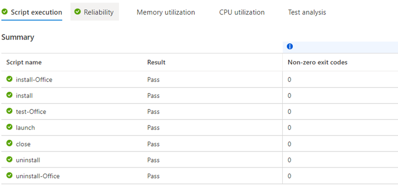

# Test your application with latest Microsoft 365 apps

[!INCLUDE [test-base-deprecation](./includes/test-base-deprecation.md)]

This section provides instructions on how to test your application with latest Microsoft 365 apps.

> [!IMPORTANT]
> Currently only pre-release of Office 365 from the monthly preview channel is available.

### Choose the Microsoft 365 application 

In the **Configure test** step when onboarding a new package, switch on the **Pre-install Microsoft apps** toggle button will enable user to choose pre-release version of Microsoft 365 apps with latest update to be installed for testing.

 > [!div class="mx-imgBorder"]  
 >   
 > [!NOTE] 
 > As the Office preview channel provides pre-release Office updates with monthly cadence, only **security update** type is enabled for the package once the toggle button is turned on. Windows OS versions that could be selected in the Test matrix also will be limited to the Windows products for which the chosen Office product are available. Due to the mentioned pre-requisite, if you would like to turn on the Office update testing feature for existing packages, un-supported update type and Windows OS products will be disabled by default.

&nbsp;  
### Define the install sequence for the chosen Microsoft 365 application 

You can use **Functional test** to define the install sequence for the pre-release Office with the latest update. Click the **Open functional test panel** icon as below after creating your own script and adding to the Functional test list.

 > [!div class="mx-imgBorder"]  
 > 

You will be able to reorder the scripts in the functional list panel by dragging the items up and down to the proper step. Choose which step to execute the Office installation by selecting the script before which you would like the pre-release Office installation to happen.  

In below example, Windows update will be installed first, followed by the pre-office-install script, then the Office pre-release will be installed before the install script for user’s application after which the run-test script will be executed.

 > [!div class="mx-imgBorder"]  
 >   
 > [!NOTE]
 > For Out of box test type, Office install will be by default executed after the Windows update installation and before the install script gets executed.

&nbsp;  
### View the test result with Microsoft 365 application  

A test run will be executed after the package passes the validation. On a monthly basis, an automated run will be scheduled on each patch Tuesday when the latest Windows security update gets released. The package will install the latest pre-release version of Office from the monthly preview channel as of the corresponding execution date to allow your application to be tested against both latest Windows and Office updates.

You can view the results of the test runs under the Test summary page by clicking the link on the package name.

 > [!div class="mx-imgBorder"]  
 > 

&nbsp;  
In the detailed page, you will see install-Office as an auto-executed script which represents the status of the pre-release Office installation.

 > [!div class="mx-imgBorder"]  
 >   
 > [!NOTE]
 > For Out of box test type, a pre-defined Office interop test script will be executed to help collect conflict signals for pre-release Office running with user’s installed application by default. You can use Functional test to define your own test flow and bypass the Office test script if you would like to focus on testing how your application works with latest Office updates.
