# Creating and Testing Binary Files on Test Base

This section provides all the steps necessary to create a new package containing binary files, for uploading and testing on Test Base. If you already have a pre-built .zip file, you can see [Uploading pre-built Zip package](uploadApplication.md), to upload your file.

> [!IMPORTANT]
> If you don't have a **Test Base** account, you'll need to create one before proceeding, as described in [Creating a Test Base account](createAccount.md).

## Create a new package

In the [Azure portal](https://portal.azure.com/), go to the **Test Base** account for which you'll be creating and uploading your package and perform the steps that follow. 

In the left-hand menu under **Package catalog**, select the **New package**. Then click the first card **‘Create new package online'** to build your package online within 5 steps!

> [!div class="mx-imgBorder"]
> 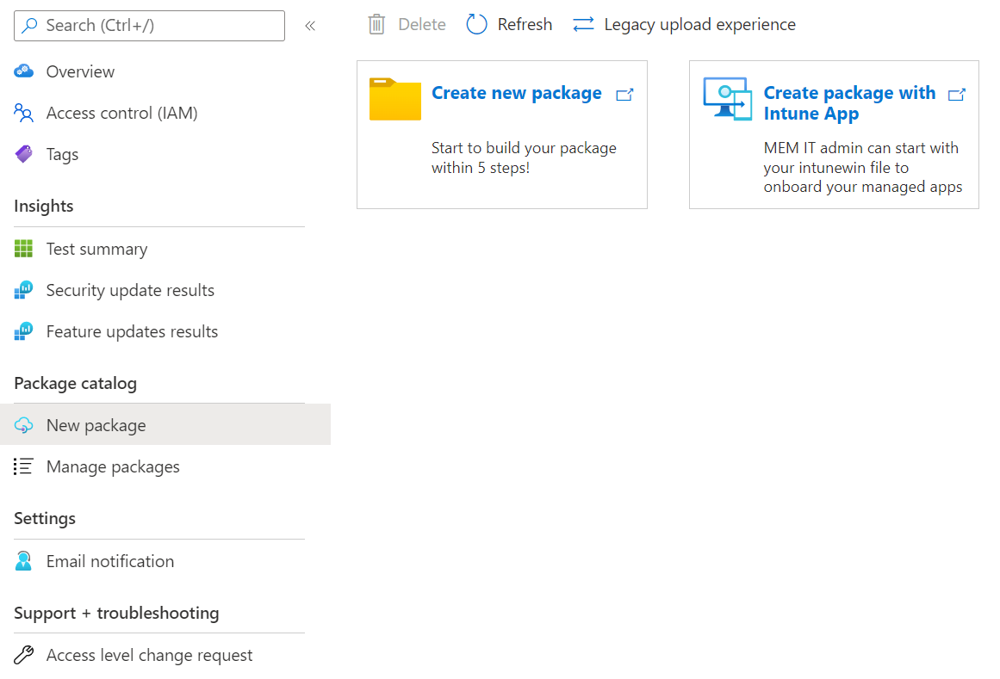

### Step 1. Define content

1. In the **Package source** section, select Binaries (for example: .exe, .msi) in the Package source type.

   > [!div class="mx-imgBorder"]
   > 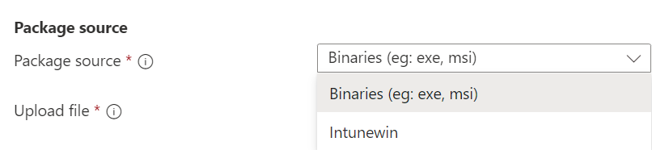

2. Then upload your app file by clicking 'Select file' button or checking the box to use the Test Base sample template as a starting point if you don't have your file ready yet.

   > [!div class="mx-imgBorder"]
   > 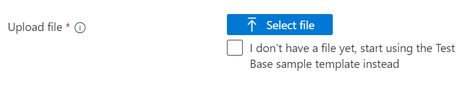

3. Type in your package's name and version in the **Basic information** section.

   > [!NOTE]
   > The combination of package name and version must be unique within your Test Base account.

   > [!div class="mx-imgBorder"]
   > 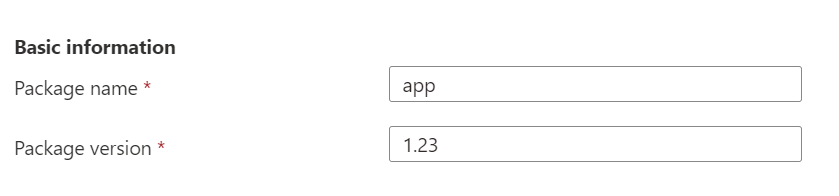

4. After all the requested information is specified, you can proceed to the next phase by clicking the **Next: Configuration test** button.

   > [!div class="mx-imgBorder"]
   > 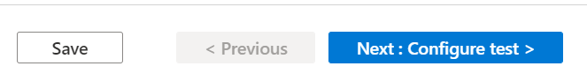

### Step 2. Configure test

1. Select the **Type of test**. There are two test types supported:
   - An **Out of Box (OOB) test** performs an install, launch, close, and uninstall of your package. After the install, the launch-close routine is repeated 30 times before a single uninstall is run. The OOB test provides you with standardized telemetry on your package to compare across Windows builds.
   - A **Functional test** would execute your uploaded test script(s) on your package. The scripts are run in the sequence you specified and a failure in a particular script will stop subsequent scripts from executing.

   > [!NOTE]
   > Out of Box test is optional now.

   > [!div class="mx-imgBorder"]
   > 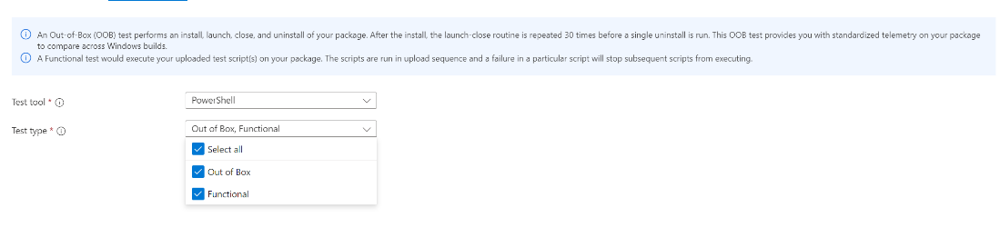

2. Once all required info is filled out, you can move to step 3 by clicking the Next button at the bottom. A notification will pop up when the test scripts are generated successfully.

   > [!div class="mx-imgBorder"]
   > 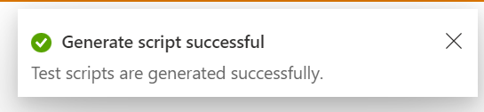

### Step 3. Edit package

1. In the Edit package tab, you can
   - Check your package folder and file structure in **Package Preview**.
   - Edit your scripts online with the **PowerShell code editor**.

   > [!NOTE]
   > Some sample scripts have been generated for your reference. You need to review each script carefully and replace the command and process name with your own. 

   > [!div class="mx-imgBorder"]
   > 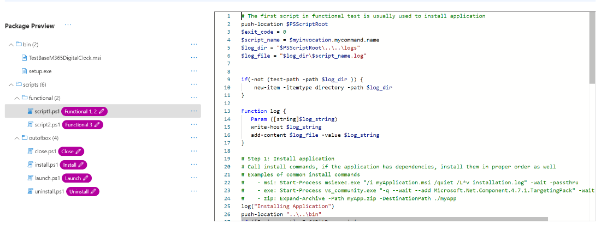

2. In the **Package Preview**, per your need, you can
   - Create a new folder.
   - Create a new script.
   - Upload a new file.

   > [!div class="mx-imgBorder"]
   > 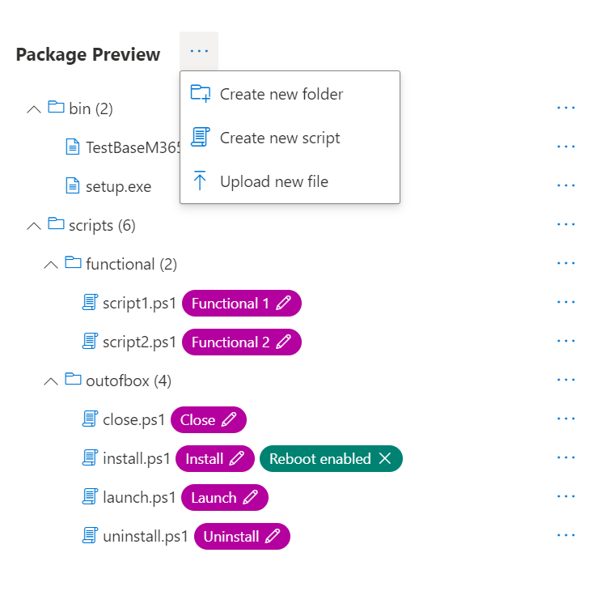

3. Under **scripts folder**, sample scripts and script tags have been created for you. All script tags are editable, you can reassign them to reference your script paths.
   - If the **Out of Box test** is selected in step 2, you can see the **outofbox** folder under the scripts folder. You also have the option to add **‘Reboot after install'** tag for the Install script.

   > [!div class="mx-imgBorder"]
   > 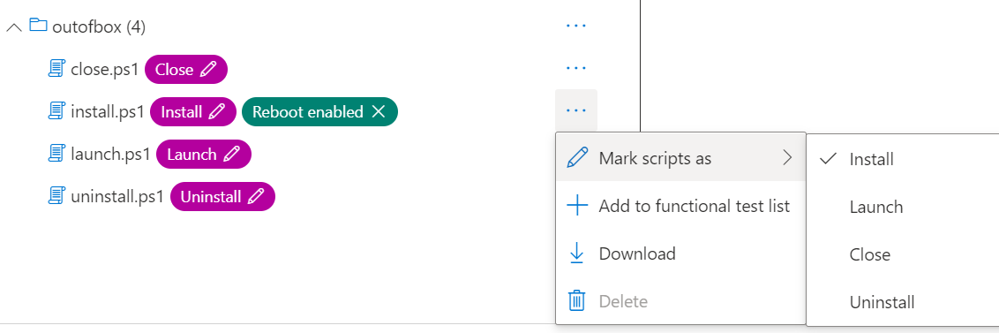

   > [!NOTE]
   > Install, Launch and Close script tags are mandatory for the OOB test type. Reassigning tags ensures that the correct script path will be used when testing is initiated.

   > [!div class="mx-imgBorder"]
   > 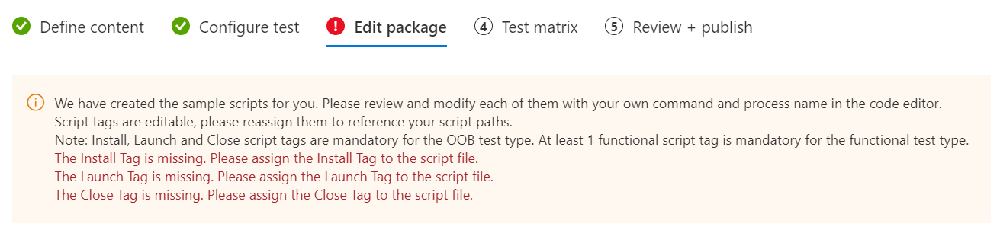

   - If the **Functional test** is selected in step 2, you can see the **functional** folder under the scripts folder. More functional test scripts can be added using the **'Add to functional test list'** button. You need a minimum of one (1) script and can add up to eight (8) functional test scripts.

   > [!div class="mx-imgBorder"]
   > 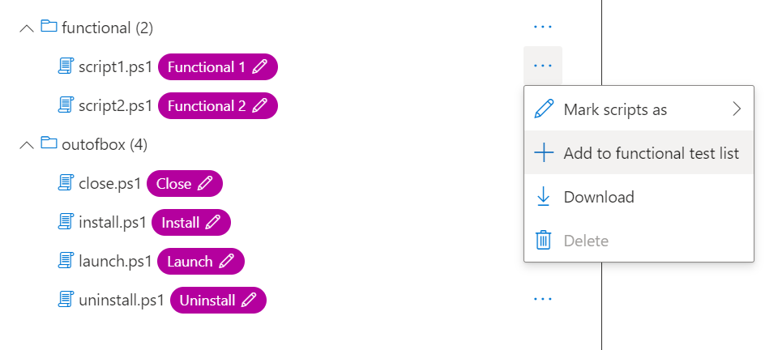

   > [!NOTE]
   > At least 1 functional script tag is mandatory for the functional test type.

   To add more Functional scripts, you can click the **'Add to functional test list'**. Then the action panel will pop up, you can:
   - Reorder the script paths by dragging with the left ellipse buttons. The functional scripts run in the sequence they're listed. A failure in a particular script stops subsequent scripts from executing.
   - Set 'Restart after execution' for multiple scripts.
   - Apply update before on specific script path. This is for users who wish to perform functional tests to indicate when the Windows Update patch should be applied in the sequence of executing their functional test scripts.

   > [!div class="mx-imgBorder"]
   > 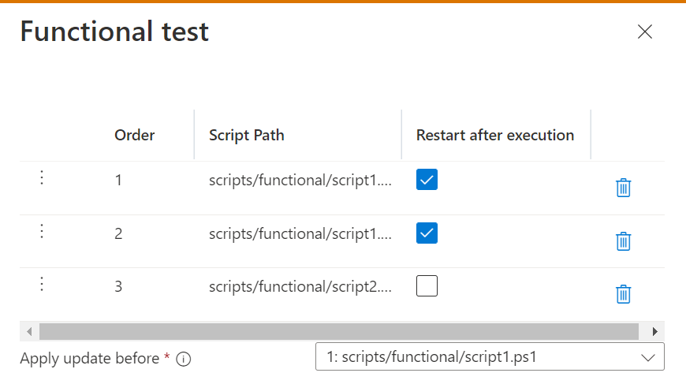

4. Once all required info is filled out, you can move to step 4 by clicking the Next button at the bottom.

### Step 4. Test matrix

1. In the Test matrix tab, select the **OS update type**. There are two OS update types supported.
   - The **Security updates** enable your package to be tested against incremental churns of Windows pre-release monthly security updates.
   - The **Feature updates** enable your package to be tested against Windows pre-release bi-annual feature updates builds from the Windows Insider Program.

2. Select the OS version(s) for Security update tests.

   If **Security updates** is selected in OS update type, you need to select the OS version(s) of Windows your package will be tested on.

   > [!NOTE]
   > If you select to test your package against both Server and Client OSes, please make sure that the package is compatible and can run on both OSes.

3. Select options for Feature update tests.
   - If **Feature updates** is selected in OS update type, you need to finish the following options.
   - For **Insider Channel**, select the Windows Insider Program Channel as the build that your packages should be tested against. We currently use builds flighted in the **Insider Beta Channel**.
   - For **OS baseline for Insight**, select the Windows OS version to be used as a baseline in comparing your test results.

   > [!div class="mx-imgBorder"]
   > 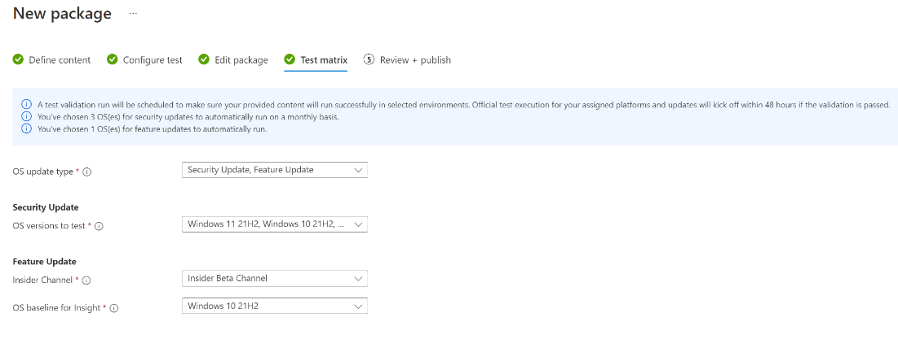

4. Once all the required info is filled out, you can move to step 5 (the last step) by clicking the Next button at the bottom.

### Step 5. Review + publish

1. Review all the information for correctness and accuracy of your draft package. To make corrections, you can navigate back to early steps where you specified the settings as needed.

   > [!div class="mx-imgBorder"]
   > 

2. You can also check the notification box to receive the email notification of your package for the validation run completion notice.

   > [!div class="mx-imgBorder"]
   > 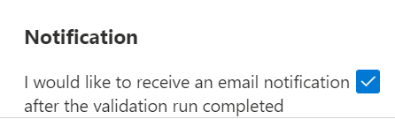

3. When you're done finalizing the input data configuration, click **Publish** to upload your package to Test Base.  The notification that follows displays when the package is successfully published and has entered the Verification process.  

   > [!NOTE]
   > The package must be verified before it is accepted for future tests. The Verification can take up to 24 hours, as it includes running the package in an actual test environment. 

   > [!div class="mx-imgBorder"]
   > 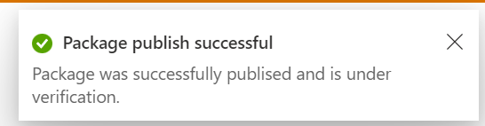

4. You'll be redirected to the **Manage Packages** page to check the progress of your newly uploaded package.

   > [!div class="mx-imgBorder"]
   > 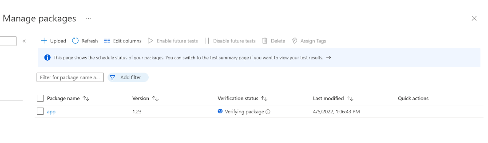

   > [!NOTE]
   > When the Verification process is complete, the Verification status will change to Accepted. At this point, no further actions are required. Your package will be acquired automatically for execution whenever your configured operating systems have new updates available. If the Verification process fails, your package is not ready for testing. Please check the logs and assess whether any errors occurred. You may also need to check your package configuration settings for potential issues.

### Resume creation of a saved draft package

If you have any previous draft packages, you can view the list of your saved draft packages on the **New package** page. By clicking the **'Edit'** pencil icon, you can resume editing the package you selected from where you left off, as described in the **Status** column.

> [!div class="mx-imgBorder"]
> 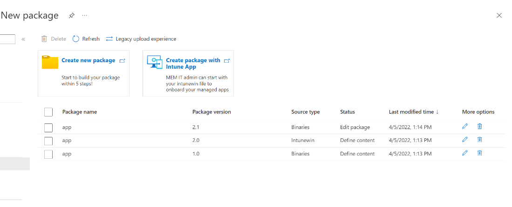

> [!NOTE]
> The dashboard only shows the saved draft packages. To view published packages, you will need to go to the Manage Packages page.

