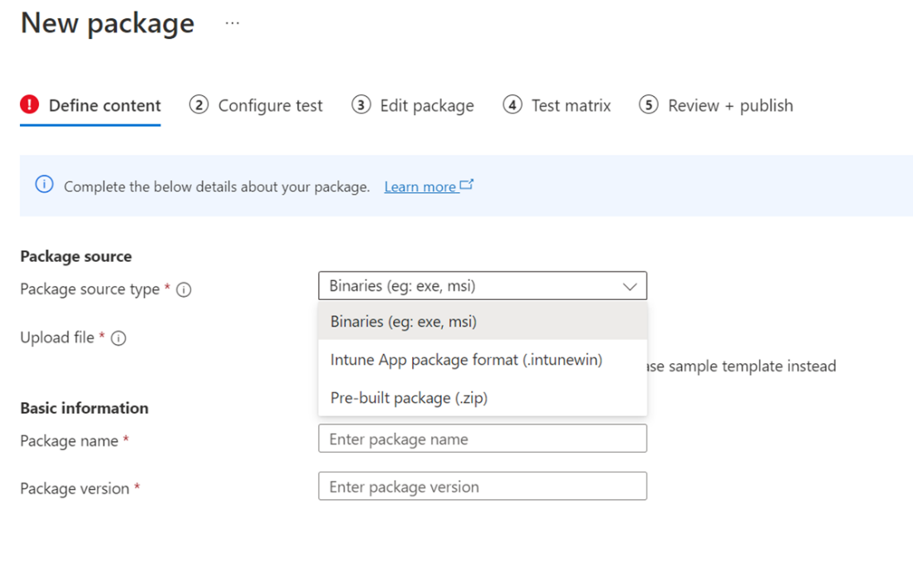
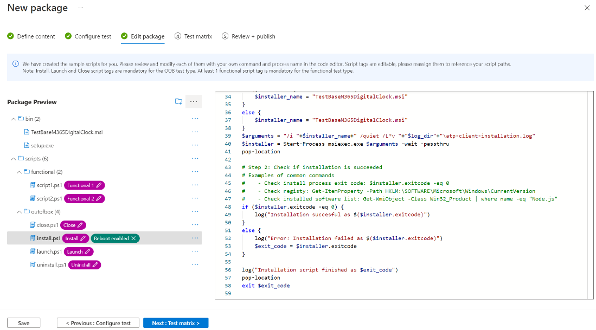
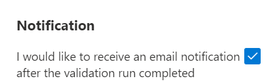

# Test your Binary Files on Test Base

> [!NOTE]
> This guide will guide you to create a new Test Base package from scratch. If you already have a Test Base package (.zip) in hand, you can switch to use our legacy upload experience [Upload your Test Base package (Zip)](uploadApplication.md).

## Prerequisites

A Test Base account. If you don't have one, [create a Test Base account](createAccount.md).

## Create a new package

In the [Azure portal](https://portal.azure.com/), go to the Test Base account in which you want to upload your package. In the left menu under **Package catalog**, select the **New package**. Then click the first card **‘Create new package'** to build your package within 5 steps!

> [!div class="mx-imgBorder"]
> 

### Step 1. Define content

1. In the **Package source** section, choose your package source. If you have an Intunewin app, select Intunewin, for others, e.g. exe or msi, select Binaries.

   > [!div class="mx-imgBorder"]
   > 

2. Then upload your app file by clicking ‘Select file' button or checking the box to use the Test Base sample template as a starting point if you don't have your file ready yet.

   > [!div class="mx-imgBorder"]
   > 

3. Type in your package's name and version in the **Basic information** section.

   > [!NOTE]
   > The combination of package name and version must be unique within your Test Base account.

   > [!div class="mx-imgBorder"]
   > 

4. Once all required info is filled out, you can move to step 2 by clicking the Next button at the bottom.

   > [!div class="mx-imgBorder"]
   > 

### Step 2. Configure test

1. Select the **Type of test**. There're two test types supported:
   - An **Out of Box (OOB) test** performs an install, launch, close, and uninstall of your package. After the install, the launch-close routine is repeated 30 times before a single uninstall is run. The OOB test provides you with standardized telemetry on your package to compare across Windows builds.
   - A **Functional test** would execute your uploaded test script(s) on your package. The scripts are run in the sequence you specified and a failure in a particular script will stop subsequent scripts from executing.

   > [!div class="mx-imgBorder"]
   > 

2. Once all required info is filled out, you can move to step 3 by clicking the Next button at the bottom. A notification will pop up when the test scripts are generated successfully.

   > [!div class="mx-imgBorder"]
   > 

### Step 3. Edit package

1. In the Edit package tab, you can
   - Check your package folder and file structure in **Package Preview**.
   - Edit your scripts online with the **PowerShell code editor**.

   > [!div class="mx-imgBorder"]
   > 

2. In the **Package Preview**, per your need, you can
   - Create a new folder.
   - Create a new script.
   - Upload a new file.

   > [!div class="mx-imgBorder"]
   > 

3. Under **scripts folder**, sample scripts and script tags have been created for you. All script tags are editable, you can reassign them to reference your script paths.
   - If the **Out of Box test** is selected in step 2, you can see the **outofbox** folder under the scripts folder. You also have the option to add **‘Reboot after install'** tag for the Install script.

   > [!div class="mx-imgBorder"]
   > 

   > [!NOTE]
   > Install, Launch and Close script tags are mandatory for the OOB test type.

   - If the **Functional test** is selected in step 2, you can see the **functional** folder under the scripts folder. Additional functional test scripts can be added using the **'Add to functional test list'** button. You need a minimum of one (1) script and can add up to eight (8) functional test scripts.

   > [!div class="mx-imgBorder"]
   > 

   > [!NOTE]
   > At least 1 functional script tag is mandatory for the functional test type.

   By clicking the **'Add to functional test list'**, the action panel will pop up, you can:
   - Reorder the script paths by dragging with the left ellipse buttons. The functional scripts run in the sequence they are listed. A failure in a particular script stops subsequent scripts from executing.
   - Set ‘Restart after execution' for multiple scripts.
   - Apply update before on specific script path. This is for users who wish to perform functional tests to indicate when the Windows Update patch should be applied in the sequence of executing their functional test scripts.

   > [!div class="mx-imgBorder"]
   > 

4. Once all required info is filled out, you can move to step 4 by clicking the Next button at the bottom.

### Step 4. Test matrix

1. In the Test matrix tab, select the **OS update type**. There're two OS update types supported.
   - The **Security updates** enable your package to be tested against incremental churns of Windows pre-release monthly security updates.
   - The **Feature updates** enable your package to be tested against Windows pre-release bi-annual feature updates builds from the Windows Insider Program.

2. Select the OS version(s) for Security update tests.

   If **Security updates** is selected in OS update type, you need to select the OS version(s) of Windows your package will be tested on.

   > [!NOTE]
   > If you select to test your package against both Server and Client OSes, please make sure that the package is compatible and can run on both OSes.

3. Select options for Feature update tests.
   - If **Feature updates** is selected in OS update type, you need to finish the following options.
   - For **Insider Channel**, select the Windows Insider Program Channel as the build that your packages should be tested against. We currently use builds flighted in the **Insider Beta Channel**.
   - For **OS baseline for Insight**, select the Windows OS version to be used as a baseline in comparing your test results.

   > [!div class="mx-imgBorder"]
   > 

4. Once all the required info is filled out, you can move to step 5 (the last step) by clicking the Next button at the bottom.

### Step 5. Review + publish

1. Can review all the information of your draft package and you're able to back to early steps to make changes if needed.

   > [!div class="mx-imgBorder"]
   > 

2. You can also check the notification box to receive the email notification of your package for the validation run completion notice.

   > [!div class="mx-imgBorder"]
   > 

3. Once you make sure all info is correct, you can proceed to upload your package to Test Base by clicking the **‘Publish'** button. A notification will pop up when the package has been published successfully.

   > [!div class="mx-imgBorder"]
   > 

4. You'll be redirected to the **Manage Packages** page to check the progress of your newly uploaded package.

   > [!div class="mx-imgBorder"]
   > 

### Continue package creation

On the **New package** page, you can see a list of all your previously saved draft packages. You can continue your edit directly to the step you paused last time by clicking the 'edit' icon.

> [!NOTE]
> The dashboard only shows the working in progress package. For the published package, you can check the Manage Package page.

> [!div class="mx-imgBorder"]
> 

### Zip Upload (Legacy upload experience)

If you have a Zip file already, you can switch back to the legacy package upload experience (zip upload). Learn more about the Zip upload [Upload your package | Microsoft Docs](uploadApplication.md).

> [!div class="mx-imgBorder"]
> 

> [!div class="mx-imgBorder"]
> 

### Intunewin Upload Flow

As part of commercial roadmap, Test Base started to support intunewin format for IT Pros who manages apps for their apps within Intune as the standard onboarding package format. The intunewin upload flow provides the experience for IT Pros to reuse their intunewin format packages, which contain the apps they deployed to their end devices via MEM/Intune to onboarding their apps and test configurations quickly to Test Base.

[Test your Intune app on Test Base.](testintuneapplication.md)
