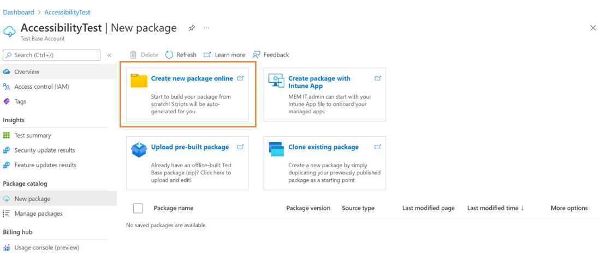
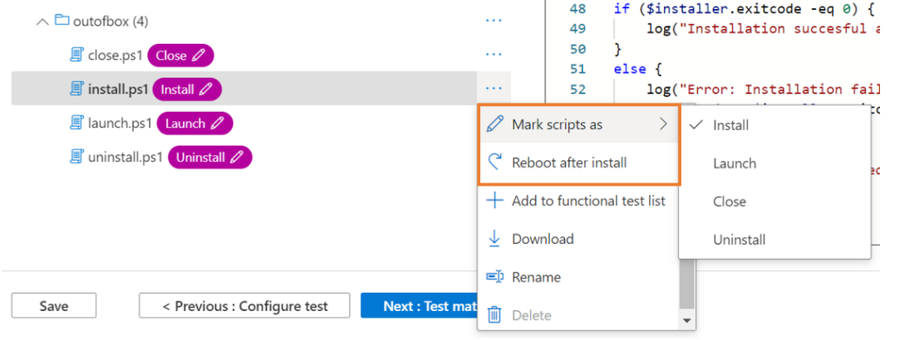
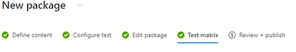
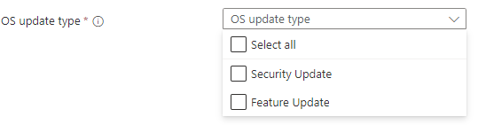
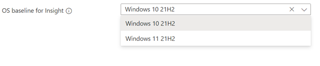
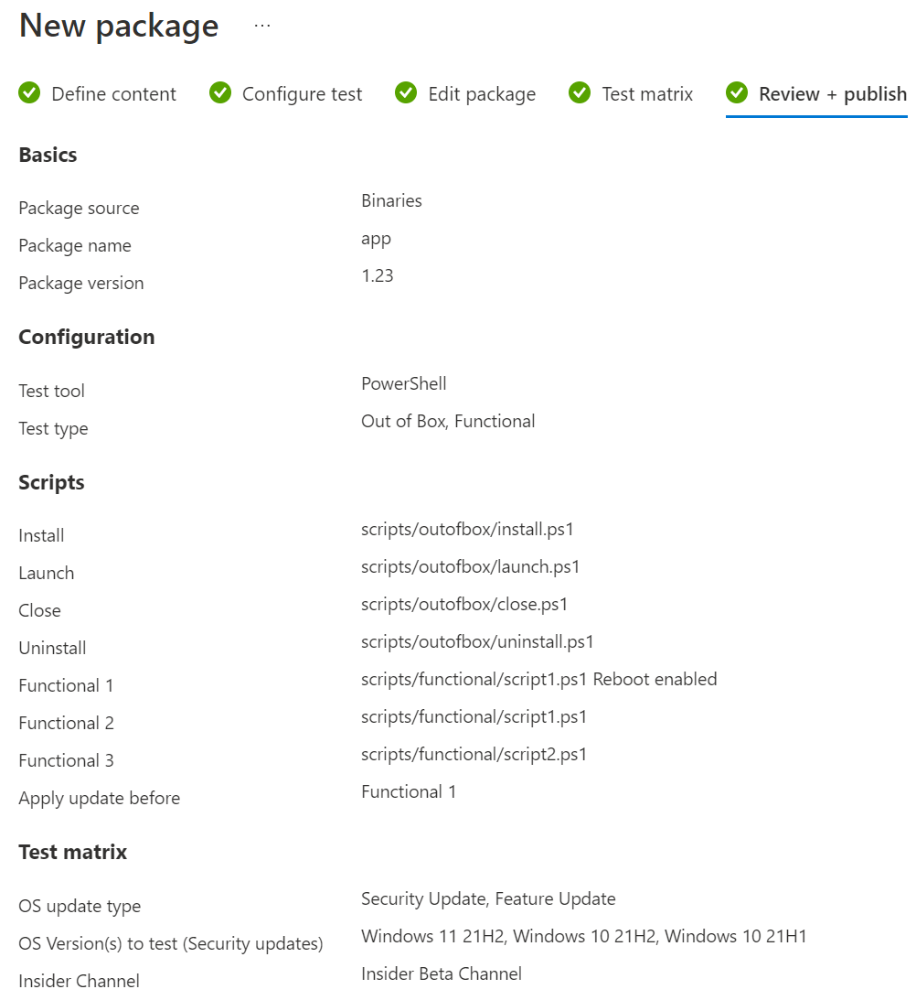
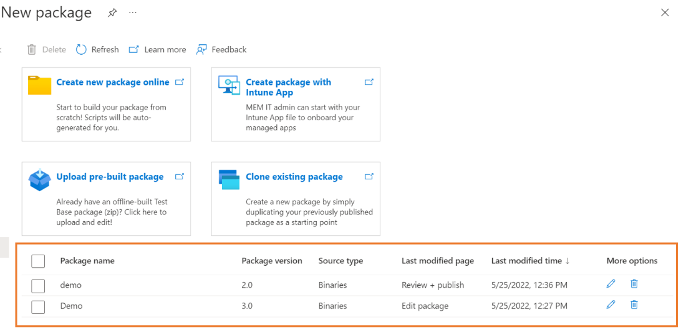

# Creating and Testing Binary Files on Test Base

[!INCLUDE [test-base-deprecation](./includes/test-base-deprecation.md)]

This section provides all the steps necessary to create a new package containing binary files, for uploading and testing on Test Base. If you already have a pre-built .zip file, you can see [Uploading pre-built Zip package](uploadApplication.md), to upload your file.

> [!IMPORTANT]
> If you don't have a **Test Base** account, you'll need to create one before proceeding, as described in [Creating a Test Base account](createAccount.md).

## Create a new package

In the [Azure portal](https://portal.azure.com/), go to the **Test Base** account for which you'll be creating and uploading your package and perform the steps that follow. 

In the left-hand menu under **Package catalog**, select the **New package**. Then click the first card **‘Create new package online'** to build your package online within 5 steps!

> [!div class="mx-imgBorder"]
> 

### Step 1: Define content

1. In the **Package source** section, select Binaries (for example: .exe, .msi) in the Package source type.

   > [!div class="mx-imgBorder"]
   > 

2. Then upload your app file by clicking 'Select file' button or checking the box to use the Test Base sample template as a starting point if you don't have your file ready yet.

   > [!div class="mx-imgBorder"]
   > 

3. Type in your package's name and version in the **Basic information** section.

   > [!NOTE]
   > The combination of package name and version must be unique within your Test Base account.

   > [!div class="mx-imgBorder"]
   > 

4. After all the requested information is specified, you can proceed to the next phase by clicking the **Next: Configuration test** button.

   > [!div class="mx-imgBorder"]
   > 

### Step 2: Configure test

1. Select the **Type of test**. There are two test types supported:
   - An **Out of Box (OOB) test** performs an install, launch, close, and uninstall of your package. After the install, the launch-close routine is repeated 30 times before a single uninstall is run. The OOB test provides you with standardized telemetry on your package to compare across Windows builds.
   - A **Functional test** would execute your uploaded test script(s) on your package. The scripts are run in the sequence you specified and a failure in a particular script will stop subsequent scripts from executing.
   - A **Flown Driven test** allows you to arrange your test scripts with enhanced flow control. To help you comprehensively validate the impact of an in-place Windows upgrade, you can use flow driven tests to execute your tests on both the baseline OS and target OS with a side-by-side test result comparison.

   > [!NOTE]
   > Users can also select the pre-installed Microsoft apps option. This option will install Microsft apps, like Office, before the user application is installed.
   >
   > Out of Box test is optional now.

   > [!div class="mx-imgBorder"]
   > 

2. Once all required info is filled out, you can move to step 3 by clicking the Next button at the bottom. A notification will pop up when the test scripts are generated successfully.

   > [!div class="mx-imgBorder"]
   > 

### Step 3: Edit package

1. In the Edit package tab, you can
   - Check your package folder and file structure in **Package Preview**.
   - Edit your scripts online with the **PowerShell code editor**.

   > [!NOTE]
   > Some sample scripts have been generated for your reference. You need to review each script carefully and replace the command and process name with your own. 

   > [!div class="mx-imgBorder"]
   > 

2. In the **Package Preview**, per your need, you can
   - Create a new folder.
   - Create a new script.
   - Upload a new file.

   > [!div class="mx-imgBorder"]
   > 

3. Under **scripts folder**, sample scripts and script tags have been created for you. All script tags are editable, you can reassign them to reference your script paths.
   - If the **Out of Box test** is selected in step 2, you can see the **outofbox** folder under the scripts folder. You also have the option to add **‘Reboot after install'** tag for the Install script.

   > [!div class="mx-imgBorder"]
   > 

   > [!NOTE]
   > Install, Launch and Close script tags are mandatory for the OOB test type. Reassigning tags ensures that the correct script path will be used when testing is initiated.

   > [!div class="mx-imgBorder"]
   > 

   - If the **Functional test** is selected in step 2, you can see the **functional** folder under the scripts folder. More functional test scripts can be added using the **'Add to functional test list'** button. You need a minimum of one (1) script and can add up to eight (8) functional test scripts.

   > [!div class="mx-imgBorder"]
   > 

   > [!NOTE]
   > At least 1 functional script tag is mandatory for the functional test type.

   To add more Functional scripts, you can click the **'Add to functional test list'**. Then the action panel will pop up, you can:
   - Reorder the script paths by dragging with the left ellipse buttons. The functional scripts run in the sequence they're listed. A failure in a particular script stops subsequent scripts from executing.
   - Set 'Restart after execution' for multiple scripts.
   - Apply update before on specific script path. This is for users who wish to perform functional tests to indicate when the Windows Update patch should be applied in the sequence of executing their functional test scripts.

   > [!div class="mx-imgBorder"]
   > 

4. Once all required info is filled out, you can move to step 4 by clicking the Next button at the bottom.

### Step 4: Set test matrix

The Test matrix tab is for you to indicate the specific Windows update program or Windows product that you may want your test to execute against.

   > [!div class="mx-imgBorder"]
   > 

1. Choose **OS update type**
   - Test Base provides scheduled testing to make sure your applications performance won’t break by the latest Windows updates. 

   > [!div class="mx-imgBorder"]
   > 

   - There are 2 available options:
   
     - The **Security updates** enable your package to be tested against incremental churns of Windows monthly security updates.
     - The **Feature updates** enable your package to be tested against new features in the latest Windows Insider Preview Builds from the Windows Insider Program.

2. Configure **Security Update**
   To set up for security updates, you must specify the Windows product(s) you want to test against from the dropdown list of "OS versions to test".

   > [!div class="mx-imgBorder"]
   > 

   - Your selection will register your application for automatic test runs against the B release of Windows monthly quality updates of selected product(s).
     - For customers who have Default Access customers on Test Base, their applications are validated against the final release version of the B release security              updates, starting from Patch Tuesday.
     - For customers who have Full Access customers on Test Base, their applications are validated against the pre-release versions of the B release security                  updates, starting up to 3-weeks before prior to Patch Tuesday. This allows time for the Full Access customers time to take proactive steps in resolving any            issues found during testing before in advance of the final release on Patch Tuesday.  
       (How to become a Full Access customer? Please refer to [Request to change access level | Microsoft Docs](accesslevel.md))

3. Configure **Feature Update**
   - To set up for feature updates, you must specify the target product and its preview channel from "Insider Channel" dropdown list.

   > [!div class="mx-imgBorder"]
   > 

   - Your selection will register your application for automatic test runs against the latest feature updates of your selected product channel and all future new            updates in the latest Windows Insider Preview Builds of your selection.

   - You may also set your current OS in "OS baseline for Insight". We would provide you more test insights by regression analysis of your as-is OS environment and the      latest target OS.

   > [!div class="mx-imgBorder"]
   > 

### Step 5: Review + publish

1. Review all the information for correctness and accuracy of your draft package. To make corrections, you can navigate back to early steps where you specified the settings as needed.

   > [!div class="mx-imgBorder"]
   > 

2. You can also check the notification box to receive the email notification of your package for the validation run completion notice.

   > [!div class="mx-imgBorder"]
   > 

3. When you're done finalizing the input data configuration, click **Publish** to upload your package to Test Base.  The notification that follows displays when the package is successfully published and has entered the Verification process.  

   > [!NOTE]
   > The package must be verified before it is accepted for future tests. The Verification can take up to 24 hours, as it includes running the package in an actual test environment. 

   > [!div class="mx-imgBorder"]
   > 

4. You'll be redirected to the **Manage Packages** page to check the progress of your newly uploaded package.

   > [!div class="mx-imgBorder"]
   > 

   > [!NOTE]
   > When the Verification process is complete, the Verification status will change to Accepted. At this point, no further actions are required. Your package will be acquired automatically for execution whenever your configured operating systems have new updates available. If the Verification process fails, your package is not ready for testing. Please check the logs and assess whether any errors occurred. You may also need to check your package configuration settings for potential issues.

### Resume creation of a saved draft package

If you have any previous draft packages, you can view the list of your saved draft packages on the **New package** page. By clicking the **'Edit'** pencil icon, you can resume editing the package you selected from where you left off, as described in the **Status** column.

> [!div class="mx-imgBorder"]
> 

> [!NOTE]
> The dashboard only shows the saved draft packages. To view published packages, you will need to go to the Manage Packages page.
