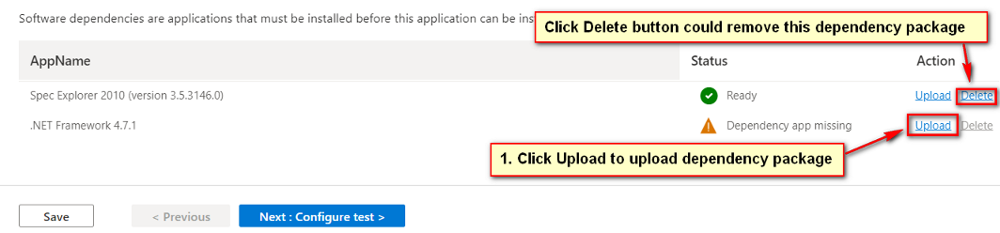
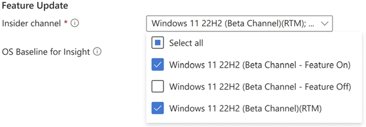

# Test your Intune application on Test Base 
  > [!Note] 
  > This guide will guide you to upload your intunewin format package to Test Base. For general Test
Base package upload instruction, please refer to this [doc](https://microsoft.sharepoint.com/:w:/t/AzureSUVPCoreTeam/EeHQIT3qA0FKqBDWI5TzmzgBiH2Syz39o5VbY2kdugMn4A?e=Rk1KD9).

## Intunewin Upload Flow
As an effort to further enable commercial utilization, Test Base started to support intunewin format for IT Pros who manages apps for their apps within Intune as the standard onboarding package format. The intunewin upload flow provides the experience for IT Pros to reuse their intunewin format packages, which contain the apps they deployed to their end devices via Intune to onboarding their apps and test configurations quickly to Test Base. 

**Prerequisites**
  - Currently Test Base support synchronizing via the same subscription between Intune account and Test Base account (you don’t have to have an Intune account to upload your intunewin package however if you’d like to synchronize the Intune configuration for the intunewin file’s corresponding apps from Intune, you'll need to make sure your Intune account is created under the same subscription as your Test Base account).
  - Intunewin packages to be uploaded. 

**Intunwin file Upload Flow (synchronized with Intune account)**  
As an Intune customer who has an Intune package, which has been already onboarded to Intune portal. Customer can onboard the intunewin package (containing an app with/without dependencies of pre-install apps managed in Intune) to Test Base service. (via Intune account, which has proper permission to sync the Intune app info).

**Prep Step**
1. Login with your Test Base account.
2. Prepare your intunewin package.
3. Start uploading by click on the "Create package with Intune App"  link as below.
    
    > [!div class="mx-imgBorder"] 
    >  

**Step 1: Define Content**
1. Upload the intunewin package you choose.
2. Grant token by clicking on below link "Grant token and select app".
3. After automatic sync with your Intune account, you'll be listed with app your applications under your Intune account. Choose the app corresponding to your uploaded intunewin package then click "Select".
    
    > [!div class="mx-imgBorder"] 
    >  

5. On the Step 1 page, you'll see dependencies listed under the Dependency section, you can either choose to upload the dependency’s install file or remove it from this step (if you plan to manage the dependency in Step 3 by self provide the related binaries). Selected dependencies in this section will be pre-installed the same way as it will be installed via Intune.
    
    > [!div class="mx-imgBorder"] 
    >  

**Step 2: Configure Test**
1. Select powershell.
2. Select Out of Box.

**Step 3: Edit Package**
1. Check the scripts auto-generated are tagged correctly.
2. If you synchronized the configuration from Intune successfully, you should be able to see the install/uninstall commands of the test app have been added in the install/uninstall scripts, the commands of the dependency **which has been uploaded** should also be inserted in the package explorer tree for review.
3. Check the test app binaries are moved under **bin** folder.
4. Check the dependency binaries **which has been uploaded** put under the **guid** folder.
5. You can edit the scripts as needed and save.
    > [!Note] 
    > If the dependency package has not been uploaded, Test Base will not generate install/uninstall commands for it.  

**Step 4. Set test matrix**

The Test matrix tab is for you to indicate the specific Windows update program or Windows product that you may want your test to execute against.

   > [!div class="mx-imgBorder"]
   > 

1. Choose **OS update type**
   - Test Base provides scheduled testing to make sure your applications performance won’t break by the latest Windows updates. 

   > [!div class="mx-imgBorder"]
   > 

   - There are 2 available options:
   
     - The **Security updates** enable your package to be tested against incremental churns of Windows monthly security updates.
     - The **Feature updates** enable your package to be tested against new features in the latest Windows Insider Preview Builds from the Windows Insider Program.

2. Configure **Security Update**
   To set up for security updates, you must specify the Windows product(s) you want to test against from the dropdown list of "OS versions to test".

   > [!div class="mx-imgBorder"]
   > 

   - Your selection will register your application for automatic test runs against the B release of Windows monthly quality updates of selected product(s).
     - For customers who have Default Access customers on Test Base, their applications are validated against the final release version of the B release security              updates, starting from Patch Tuesday.
     - For customers who have Full Access customers on Test Base, their applications are validated against the pre-release versions of the B release security                  updates, starting up to 3-weeks before prior to Patch Tuesday. This allows time for the Full Access customers time to take proactive steps in resolving any            issues found during testing before in advance of the final release on Patch Tuesday.  
       (How to become a Full Access customer? Please refer to [Request to change access level | Microsoft Docs](accesslevel.md))

3. Configure **Feature Update**
   - To set up for feature updates, you must specify the target product and it’s preview channel from "Insider Channel" dropdown list.

   > [!div class="mx-imgBorder"]
   > 

   - Your selection will register your application for automatic test runs against the latest feature updates of your selected product channel and all future new            updates in the latest Windows Insider Preview Builds of your selection.

   - You may also set your current OS in "OS baseline for Insight". We would provide you more test insights by regression analysis of your as-is OS environment and the      latest target OS.

   > [!div class="mx-imgBorder"]
   >   

**Step 5: Review + Publish**  
Review the configuration after which the package could be published.  

**Intunwin file Upload Flow (unable to synchronize with Intune account)**  
As a Test Base customer who has a standalone intunewin package. Customer can onboard the intunewin package (containing an app with/without dependencies of pre-install apps managed in Intune) without needing to get permission granted against Intune account to finish the onboarding process.

**Prep Step**
1. Login with your Test Base account.
2. Prepare your intunewin package.
3. Start uploading by click on the "Create package with Intune App" link as below.
    
    > [!div class="mx-imgBorder"] 
    >  

**Step 1: Define Content**
1. Upload the intunewin package.
2. Specify all information as per your preference.

**Step 2: Configure Test**
1. Select powershell.
2. Select Out of Box.

**Step 3: Edit Package**
1. Check the scripts are tagged correctly.
2. As no install/uninstall commands are synchronized from corresponding Intune account, you'll need to provide all the scripts (install/uninstall/launch/close) by yourself.
3. Check the test app binaries are moved under bin folder.
4. You can edit the scripts as needed and save.

**Step 4: Test Matrix**
1. No default OS version will be pre-selected.
2. Users are allowed to make their own selection on the OSes to be scheduled.

**Step 5: Review + Publish**  
Review the configuration after which the package could be published.

