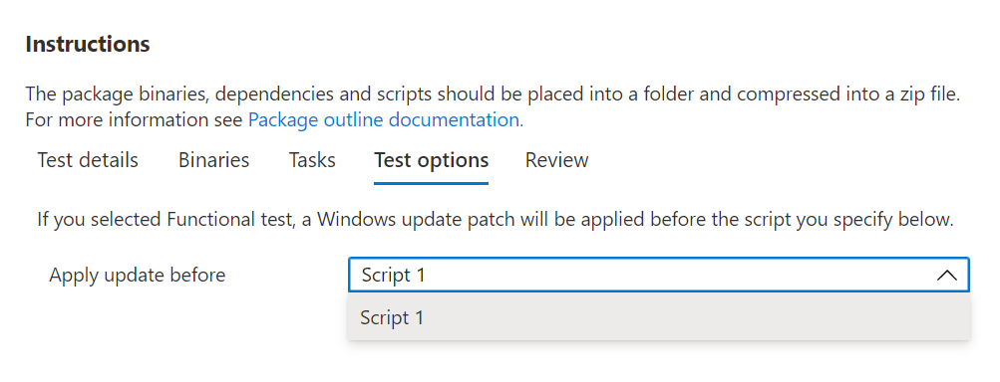

# Step 5: Choose your test options. 

The ```Test Options``` tab is for users who wish to perform functional tests to indicate when the Windows Update patch should be applied in the sequence of executing their functional test scripts.



Select _**Review**_ to navigate to the next tab and review your selected test options.

## Next steps

Details of the nest step can be seen in the next article via the link below:
> [!div class="nextstepaction"]
> [Next step](review.md)
