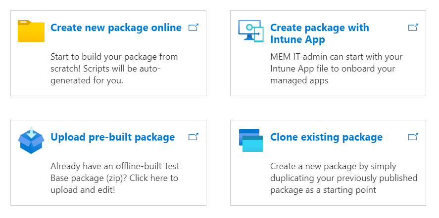

# Test your application on Test Base

In this section, you'll learn how to create packages with different types of applications for uploading and testing on **Test Base**. Application types consist of the following values:

   > [!div class="mx-imgBorder"]
   > 

   - **Test Binaries files**

      See [Creating and Testing Binary Files on Test Base](testapplication.md) to prepare a package with a Binary application file (that is, .exe, .msi) for uploading and testing.

   - **Intunewin app**

      See [Test your Intune app on Test Base](testintuneapplication.md) to prepare a package with an Intune application file (.intunewin) for uploading and testing.

   - **Pre-built Zip package**

      See [Uploading pre-built zip package](uploadapplication.md) if you already have an offline built package in .zip format.

   - **Clone existing package**

      See [Clone an existing package](clonepackage.md) to create a new package by duplicating your previously published package.

