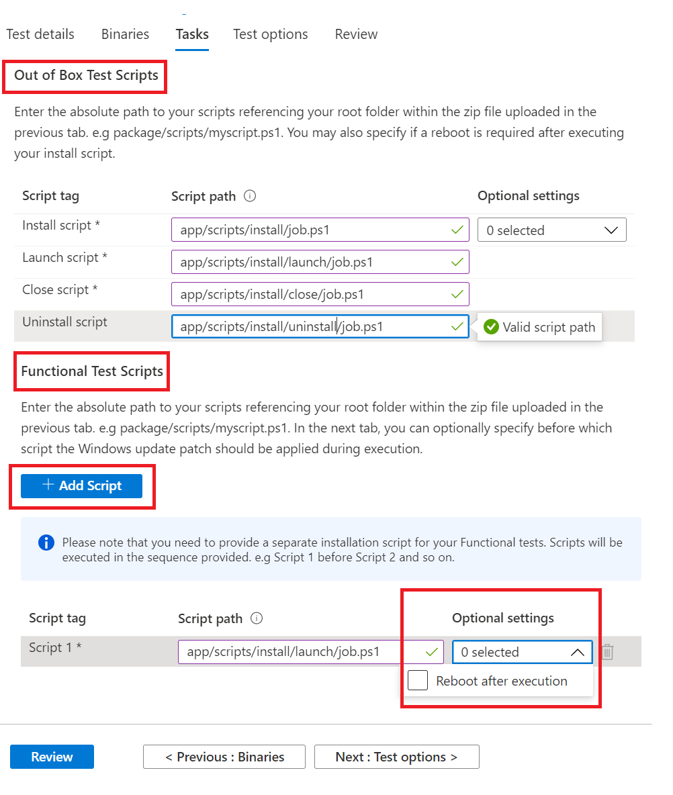

# Step 4: The Tasks Tab

On the Tasks tab, you are expected to provide the paths to your test scripts which are in the zip folder you uploaded under the Binaries tab.

  - **Out of Box Test Scripts:** Type in the relative paths to your install, launch, close and uninstall scripts. You also have the option to select additional settings for the install script.
  - **Functional Test Scripts:** Type in the relative path to each functional test script uploaded. Additional functional test scripts can be added using the ```Add Script``` button. You need a minimum of one (1) script and can add up to eight (8) functional test scripts. 
  
    The scripts are run in upload sequence and a failure in a particular script will stop subsequent scripts from executing.
    You also have the option of selecting additional settings for each script provided.



Sample of how to provide the relative path on a folder structure is below:

_**Zip_file_uploaded**_
~~~
├── file1.exe

├── ScriptX.ps1

├── folder1

│   ├── file3.exe

│   ├── script.ps1
~~~
  - **ScriptX.ps1** would have. _ScriptX.ps1_ as the relative path.
  - **Script.ps1** would have _folder1/script.ps1_ as the relative path.


## Next steps

View details of the Test Options tab in the next article 
> [!div class="nextstepaction"]
> [Next step](testoptions.md)
