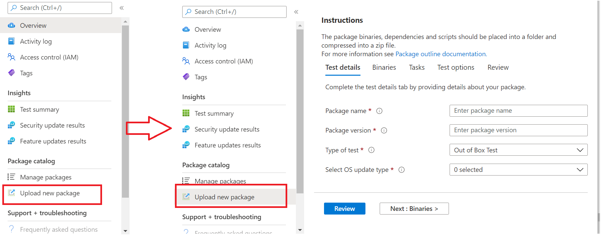
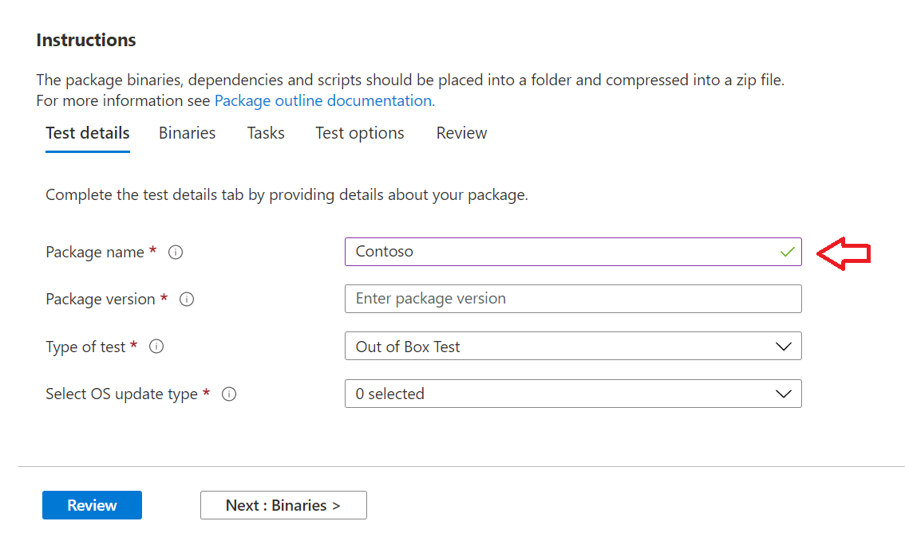
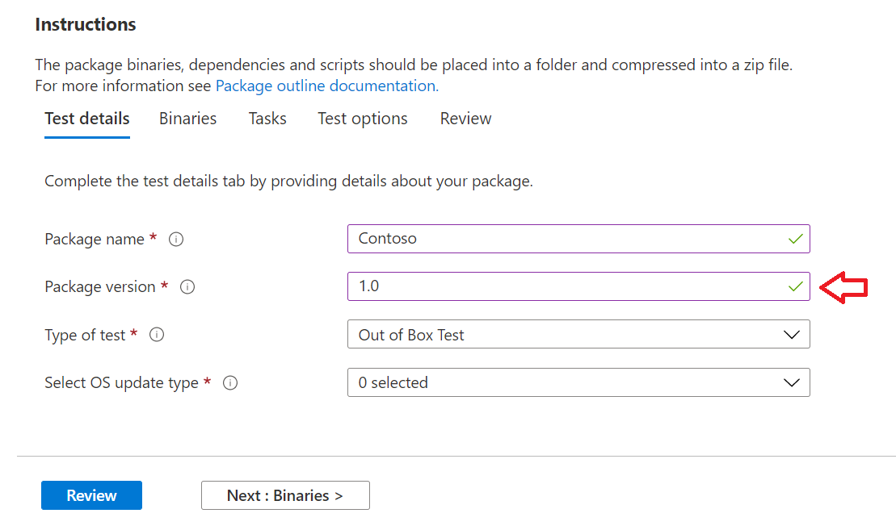
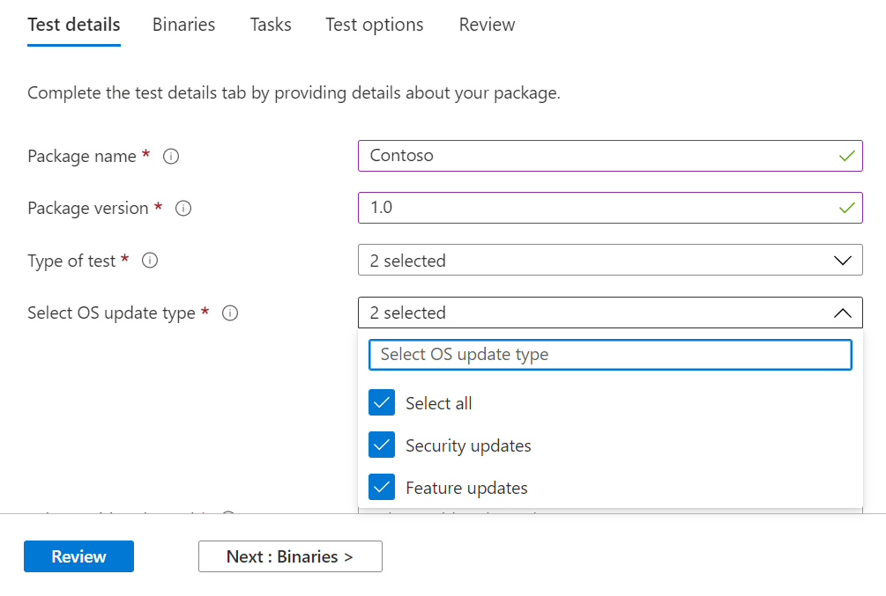
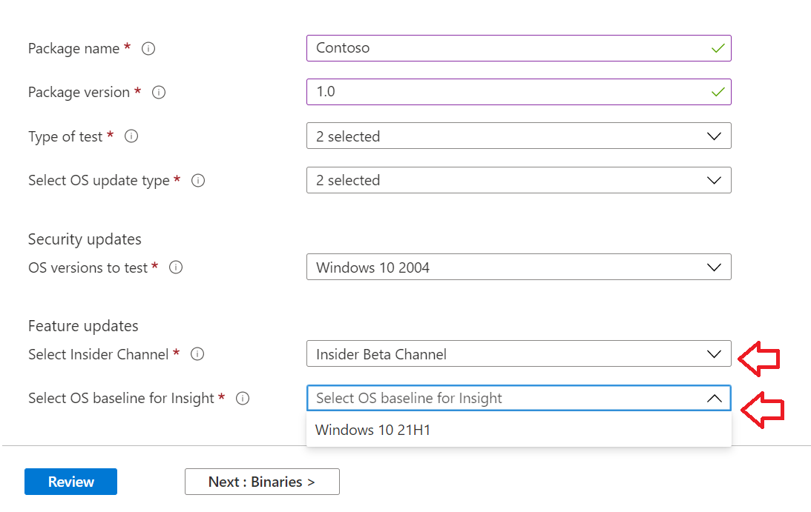

# Step 2: Uploading a Package

On the Test Base portal page, navigate to the ‘Upload new package option on the left navigation bar as shown below:


Once there, follow the steps below to upload a new package.

## Enter details for your package

On the Test details tab, type in your package's name, version and other details as requested. 

**Out-of-Box** and **Functional testing** can be done via this dashboard.

The steps below provides a guide on how to fill out your package details:

1.	**Enter the name to be given your package in the ```“Package name``` field.**

> [!Note]  
> The package name and version combination entered must be unique within your organization. This is validated by the checkmark as shown below.
  
  - If you choose to re-use an package's name, then the version number must be unique (i.e. never been used with an package bearing that particular name).
  - If the combination of the package name + version does not pass the uniqueness check, you will see an error message which reads, *“Package with this package version already exists”*. 



2. **Enter a version in the “Package version” field.**



3.	**Select the type of test you want to run on this package**

    An **Out-of-Box (OOB)** test performs an *install*, *launch*, *close* and *uninstall* of your package. After the install, the launch-close routine is repeated 30 times before a single uninstall is run. 
    
    This OOB test provides you with standardized telemetry on your package to compare across Windows builds.

    A **Functional test** would execute your uploaded test script(s) on your package. The scripts are run in upload sequence and a failure in a particular script will stop subsequent scripts from executing.

> [!Note]
> **All** scripts run for 80 minutes at the most. 
    
4.	**Select the OS update type**

   - The ‘Security updates’ enables your package to be tested against incremental churns of Windows pre-release monthly security updates. 
   - The ‘Feature updates’ enables your package to be tested against Windows pre-release bi-annual feature updates builds from the Windows Insider Program.
<!---
Change to the correct picture
-->


5.	**Select the OS version(s) for Security update tests.**

In the multi-select dropdown, select the OS version(s) of Windows your package will be installed on. 

  - To test your package against Windows Client OSes only, select the applicable Windows 11 OS versions from the menu list.
  - To test your package against Windows Server OSes only, select the applicable Windows Server OS versions from the menu list.
  - To test your package against Windows Client and Server OSes, select all applicable OSes from the menu list. 

> [!Note]
> If you select to test your package against both Server and Client OSes, please make sure that the package is compatible and can run on both OSes


<!---
Change to the correct picture
-->
6.	**Select options for Feature update tests:**

  - On the option to “Select Insider Channel”, select the ```Windows Insider Program Channel``` as the build which your packages should be tested against.
  
    We currently use builds flighted in the Insider Beta Channel.

  - On the option to “Select OS baseline for Insight”, select the Windows OS version to be used as a baseline in comparing your test results. 

> [!Note]
> We DO NOT support Feature update testing for Server OSes at this time
<!---
Note to actual note format for markdown
-->
<!---
Change to the correct picture
-->


7.	A completed Test details page should look like this: 


## Next steps

Our next article covers Uploading your Binaries to our serivce.
> [!div class="nextstepaction"]
> [Next step](binaries.md)

<!---
Add button for next page
-->

