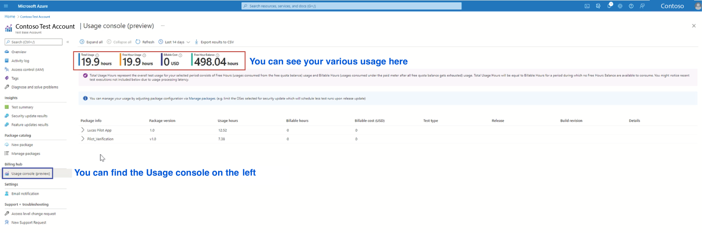
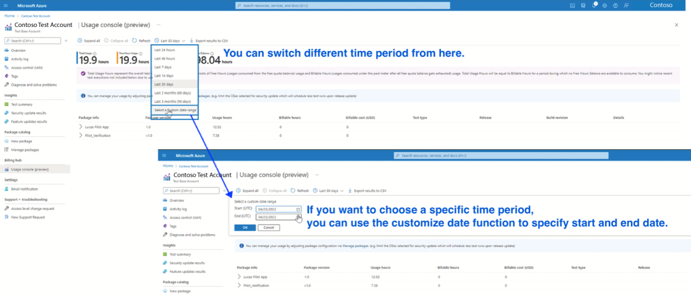
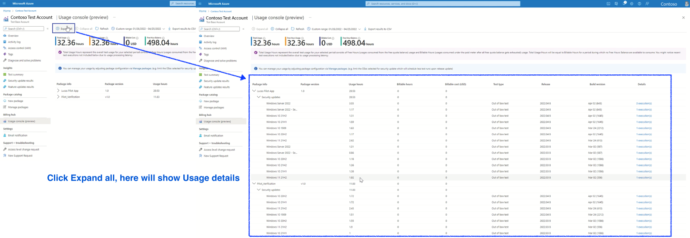
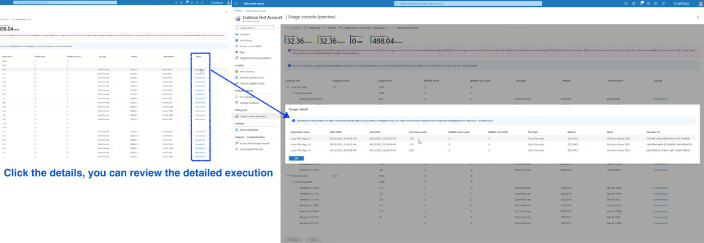
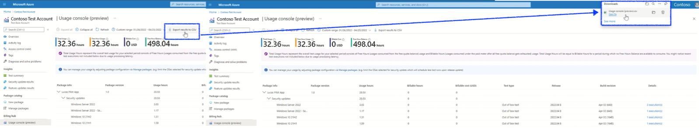

# Understand your usage cost

[!INCLUDE [test-base-deprecation](./includes/test-base-deprecation.md)]

> [!NOTE]
> Test Base now offers the billing hub feature to help users understand their test usage and cost.

## Usage console under Billing hub

By access the new “Usage console” under the "Billing hub" section from portal, user will be able to review their Total usage for the selected period, Free hour balance and the Billable cost based on the usage.

**Prep Step**

1. Login with your Test Base account.
2. In the navigation bar on the left, click Usage console under Billing Hub

> [!div class="mx-imgBorder"]
> 

Users can switch between different time periods or specify customized start end date up to three months from the current date.

> [!div class="mx-imgBorder"]
> 

Usage details by package and test type can be further reviewed in the lower section after you click on the "Expand all". There normally will be one or more test executions for a particular package scheduled for a specific test type on the target platform.

> [!div class="mx-imgBorder"]
> 

Clicking on the "Detail" column will pop up the detailed execution records for all the executions including the execution ID, usage hour breakdown by free hour portion and paid hour portion.

> [!div class="mx-imgBorder"]
> 

In other, Export function is provided to download the detailed usage report for your own analysis or reporting purposes.

> [!div class="mx-imgBorder"]
> 

> [!NOTE]
> Please be remind that usage console currently shows all test usage records at subscription level. You might notice test activities from other test accounts if you have more than one Test Base account recreated under the subscription.
