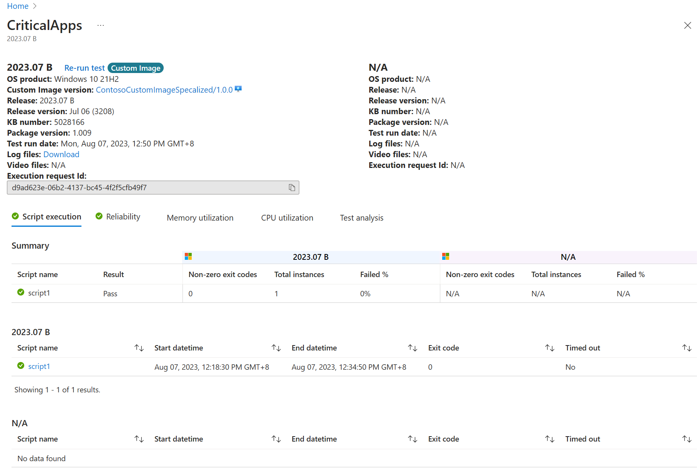

# Validate apps against a custom image

[!INCLUDE [test-base-deprecation](./includes/test-base-deprecation.md)]

> [!NOTE]
> This guide will show you how to onboard your own Windows image to Test Base as a baseline for security update or in-place upgrade validation.

## Custom Image
Many enterprises' IT departments have customized Windows builds which contain their tier 0 applications, configurations, and settings. Those images are commonly used for classic image-based deployment for new PCs or Windows updates.
Test Base supports IT Pros, allowing them to share their custom image directly as a baseline to transfer the validation process to the cloud testing solution where the latest Windows updates can be deployed to their own image just as how they validate in their own environment to gain additional app confidence for monthly Windows updates or major Windows upgrade (e.g. Windows 11 deployment pre-validation).
To set up your own image-based tests, please follow below guidance:
* [Prerequisites](#prerequisites)
* [Upload an image as baseline](#uploadanimageasbaseline)
* [Create an in-place upgrade test using a custom image as the baseline](#createinplaceupgrade)
* [Create a security update test using a custom image as the baseline](#createsecurityupgrade)

## Prerequisites
Users need to prepare their own images from working environments (e.g. export from Configure Manager or take snapshots from Hyper-V). Please follow below instructions to ensure the image is prepared in VHD format and compatible for Test Base usage.
[How to prepare a Windows VHD for Test Base](prepare-testbase-vhd-file.md)

## Upload an image as baseline
Users can upload images exported from their working environments to use as baseline for validation.

##### Step 1: Upload your VHD file
1. Visit the 'New image' tab from the navigation bar on the left. Click on the 'Upload VHD' link to direct to the VHD upload page.
> [!div class="mx-imgBorder"]
> 

2. Click the "Select a VHD file to upload" button.
> [!div class="mx-imgBorder"]
> 

3. Follow the instructions from the popup to select your VHD image file from local. Once selected, click 'Download' link to generate PowerShell script which would help upload the file from your local path via PowerShell.
> [!div class="mx-imgBorder"]
> 

4. Launch the PowerShell script from command line and provide the file path of the selected VHD to continue with the upload.
5. Once uploaded, refreshing the 'Upload VHD to storage blob' page will display your file in Validation/Ready mode.
> [!div class="mx-imgBorder"]
> 

##### Step 2: Create image from uploaded VHD
1. Visit the 'New image' tab under the left navigation bar
2. For the VHD section under 'Image source', select your uploaded VHD from the dropdown and make sure all the basic info for the image is correctly configured before publishing
> [!div class="mx-imgBorder"]
> 

3. Image creation might take a while to complete. Please stay on the resource deployment page until the creation process finishes.
> [!div class="mx-imgBorder"]
> 

4. Access the 'Manage image' tab under the navigation bar. The new image should be under the 'Validation in progress' status with other existing images shown as below.
> [!div class="mx-imgBorder"]
> 

> [!NOTE]
> The uploaded VHD files will be automatically deleted in 14 days in accordance to Microsoft's data retention policy. You may upload up to 10 custom images due to storage limitations.

## Create an in-place upgrade test using a custom image as the baseline
Users can create an in-place upgrade test by choosing an existing custom image as their baseline, allowing the validation to be based on their existing OS settings and configuration.

##### Step 1: Define custom image as the baseline from the 'Edit package' tab
1. Either create a new package or open an existing package to edit
2. Choose 'Flow driven' as in the 'Configure test' step and make the corresponding script changes in the 'Edit package' step.
3. Continue to the 'Test matrix' step and choose the target custom image from the dropdown list
> [!div class="mx-imgBorder"]
> 

4. Toggle on 'Pre-install security update release on baseline OS' if you would like the target security update installed before the base image gets upgraded. Otherwise, the latest available security update will be installed after the base image gets upgraded to the target OS version.
> [!div class="mx-imgBorder"]
> 

5. Review and publish the package once you have confirmed the Test matrix is properly configured with your desired custom image selected.
> [!div class="mx-imgBorder"]
> 

##### Step 2: Review the test result once your package has completed execution.
1. Under the navigation, click on the 'In-place upgrade results' tab and search for the package you created with your custom image as the baseline OS. The test results should be displayed for review.
> [!div class="mx-imgBorder"]
> 

2. Click the 'See details' link to view the package test results with your custom image as a baseline. There should be a 'Custom Image' tag next to your OS Product at the top to indicate your custom image was used as the baseline.
> [!div class="mx-imgBorder"]
> 

## Create a security update test using a custom image as the baseline
Users can create a security update test by selecting the desired custom image as the baseline from existing custom images to validation against their existing settings and configuration.

##### Step 1: Define the custom image as the baseline from the Edit package tab
1. Create a new package or open an existing package to edit
2. Choose 'Out of Box' or 'Functional' in the 'Configure test' step and make corresponding script changes in the 'Edit package' step.
3. Navigate to the 'Test matrix step', choose 'Security update' as the test type, and select the target custom image from the dropdown list of 'OS versions to test'
> [!div class="mx-imgBorder"]
> 

4. Review and publish the package once you have confirmed the Test matrix is properly configured with your desired custom image selected.
> [!div class="mx-imgBorder"]
> 

##### Step 2: Review the test results once the package has completed execution
1. Under the left navigation bar, click on the 'Security update results' tab and search for the package you created with your custom image as the baseline OS. The test results should be displayed for review.
> [!div class="mx-imgBorder"]
> 

2. Click the 'See details' link to view the package test results with your custom image as a baseline.
> [!div class="mx-imgBorder"]
> 
