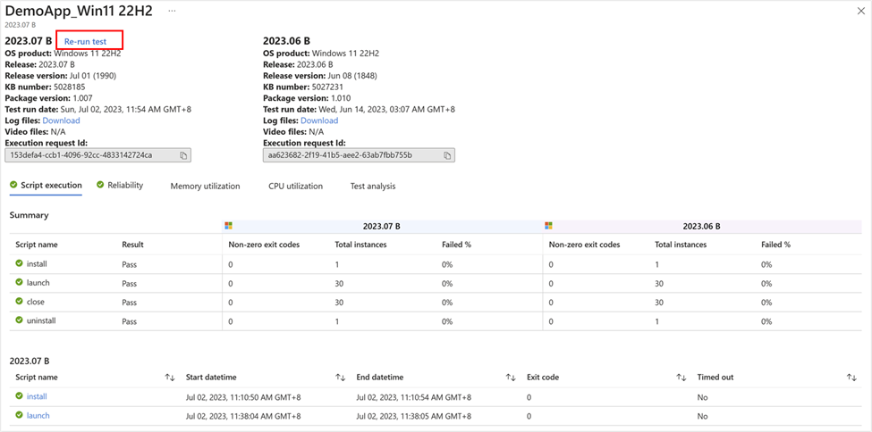

# Test against Windows monthly security updates

Test Base provides scheduled automatic tests against these fixed in a proactive way, so that you can get more assurance and have a chance to fix the issue before any damage happens, and your organization or your users can stay productive and protected.

This section will show you how to set up your own scheduled tests against Windows monthly security updates.

## Prepare your package

1.  **Define content:** Depending on your package type, you may select below instructions:
-   [Creating and Testing Binary Files on Test Base](https://learn.microsoft.com/en-us/microsoft-365/test-base/testapplication?view=o365-worldwide)
-   [Test your Intune application on Test Base](https://learn.microsoft.com/en-us/microsoft-365/test-base/testintuneapplication?view=o365-worldwide)
-   [Uploading a pre-built zip package](https://learn.microsoft.com/en-us/microsoft-365/test-base/uploadapplication?view=o365-worldwide)
1.  **Configure test:** Both *Out-of-Box* test and *Functional* test are supported. Selecting *Out-of-Box* will leverage the officially suggested test flow and automatically generate install / uninstall / launch / close test scripts for you; *Functional* tests will allow you more flexibility to set up your own test flow. You may also select both.
2.  **Edit package:** Edit test scripts and test flow as you need.

    Note: To better mimic the update process, Test Base allows you to update from previous month’s OS (or your own image, see in Custom Image documentation). If you have selected Functional tests in the Configure test step, you may further decide when you would like the Windows update to happen in your test flow.

## Sign-up for Windows monthly security updates

Scheduled tests against Windows monthly updates are set in the **Test matrix** step. By selecting **Security update**, your package would be tested against incremental churns of Windows monthly security updates.

Then, you may specify the Windows product(s) you want to test against from the dropdown list of “*OS versions to test*”.

Your selection will register your application for automatic test runs against the B release of Windows monthly security updates of selected product(s).

-   For customers who have Default Access customers on Test Base, their applications are validated against the final release version of the B release security updates, starting from Patch Tuesday.
-   For early validation before the official release, you may request to become a Full Access customer on Test Base. Your applications would be validated against the pre-release versions of the B release security updates, starting up to 3-weeks before prior to Patch Tuesday. This allows more lead time to take proactive steps in resolving any issues found during testing before in advance of the final release on Patch Tuesday. (How to become a Full Access customer? Please refer to [Request to change access level \| Microsoft Docs](https://learn.microsoft.com/en-us/microsoft-365/test-base/accesslevel?view=o365-worldwide))
-   To protect your devices from unpatched vulnerabilities, Microsoft also offers more types of update releases other than B release security updates (See in [Update release cycle for Windows clients](https://learn.microsoft.com/en-us/windows/deployment/update/release-cycle)). If you would like to test against optional non-security preview releases, please contact us via [testbasepreview@microsoft.com](mailto:testbasepreview@microsoft.com).
-   If the OS you’re looking for didn’t show up in our current supported product list, feel free to [Let us know your request](https://forms.office.com/r/ZeGihXBXHk)).

## Check test results for monthly security updates

A test run will be executed after the package passes the validation. On a monthly basis, an automated run will be scheduled on each patch Tuesday when the latest Windows security update gets released. (For Full Access customer, your tests will be triggered more frequently when there is a new release available.)

You can view the results of the test runs under the **Test summary** page by clicking the link on the package name.

You may use the release number / release version / KB number to map with the update version pushed to your organization. You will not only get the detailed script execution results with test logs but also compare regressively with previous’ month’s execution result to deep dive into any further performance risks. In case you might need to reproduce the failure and see in detail the execution process in video, you may click on **Re-run test**.

For on-demand tests against certain OS version, you may also go to Package catalog \> Manage packages \> Run on request.

