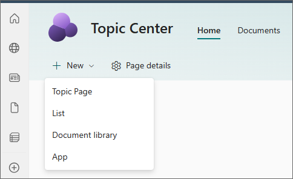
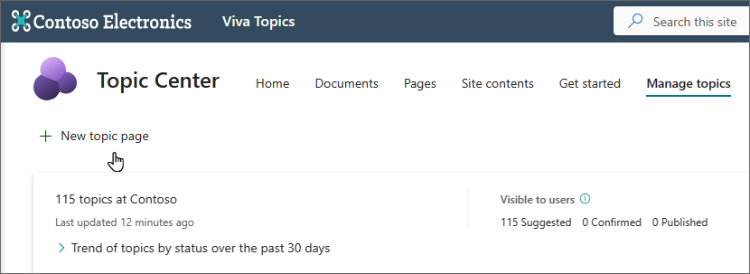
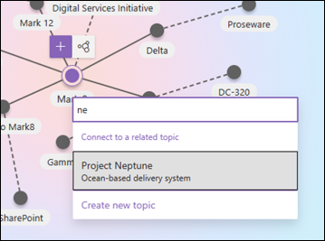
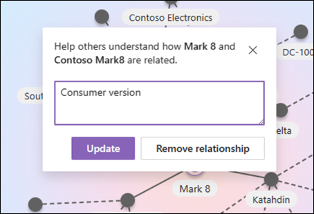
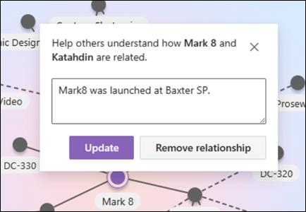
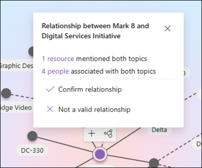
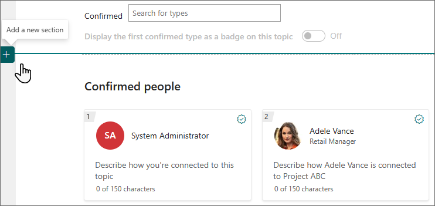

# Create a new topic in Topics

In Topics, you can create a new topic if one is not discovered through indexing or if the AI technology did not find enough evidence to establish it as a topic.

> [!NOTE]
> While information in a topic that is gathered by AI is [security trimmed](topic-experiences-security-trimming.md), note that topic description and people information in a manually created topic is visible to all users who have permissions to view the topic.

## Requirements

To create a new topic, you need to:

- Have a license that includes Topics.
- Have permissions to [**Who can create or edit topics**](./topic-experiences-user-permissions.md). Knowledge admins can give users this permission in the Topics topic permissions settings.

> [!NOTE]
> Users who have permission to manage topics in the topic center (knowledge managers) already have permissions to create and edit topics.

## To create a topic

You can create a new topic from two locations:

- Topic center home page: Any licensed user with the **Who can create or edit topics** permission (contributors) can create a new topic from the topic center by selecting the **New** menu and select **Topic Page**.

      

- **Manage topics** page: Any licensed user who has **Who can manage topics** permission (knowledge managers) can create a new topic from the **Manage topics** page in the topic center by selecting **New topic page**.

      

### To create a new topic

1. Select the option to create a new Topic Page from either your Topic Center home or Manage Topics page.

1. In the **Name** section, type the name of the new topic.

1. Choose a language for your topic, then choose **Next**.

1. In the **Alternate Names** section, type any other names that the topic might be referred to.

1. In the **Description** section, type a couple of sentences that describe the topic.

1. Choose a type for your topic from the **Types** list.

1. In the **Confirmed people** section, you can confirm a person to show them as having a connection to the topic (for example, an owner of a connected resource). Begin by typing their name or email address in the **Name or email address** box, and then select the user you want to add from the search results. You can also remove them by selecting the **Remove** icon on the user card. You can also drag the person to another place in the list.

    

1. In the **Pinned files and pages** section, you can add a file or SharePoint site page that is associated to the topic.

   

    To add a new file, select **Add**, select the SharePoint site from your Frequent or Followed sites, and then select the file from the site's document library.

    You can also use the **From a link** option to add a file or page by providing the URL.

    > [!NOTE]
    > Files and pages that you add must be located within the same Microsoft 365 tenant. If you want to add a link to an external resource in the topic, you can add it through the canvas icon in step 8.

1. The **Pinned sites** section shows sites that have information about the topic.

    You can pin site by selecting **Add** and then either searching for the site, or selecting it from your list of Frequent or Recent sites.

    

1. The **Related topics** section shows which topics are connected.

    With the topic page in edit mode, you can add, edit, or remove connections in the Related Topics web part. You can only add or modify first-degree connections because modifying a second-degree connection would directly edit a different topic page.

    You can add a connection to a different topic by selecting the Connect to a related topic button, typing the name of the related topic, and selecting it from the search results.

    

    You can then give a description of how the topics are related. Select **Update**

    

    The related topic added will display as a connected topic.

    When a connection between Topic A and Topic B is manually created on Topic Page A, the connection between these topics is represented as a suggested connection (dotted line) on Topic Page B. Representing this as a manual connection on Topic Page B would be equivalent to making a direct change to Topic Page B from Topic Page A, which is not allowed.

    To remove a related topic, select the line segment corresponding to the topic you want to remove, then select the Remove relationship icon.

    

    Dotted lines represent connections suggested by AI. Users can optionally confirm or remove these connections by selecting the line segment between two nodes.

    

1. You can also add static items to the page (such as text, images, or links) by selecting the canvas icon, which you can find below the short description. Selecting it opens the SharePoint toolbox from which you can choose the item you want to add to the page.

   

1. Select **Publish** to save your changes.

After you publish the page, the topic name, alternate name, description, and confirmed people will display to all licensed users who view the topic. Specific files, pages, and sites will only appear on the topic page if the viewer has Microsoft 365 permissions to the item.
