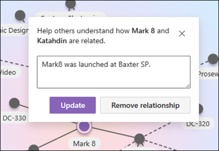
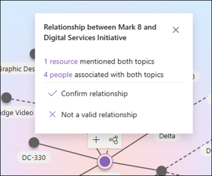
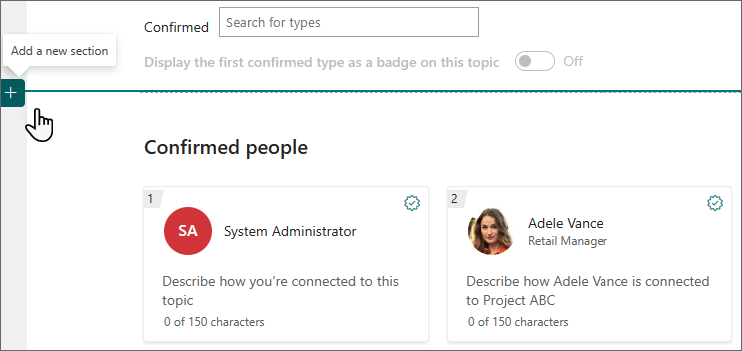

# Edit an existing topic in Topics

 

> [!VIDEO https://www.microsoft.com/videoplayer/embed/RE4LA4n]  

 

In Topics, you can edit an existing topic. You might need to do this if you want to correct or add additional information to an existing topic page.

> [!NOTE]
> While information in a topic that is gathered by AI is [security trimmed](topic-experiences-security-trimming.md), the topic description and people information that you manually add when editing an existing topic is visible to all users who have permissions to view topics.

## Requirements to edit a topic

To edit an existing topic, you need to:

- Have a license that includes Topics.
- Have permissions to [create or edit topics](./topic-experiences-user-permissions.md). Knowledge admins can give users this permission in the Topics topic permissions settings.

> [!NOTE]
> Users who have permission to manage topics in the topic center (knowledge managers) already have permissions to create and edit topics.

## How to edit a topic page

You can edit a topic by opening the topic page from a topic highlight, and then selecting the **Edit** button on the top right of the topic page. You can also edit a topic from the Topic Center.

   

### To edit a topic page

1. On the topic page, select **Edit**. This lets you make changes as needed to the topic page.

     

1. In the **Alternate Names** section, type any other names that the topic might be referred to.

      

1. In the **Description** section, type a couple of sentences that describe the topic.

    

1. In the **Pinned people** section, you can "pin" a person to show them as having a connection to the topic (for example, an owner of a connected resource). Begin by typing their name or email address in the **add a new user** box, and then select the user you want to add from the search results. You can also "unpin" them by selecting the **Remove from list** icon on the user card. You can also drag the person to another place in the list.

    

1. In the **Pinned files and pages** section, you can add or "pin" a file or SharePoint site page that is associated to the topic.

   

    To add a new file, select **Add**, select the SharePoint site from your Frequent or Followed sites, and then select the file from the site's document library.

    You can also use the **From a link** option to add a file or page by providing the URL.

    > [!NOTE]
    > Files and pages that you add must be located within the same Microsoft 365 tenant. If you want to add a link to an external resource in the topic, you can add it through the canvas icon in step 8.

1. The **Related sites** section shows sites that have information about the topic.

    

    You can add a related site by selecting **Add** and then either searching for the site, or selecting it from your list of Frequent or Recent sites.

    

1. The **Related topics** section shows connections that exist between topics.

    With the topic page in edit mode, you can add, edit, or remove connections in the Related Topics web part. You can only add or modify first-degree connections because modifying a second-degree connection would be tantamount to directly editing a different topic page, which we don't allow.

    You can add a connection to a different topic by selecting the Connect to a related topic button, typing the name of the related topic, and selecting it from the search results.

    

    You can then give a description of how the topics are related. Select **Update**

    

    The related topic added will display as a connected topic.

    When a connection between Topic A and Topic B is manually created on Topic Page A, the connection between these topics is represented as a suggested connection (dotted line) on Topic Page B. Representing this as a manual connection on Topic Page B would be equivalent to making a direct change to Topic Page B from Topic Page A, which is not allowed.

    To remove a related topic, select the line segment corresponding to the topic you want to remove, then select the Remove relationship icon.

    

    Dotted lines represent connections suggested by AI. Users can optionally confirm or remove these connections by selecting the line segment between two nodes.

    

1. You can also add static items to the page (such as text, images, or links) by selecting the canvas icon, which you can find below the short description. Selecting it opens the SharePoint toolbox from which you can choose the item you want to add to the page.

   

1. Select **Publish** or **Republish** to save your changes. **Republish** will be your available option if the topic has been published previously.
