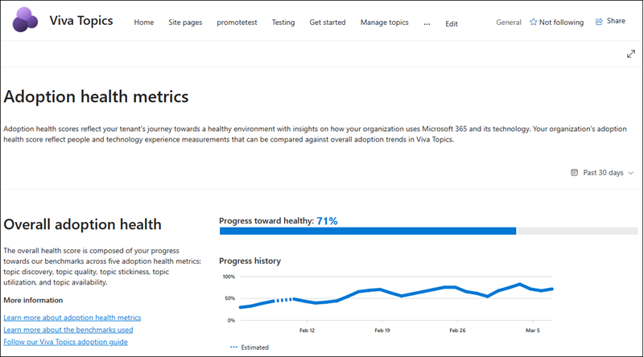
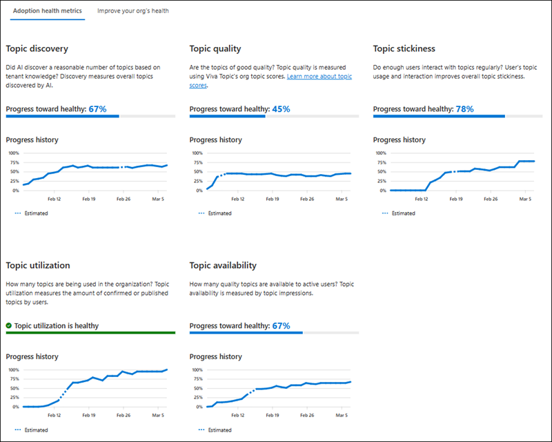
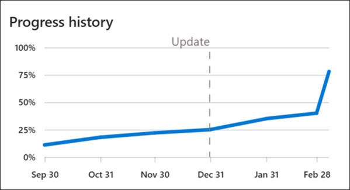
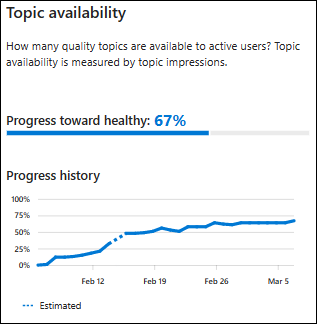
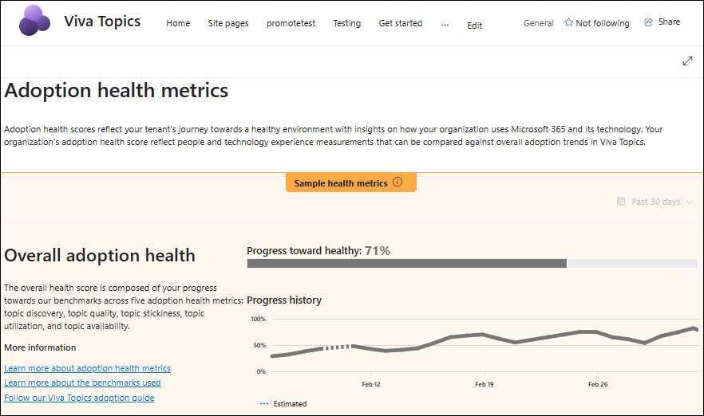
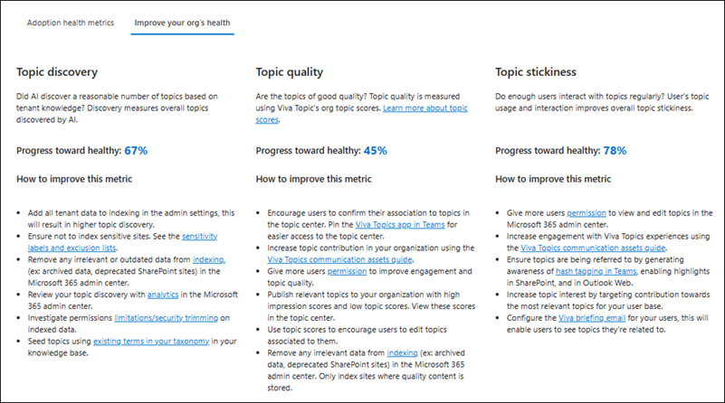

# Adoption health metrics in Topics

Adoption health metrics help you create and maintain a healthy topic tenant environment in Viva Topics by measuring key areas.

To access Topics health metrics:

1. From your topic center, select the **Analytics** tab.
2. On the **Analytics** tab, select **Adoption metrics.**

> [!NOTE]
> For Topics to collect information for adoption health metrics, topics indexing must be enabled in the [admin center](set-up-topic-experiences.md). Viewing permissions for your organization must be of at least 15 users. The more active licensed users in your organization, the more accurate and helpful your metrics will be.

## Adoption health metrics overview

The adoption health metrics section in analytics provides a look at the different adoption metrics that make up overall adoption health. Adoption health is measured based on five individual metrics:

- Topic discovery
- Topic quality
- Topic stickiness
- Topic utilization
- Topic availability

Each individual metric is considered when identifying a healthy topic environment.

The adoption health metrics include two sections for interpreting metrics: overall adoption health, and adoption health metrics.

The **Overall adoption health** section provides a general measurement of your tenant's health by combining the five individual health metrics. You can see your overall progress toward the healthy target and a progress history graph, depending on the time period you select. Depending on the age of your tenant, you can see your progress history as far back as six months.

The **Adoption health metrics** section shows your progress based on each of the five individual health metrics breaking down the different components that make up the overall adoption health metric.

Each metric is calculated independently, but they're all used collectively to determine your overall adoption health.

|Topic metric     |Value  |
|---------|---------|
|Discovery|The number of topics discovered based on the organization's tenant knowledge |
|Quality | The aggregate org topic score of all suggested, confirmed, and published topics     |
|Stickiness  | The percentage of licensed users active two months in a row who actively interact with topics in the tenant
|Utilization | The number of topics being utilized in the tenant   |
|Availability | The amount of knowledge available and discoverable to users through topics |

## Understanding healthy adoption benchmarks

Healthy adoption metrics are measured based on the size of an organization’s tenant. The metric benchmarks can change as the Viva Topics product evolves, new features become available, AI algorithms become refined, and as tenants grow. Target benchmarks for your organization may change three to four times a year as AI learns more about your organization. Changes in metric benchmarks can lead to changes in your overall health metrics. For example, where you once had 98% progress toward healthy topic discovery, you might see a change to a lower metric due to updated benchmark requirements. You'll be notified in the metrics page one week before there are new targets that affect your organization’s adoption metrics. However, at any given time, your organization’s overall adoption health depends on how well the five individual adoption metrics are doing.

To track an updating benchmark, metric graphs will include an **update** highlight in the metric's progress history.

When all the adoption health metrics reach the target of 100%, the overall adoption health will mark the 100% target indicating your organization has excellent adoption health.

## Track your healthy adoption

Your progress toward healthy is reflected by the different benchmarks for adoption health. You can track your metrics' health by noting the **Progress toward healthy** score and by the graphs that show your progress.

Progress history graphs show how well your healthy topic tenant metric is doing considering the current health benchmarks. Some progress graphs can show an **Estimated** line as part of your metrics' journey toward health. Estimated data in your graph occurs when there was an issue retrieving data for that specific time period.

### How to make sure your metrics are being measured

Your healthy adoption metrics may not be available due to current settings, such as site indexing, or there aren't enough users with topic viewing permissions. When there isn't enough information to track your health metrics, your analytics will show **Sample health metrics** or **insufficient data**.

 There are three possible states that show you if your metrics are being tracked for healthy adoption

|View state    | Description  |
|---------|---------|
|All five metrics and overall score is available|There are at least 15 topic viewers and indexing is complete. No action necessary.|
|Insufficient data | Only topic quality and discovery scores are available. Requires at least 15 topic viewers to complete metrics measuring.    |
|Sample data or No data | No metrics available. Topics are available in your environment, but indexing isn't enabled. Enable indexing to begin tracking.

## Create a healthy Viva Topics environment

Depending on the overall health of your tenant, you can see recommendations on how to improve your organization's health in the **How to improve your org's health** tab.

Recommended actions are based on your tenant's needs. Each adoption metric under the 100% target will have recommendations on how you can improve your adoption health and score.
