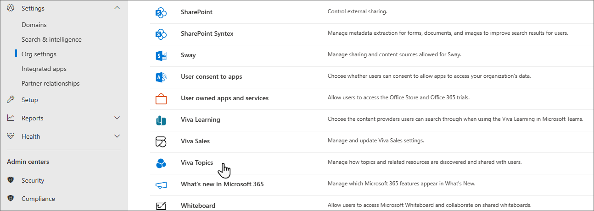
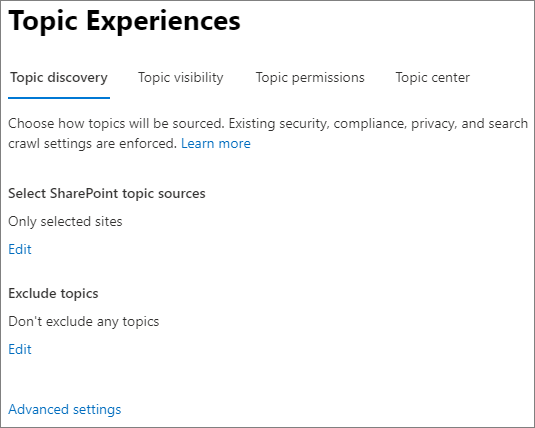

# Manage topic discovery in Topics

You can manage topic discovery settings in the [Microsoft 365 admin center](https://admin.microsoft.com). You must be a global administrator or SharePoint administrator to perform these tasks.

## To access topics management settings

1. In the Microsoft 365 admin center, select **Settings**, then **Org settings**.
2. On the **Services** tab, select **Topics**.

    

3. Select the **Topic discovery** tab. See the following sections for information about each setting.

    

## Select SharePoint topic sources

You can change the SharePoint sites in your organization that will be crawled for topics.

If you want to include or exclude a specific list of sites, you can use the following .csv template:

``` csv
Site name,URL
```

If you add sites using the site picker, they are added to the existing list of sites to include or exclude. If you upload a .csv file, it overwrites any existing list. If you have previously included or excluded specific sites, you and download the list as a .csv file, make changes, and upload the new list.

To choose sites for topic discovery

1. On the **Topic discovery** tab, under **Select SharePoint topic sources**, select **Edit**.
2. On the **Select SharePoint topic sources** page, select which SharePoint sites will be crawled as sources for your topics during discovery. This includes:
    - **All sites**: All SharePoint sites in your tenant. This captures current and future sites.
    - **All, except selected sites**: Type the names of the sites you want to exclude.  You can also upload a list of sites you want to opt out from discovery. Sites created in the future will be included as sources for topic discovery. 
    - **Only selected sites**: Type the names of the sites you want to include. You can also upload a list of sites. Sites created in the future won't be included as sources for topic discovery.
    - **No sites**: Topics won't be automatically generated or updated with SharePoint content. Existing topics remain in the topic center.

    

3. Select **Save**.

>[!NOTE]
>Encrypted files won't be used for topic discovery.

## Exclude topics by name

You can exclude topics from discovery by uploading a list using a .csv file. If you've previously excluded topics, you can download the .csv, make changes, and upload it again.

1. On the **Topic discovery** tab, under **Exclude topics**, select **Edit**.
2. Select **Exclude topics by name**.
3. If you need to create a list, download the .csv template and add the topics that you want to exclude (see *Working with the .csv template* below). When the file is ready, select **Browse** and upload the file. If there's an existing list, you can download the .csv containing the list.
4. Select **Save**.

    

> [!NOTE]
> A topic, when excluded, can take up to 24 hours to stop appearing to users in your organization.

### Working with the .csv template

You can copy the csv template below:

``` csv
Name (required),Expansion,MatchType- Exact/Partial (required)
```

In the CSV template, enter the following information about the topics you want to exclude:

- **Name**: Type the name of the topic you want to exclude. There are two ways to do this:
    - Exact match: You can exclude the exact name or acronym (for example, *Contoso* or *ATL*).
    - Partial match: You can exclude all topics that have a specific word in it.  For example, *arc* will exclude all topics with the word *arc* in it, such as *Arc circle*, *Plasma arc welding*, or *Training arc*. Note that it will not exclude topics in which the text is included as part of a word, such as *Architecture*.
- **Stands for (optional)**: If you want to exclude an acronym, type the words the acronym stands for.
- **MatchType-Exact/Partial**: Type whether the name you entered was an *exact* or *partial* match type.

    

## Exclude resources based on sensitivity labels

If you use sensitivity labels in your organization, you can exclude SharePoint sites and files that have sensitivity labels from topic discovery. This allows you to prevent these files from being listed as suggested files on a topic. Information in labeled files won't be used for AI-extracted topic names and descriptions.

This setting excludes content based on both file and site labels.

Changing this setting may cause people, alternate names, or descriptions extracted from labeled files and sites to be removed from existing topics if they occur uniquely in those locations. Some already suggested topics may be removed if they're based only on labeled content. This process may take up to two weeks once you save the setting.

This setting applies to content that is suggested by Topics and won't remove any content that has been pinned to a topic page.

You must be a Microsoft 365 global admin to configure this setting.

> [!NOTE]
> This option is only available if you have [created sensitivity labels in the Microsoft 365 compliance center](/microsoft-365/compliance/create-sensitivity-labels).

To exclude resources based on sensitivity labels

1. On the **Topic discovery** tab, select **Advanced settings**.
1. Under **Exclude resources based on sensitivity labels**, select the labels for the resources you want to exclude.
1. Select **Save**.
1. Close the advanced settings panel.

When a label is newly applied to a file, the exclusion will take effect as soon as the change is processed by Topics, usually within a day. When a label is newly applied to a site, the exclusion will take effect within in a few days depending on the number of files and pages on the site.

## Exclude people from being suggested for topics by AI

You can exclude specific people from being suggested for topics by Topics. For example, you might want to exclude executives from being suggested as people associated with topics.

You can exclude both individual users and security groups.

To exclude people from being suggested for topics by AI

1. On the **Topic discovery** tab, select **Advanced settings**.
1. Under **Exclude people from being suggested for topics by AIsuggested for topics by AI**, select the **Exclude users or groups from being suggested for topics by AI** option.
1. Type the users and groups that you want to exclude.
1. Select **Save**.
1. Close the advanced settings panel.
