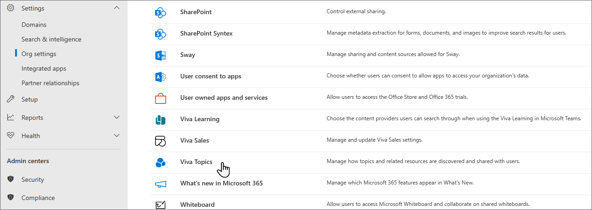
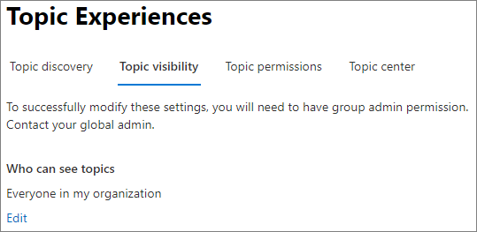
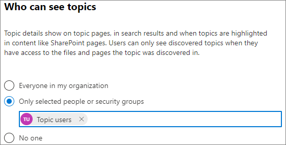
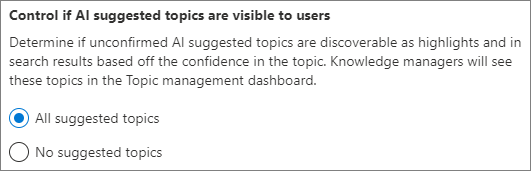

# Manage topic visibility in Topics

You can manage who can see topic highlights, topic cards, and the topic center in the [Microsoft 365 admin center](https://admin.microsoft.com). You must be a global administrator or SharePoint administrator and Groups admin to do these tasks.

## To access topics management settings

1. In the Microsoft 365 admin center, select **Settings**, then **Org settings**.
2. On the **Services** tab, choose **Topics**.

    

3. Select the **Topic visibility** tab. See the following sections for information about each setting.

    

##  Change who can see topics in your organization

You can change the users who can see topics in your organization.

1. On the **Topic visibility** tab, under **Who can see topics**, select **Edit**.
2. On the **Who can see topics** page, you choose who will have access to topic details, such as highlighted topics, topic cards, topic answers in search, and topic pages. You can select:
    - **Everyone in your organization**
    - **Only selected people or security groups**
    - **No one**

    

3. Select **Save**.  

> [!NOTE]
> While this setting allows you to select any user in your organization, only users who have Topic Experiences licenses assigned to them will be able to view topics.

## Prevent topic viewers from seeing suggested topics

You can prevent topic viewers from seeing unconfirmed AI-suggested topics in highlights and search results. This allows knowledge managers to review the topics first and confirm them before topic viewers see them.

To hide suggested topics from topic viewers

1. On the **Topic visibility** tab, select **Advanced settings**.
1. Under **Control if AI suggested topics are visible to users**, choose **No suggested topics**.
1. Select **Save**.
1. Close the advanced settings panel.

    
