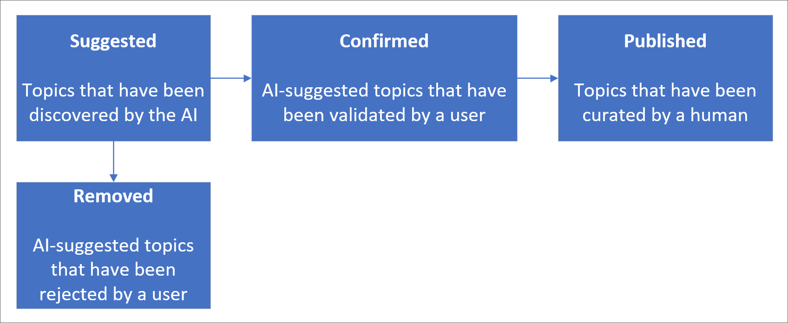
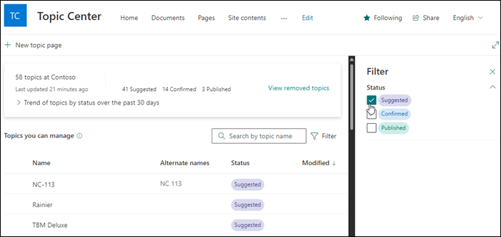
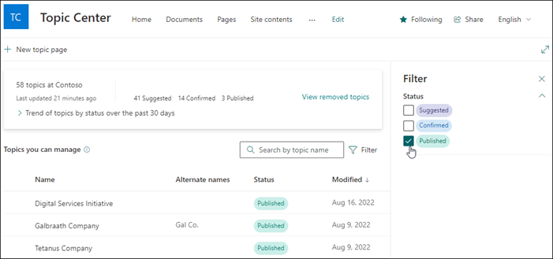
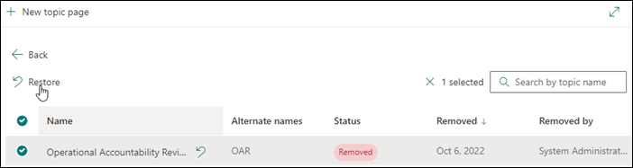

# Manage topics in the topic center in Topics

 

> [!VIDEO https://www.microsoft.com/videoplayer/embed/RE4LxDx]  

 

In the Topics topic center, a knowledge manager can view the **Manage topics** page to review topics that have been identified in the source locations as specified by your knowledge admin.  

:::image type="content" alt-text="Screenshot that shows the Topic Center." source="../media/knowledge-management/manage-topics-view.png":::

## Topic status

Knowledge managers help to guide discovered topics through the various topic lifecycle statuses: **Suggested**, **Confirmed**, **Published**, and **Removed**.

   

- **Suggested**: A topic has been identified by AI and has enough supporting resources, connections, and properties. (These are marked as a **Suggested Topic** in the UI.)

- **Confirmed**: A topic that has been discovered by AI and has been validated. Topic validation occurs when either:

   - A knowledge manager confirms a topic. A knowledge manager [confirms a topic](manage-topics.md#confirmed-topics) on the **Manage topics** page.

   - Multiple users confirm a topic. There must be a net of two positive votes received from users who voted using the feedback mechanism on the topic card. For example, if one user voted positive and one user voted negative for a particular topic, you would still need two more positive votes for the topic to be confirmed.

- **Published**: A topic that has been curated. Manual edits have been made to improve its quality, or it has been created by a user.

- **Removed**: A topic that has been rejected and will no longer be visible to viewers. A topic can be removed in any state (suggested, confirmed, or published). Topic removal occurs when either:

   - A knowledge manager removes a topic. A knowledge manager removes a topic on the **Manage topics** page.

   - Multiple users cast negative votes using the feedback mechanism on the topic card. For a topic to be removed, there must be a net of two negative votes received from users. For example, if one user voted negative and one user voted positive for a particular topic, you would still need two more negative votes for the topic to be removed.

  When a published topic is removed, the page with the curated details will need to be deleted manually through the Pages library of the topic center.

> [!NOTE]
> A topic, when removed, can take up to 24 hours to stop appearing to users in your organization.

> [!NOTE]
> On the **Manage topics** page, each knowledge manager will only be able to see topics where they have access to the underlying files and pages connected to the topic. This permission trimming will be reflected in the list of topics that appear in the manage topics page. The topic counts, however, show the total counts in the organization regardless of permissions.

## Requirements

To manage topics in the topic center, you need to:

- Have a license that includes Topics.

- Have the [**Who can manage topics**](./topic-experiences-user-permissions.md) permission. Knowledge admins can give users this permission in the Topics topic permissions settings.

You won't be able to view the **Manage topics** page in the topic center unless you've the **Who can manage topics** permission.

In the topic center, a knowledge manager can review topics that have been identified in the source locations you specified, and can either confirm or remove them. A knowledge manager can also create and publish new topic pages if one wasn't found in topic discovery, or edit existing ones if they need to be updated.

## Suggested topics

On the **Manage topics** page, topics that were discovered in your specified SharePoint source locations will be labeled as **Suggested** in the status column. If needed, a knowledge manager can review unconfirmed topics and choose to confirm or remove them.

   

To review a suggested topic:

1. On the **Manage topics** page, filter your view to see topics with a **Suggested** status, and then select the topic to open the topic page.

2. On the topic page, review the topic page, and select **Edit** if you need to make any changes to the page. Publishing any edits will update the topic's status to **Published**.

3. After reviewing the topic, go back to the **Manage topics** page. For the selected topic, you can:

   - Select the check mark to confirm the topic.

   - Select the **x** if you want to remove the topic.

    Confirmed topics will be removed from the **Suggested** list and will now display in the **Confirmed** list.

    Removed topics will be removed from the **Suggested** list and will now display a **Removed** status.

### Topic scores

Each topic that appears on the manage topics page has an **Org topic score** and a **Topic score**. The Org topic score is a measure of how complete and full quality the information associated to the topic is within the organization. The Topic score accounts for the files and resources that the current user has permissions to access. Topic scores will rise when the user adds information such as a description to a topic page, although this change isn't reflected immediately. Used in combination, these scores help knowledge managers focus their efforts on publishing high-quality topics, focusing on topics that the user has the most comprehensive access to.

>[!NOTE]
>Scores are AI-determined. In general, the more metadata a topic has, the higher the score will be. In addition, human confirmation raises topic scores.

 For example, if a user shows a high topic score for a topic, that user has the most comprehensive access to the resources of that topic and can edit and confirm the topic with full confidence. If an Org topic score is higher than a user’s topic score, the Knowledge Manager can find someone who has a high topic score to update and confirm that topic.

Knowledge managers might come across topic scores of 0 for some topics. A 0 topic score may occur when there aren't enough resources attached to a particular topic that the user can access. Knowledge managers are encouraged to either augment these low-quality topics with additional information or remove them as needed. Topics that have an Org Topic score of less than 50 aren't displayed to end users because they aren't deemed to be of sufficient quality. Keep in mind that some topics can have associated information or resources available, and still have a zero topic score due to the quality and quantity of those resources.

### Impressions

The **Impressions** column displays the number of times a topic has been shown to end users. This includes views through topic answer cards in search and through topic highlights. It doesn't reflect the click-through on these topics, but that the topic has been displayed. The **Impressions** column will show for topics in the manage topics tab.

## Confirmed topics

On the **Manage topics** page, topics that were discovered in your specified SharePoint source locations and have been confirmed by a knowledge manager or "crowdsourced" confirmed by a net two or more people (balancing negative user votes against positive user votes) through the card feedback mechanism will be listed as **Confirmed** in the status column. If needed, a user with permissions to manage topics can review confirmed topics, and choose to reject them.

To review a confirmed topic:

1. Find a topic with a **Confirmed** status in the manage topics tab, select the topic to open the topic page.

2. On the topic page, review the topic page, and select **Edit** if you need to make any changes to the page.

You can still choose to reject a confirmed topic. To reject a confirmed topic, go to the selected topic with a **Confirmed** status, and select the **x** if you want to reject the topic.

## Published topics

On the **Manage topics** page, topics that were discovered in your specified SharePoint source locations will show a **Published** status. Published topics have been edited so that specific information will always appear to whoever encounters the page. Manually created topics are listed here as well.

   

## Removed topics

On the **Manage topics** page, topics that were discovered in your specified SharePoint source locations will be listed as **Removed** in the status column. Some suggested topics can appear here based on the end user votes on topic cards in the topic center.

Removed topics can later be added back as viewable topics if needed. If you want to add a removed topic back as a viewable topic:

1. Select the topic with **Removed** status.

2. Select **Restore**.

   

## Topic count dashboard

This chart in the dashboard view lets you see the number of topics in your Topics topic center. The chart shows the topic counts per topic lifecycle status and also shows how topic counts have trended over time. Knowledge managers can visually monitor the rate at which new topics are being discovered by AI and the rate at which topics are getting confirmed or published by the knowledge manager or user actions.

Knowledge managers might see a different count of topics represented in the list of topics on the **Manage topics** page than they see in the dashboard. This is because a knowledge manager might not have access to all topics. The count presented in the dashboard view is taken before applying permission-trimming.

:::image type="content" alt-text="Screenshot of topic count dashboard." source="../media/knowledge-management/trend-of-topics-graph.png":::

## Topic Origin filter

Topic Origin indicates where the topic was sourced from, although this can change if the topic is automatically or manually merged with another topic. Engage and Taxonomy topics are called out specifically because they may lack much of the information that is associated with a typical topic.

1. Topics: These are topics that have been created or augmented by the system at some point in their lifecycle.
2. User: These are topics that have been curated by a user at some point in their lifecycle.
3. Engage: These include topics that were created in Engage since the Topics integration with Engage was turned on. These also include former legacy Engage topics that have been converted into full Topics. The converted topics will likely lack a definition, so if you want to see the list of topics that have been converted from the legacy Engage topic experience, you should select both the Viva Engage filter and the Does Not Have Description filter.
4. Taxonomy: These are topics that were created from term sets in Managed Metadata Services. They will likely lack much of the information that is associated with a typical topic.
