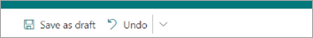

# Save a topic as a draft in Topics

You can save as a draft a new topic or a revised topic that you're working on, but not ready to publish yet.

## Save a new topic as a draft

1. From the topic center, select **New** > **Topic Page**.

   

2. As you’re editing the new topic, a draft is automatically saved.
  
   

3. When you're done with your current edits, but not ready to publish, select **Save as draft** to save your changes. Your audience won't see the edits on the page until you publish it. Only people with edit permissions to topics will be able to see the draft.

   

4. Select **Publish** to save your changes. After you publish the page, the topic name, alternate name description, and pinned people will display to users who can view the topic. Specific files, pages, and sites will only appear on the topic page, if the viewer has access to them.

## Save a revised topic as a draft

1. Open a topic page to edit it.

2. As you’re editing the topic page, a draft is automatically saved.
  
   

3. When you're done with your current edits, but not ready to publish, select **Save as draft** to save your changes and close edit mode.

   

4. When you're ready for users to see your changes, you'll see either a **Publish** or **Republish** button.

    - **Publish** is available when the topic only has AI-discovered content and you're editing for the first time. When you publish, edits you made to the topic name, alternate name, description, or pinned people will display to users who can view the topic. Specific files, pages, sites, AI-discovered alternate names, and people will still be visible only to those users who have permissions to those resources.

    - **Republish** means that you're editing a previously published topic.

## Lifecycle of a draft page

1. When you save a topic as a draft and close the page, the topic is checked in as a minor version, and becomes a "shared" draft. This means that anyone with edit permissions (or site owners) can now see the draft and edit it.

2. Drafts are automatically saved when editing.

3. Anyone with edit permissions (or site owners) will be taken directly to the saved draft when they open the topic page that is in a draft state. A message will be shown to tell you that this is a draft page and when the last draft was saved.
  
    

4. After closing edit mode, you can get back to the drafts by getting back to the topic page:
    - For users:
         - From the **Confirmed Topics** section on topics web part
         - By searching for topic and opening it from the topic answer
         - From a direct link to the topic page

    - For knowledge managers:
         - From the **Manage Topics** page
         - In the Sites Pages library
         - From a direct link to the topic page

## One person edits at a time

Two people can't edit the same page at the same time, no matter if it’s a draft or not.
If one person has a page open for editing, and another person tries to edit the page, the user is shown a message that says the page is being edited by someone else.
  
   

You can ask the person who has the page open for editing to "release" the page by saving and closing, discarding changes, or publishing. However, if the page has no activity for 5 minutes, the editing session will automatically time out and the page will be "unlocked," unless someone closes the browser within 5 minutes.
