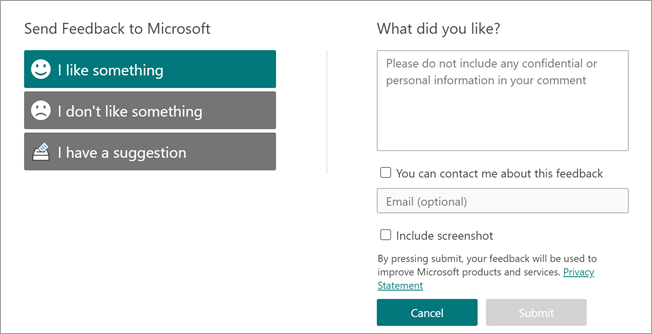

# Topics overview

Topics uses Microsoft AI technology, Microsoft 365, Microsoft Graph, Search, and other components and services to bring knowledge to your users in the Microsoft 365 apps they use everyday, starting with SharePoint modern pages, Microsoft Search, and Search in Word, PowerPoint, Outlook, and Excel.

 

> [!VIDEO https://www.microsoft.com/videoplayer/embed/RE4LhZP]  

 

Topics helps to address a key business issue in many companies — providing the information to users when they need it. For example, new employees need to learn a lot of new information quickly, and encounter terms they know nothing about when reading through company information. To learn more, the user might need to step away from what they are doing and spend valuable time searching for details, such as information about what the term is, who in the organization is a subject matter expert, and maybe sites and documents that are related to the term.

Topics uses AI to automatically search for and identify *topics* in your organization. It compiles information about them, such as a short description, people working on the topic, and sites, files, and pages that are related to it. A knowledge manager or contributor can choose to update the topic information as needed. The topics are available to your users, which means that for every instance of the topic that appears in a modern SharePoint site in news and pages, the text will be highlighted. Users can choose to select the topic to learn more about it through the topic details. Topics can also be found in SharePoint Search.  [Learn more about Topics in Microsoft 365 apps and how topics are displayed to users](where-to-find-topics.md).

## Knowledge indexing

Topics uses Microsoft AI technology to identify *topics* in your Microsoft 365 environment.

A topic is a phrase or term that is organizationally significant or important. It has a specific meaning to the organization, and has resources related to it that can help people understand what it is and find more information about it. There are lots of different types of topics that will be important to your organization. Initially, the Microsoft AI technology focuses on the following types:

- Project
- Event
- Organization
- Location
- Product
- Creative work
- Field of study

When a topic is identified and AI determines that it has enough information for it to be a suggested topic, a *topic page* displays the information that was gathered through topic indexing, such as:

- Alternate names and acronyms.
- A short description of the topic.
- People who might be knowledgeable about the topic.
- Files, pages, and sites that are related to the topic.

Your knowledge admins can choose to crawl all SharePoint sites in your tenant for topics, or to just select certain ones.

For more information, see [Topic discovery and curation](./topic-experiences-discovery-curation.md).

## Roles

When you use Topics in your Microsoft 365 environment, your users will have the following roles:

- Topic viewers: Users who can see topic highlights on SharePoint modern sites that they have at least *Read* access to, and in Microsoft Search. They can select topic highlights to see topic details in topic pages. Topic viewers can provide feedback on how useful a topic is to them.

- Contributors: Users who have rights to edit existing topics or create new ones. Knowledge admins assign contributor permissions to users through the Topics settings in the Microsoft 365 admin center. Note that you can also choose to give all topic viewers the permission to edit and create topics so that everyone can contribute to topics that they see.

- Knowledge managers: Users who guide topics through the topic lifecycle. Knowledge managers use the **Manage topics** page in the topic center to confirm AI-suggested topics, remove topics that are no longer relevant, as well as edit existing topics or create new ones, and are the only users who have access to it. Knowledge admins assign knowledge manager permissions to users through the Topics admin settings in the Microsoft 365 admin center.

- Knowledge admins: Admins set up Topics and manage it through the admin controls in the Microsoft 365 admin center. Currently, a Microsoft 365 global or SharePoint administrator can serve as a knowledge admin.

For more information, see [Topics roles](topic-experiences-roles.md).

## Topic management

Topic management is done in the **Manage topics** page in your organization's *topic center*. The topic center is created during setup and serves as your center of knowledge for your organization.

While all licensed users can see topics they're connected with in the topic center, only users with *Manage topics* permissions (knowledge managers) can view and use the **Manage topics** page.

Knowledge managers can:

- Confirm or remove topics that were discovered in your tenant.
- Create new topics manually as needed (for example, if not enough information was provided for it to be discovered through AI).
- Edit existing topic pages.

For more information, see [Manage topics in the topic center](manage-topics.md).  

## Admin controls

Admin controls in the Microsoft 365 admin center allow you to manage Topics. They allow a Microsoft 365 global or SharePoint administrator to:

- Control which users in your organization are allowed to see topics in SharePoint modern pages or in SharePoint search results.
- Control which SharePoint sites will be crawled to identify topics.
- Exclude specific topics from being found.
- Control which users can manage topics in the topic center.
- Control which users can create and edit topics.
- Control which user can view topics.

For more information about admin controls, see [assign user permissions](./plan-topic-experiences.md#user-permissions), [manage topic visibility](./manage-topic-visibility.md), and [manage topic discovery](./manage-topic-discovery.md).

## Topic curation and suggestions

AI will continually work to provide you suggestions to improve your topics as changes occur in your environment.

Users with edit or create topics permissions can make updates to topic pages directly if they want to make corrections or add additional information. They can also add new topics that AI wasn't able to identify. If there's enough information on these manually added topics, and AI is able to identify this type of topic, additional suggestions from AI might enhance these manually added topics.

Users that you allow access to see topics in their daily work might be asked if the topic was useful to them. The system looks at these responses and uses them to improve the topic highlight, and help determine what's shown on topic summaries and in topic details.

For more information, see [Topic discovery and curation](./topic-experiences-discovery-curation.md).

## Provide us feedback

At Microsoft we take feedback from our customers very seriously. The feedback you provide for Topics will be used to troubleshoot, fix bugs, enhance existing features, and develop new ones.

You can send feedback to Microsoft directly from a topic page, and from the **Manage topics** and **My topics** pages. Look for this button in the lower-right corner of the page.

   

   The button will only appear in tenants that have a correctly configured [OCPS policy](/deployoffice/admincenter/overview-cloud-policy).

On the **Send Feedback to Microsoft** page, let us know if you like something, if you don't like something, or if you have a suggestion.

   

When you submit feedback, we ask that you not include sensitive information, such as phone numbers, addresses, or highly personal stories. Instead, please provide information on the specific issue you are experiencing with Topics or your experience in general with Topics. This will help us maintain your privacy as we review and take action based on your feedback.

Thank you for taking the time to share your thoughts with us. Your perspective helps us improve our existing features and develop new ones.

## See also

Join the discussion and see the latest events in the [Topics Community](https://techcommunity.microsoft.com/t5/viva-topics/ct-p/Viva-Topics).

[Use Microsoft Search to find topics in Topics](./search.md)
