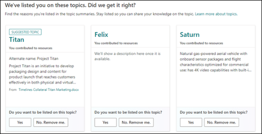

# Topic contributors: Share knowledge and expertise in Topics

[Topics](topic-experiences-overview.md) helps organizations make knowledge and expertise accessible to all employees. It’s like Wikipedia for organizations, but [artificial intelligence (AI) develops the first draft](topic-experiences-discovery-curation.md) and subject matter experts edit the information to add their unique knowledge. Topics then makes the knowledge available to colleagues and leaders at the time of need, and in the flow of their work. In this article we review how to:  

- [Showcase knowledge and expertise with Topics](#showcase-knowledge-and-expertise-with-topics)

- [Contribute to relevant topics](#contribute-to-relevant-topics)

- [Edit and create topics in Topics](#edit-and-create-topics-in-topics)

- [Get help from colleagues](#get-help-from-colleagues)

## Showcase knowledge and expertise with Topics

We all have unique expertise and insight valuable to our peers. Making our knowledge accessible to everyone in the organization has always been challenging. Topics makes it easy to share knowledge and make it accessible for colleagues when they need it.  

By sharing knowledge in Topics, contributors will:

- Broaden their organizational impact by helping colleagues benefit from their contributions 

- Get recognized as a knowledge expert in the organization  

- Make new connections and lend expertise to colleagues who share similar interests  

Sharing knowledge can help peers within the organization spend less time searching for or recreating information, and give time back to innovate more, learn more effectively, make better decisions, and improve how new team members get onboarded.  

Topics uses AI to help organize an organization’s knowledge into shared topics. A topic is a phrase or term that has a specific meaning to the organization. Topics have resources related to them that can provide knowledge about the topic and help people find more information and experts related to the topic. There can be many different types of important topics to an organization, including projects, products or services, materials or supplies, customers, suppliers, processes, disciplines, functions, and assets.  

The AI not only organizes knowledge into topics, it also automatically creates a suggested topic page for each. To take the knowledge base to the next level, people can easily add their tacit knowledge, provide unique insights, or generally improve the quality of the topic.  

When the context is appropriate, Topics will suggest topics to be highlighted on all modern SharePoint site pages in a tenant. The topic can also be directly referenced on the modern SharePoint site page by a page author using a hashtag. Page authors can invoke the topic picker on a modern SharePoint page by adding a hashtag and then selecting the topic they’d like to include on the page.  

When a user is curious to learn more about a topic, they can select the highlighted topic to view a **topic summary card** that provides a short description. And if they want to learn more, they can select the **Topic details** link in the summary to open the detailed topic page. Any edits made, along with appearances in the people and suggested files and pages properties of the topic, are properly attributed to the author.  

Additionally, users will also be able to find topics through Microsoft Search and Microsoft Office. Over time, Topics will be added to more places across Microsoft 365, including Teams, Viva Engage, and Outlook.  

## Contribute to relevant topics

There are multiple easy to find relevant topics in the organization to contribute towards:

1. **Topic center**: The Topic center is the center of knowledge for the organization. It highlights the topics to which a user has a connection. There are two types of connections:  

    **Suggested connections** - You will see topics listed under ***We've listed you on these topics. Did we get it right?*** These are topics in which a user’s connection to the topic has been suggested through AI based on contributions made to related files or sites. The user is asked to confirm whether they should stay listed as a related person for the topic. By responding to the confirmation request, the user is making Topics better for themselves and the organization as a whole.   

    

    **Confirmed connections** - These are topics that users have pinned on the topic page or confirmed as a suggested connection to the topic. Topics will move from the suggested to confirmed section when they confirm a suggested connection. 

      

2. **In the flow of work**: As content is read and stored in Microsoft 365, topics will be highlighted inline. When hovering over the topic name, more information will be shown on a topic card. Certain prompts can appear to provide feedback on topic cards and the user can then select the topic page and select the edit button on the top right of the topic page to [edit](#edit-and-create-topics-in-topics).  

    

3. **Search**: If there's a specific topic to edit, the user can [search for it using Microsoft Search](search.md). If there's no existing topic in the tenant, a new topic can be created. 

    

4. **Knowledge manager**: People in the organization can take on the role of knowledge manager and reach out to colleagues to get help curating specific topics. 

    Only users who have the **Who can create or edit topics permission** link can edit or create a topic. If the user is unable to edit or create a topic, they can reach out to the admin to get the required permissions.  

## Edit and create topics in Topics

Each topic contains a consistent set of AI generated properties that can be edited.  

The properties are identified from the files and pages that are part of the evidence the AI gathered for identifying the topic. Alternate names and acronyms are sourced from these files and pages. The short description is sourced from these files and pages, or from the internet through Wikipedia. The source file, page, or Wikipedia article is referenced alongside the suggested properties. People are suggested based on their active contributions (for example, edits) to the files and pages. A reference to the number of contributions from a particular person provides a hint as to why the person has been identified. Files, pages, and sites are ranked based on whether they're central to the topic, or whether they can give an overview or introduction to the topic. 

It’s possible to improve the quality of topics in an organization by adding the correct alternate names and descriptions, recommending people, files, pages, and related topics relevant for others in the company to learn more about the topic. 

Editing or creating a topic is like editing or publishing a SharePoint page. Learn how to [edit an existing topic](edit-a-topic.md). If the AI didn't discover topics that are important to the organization, they can [create new topics](create-a-topic.md) in Topics. Users can [save a topic as draft](save-topic-as-draft.md) if they aren't ready to publish it.  

> [!Note] 
> While information in a topic that is gathered by AI is [security trimmed](topic-experiences-security-trimming.md), the topic description and people information manually added when editing an existing topic is visible to all users who have permissions to view topics. 

### Contribution guidance

To make contributions to Topics inclusive and helpful, keep in mind: 

- Contributions should avoid acronyms or other “insider” terms 

- Contributions should distinguish between facts and opinion 

- Contributions should contain up—to—date information 

- Contributions should be accurate, relevant, reliable, and reusable 

- Contributions shouldn't contain confidential information that is not intended for broad distribution 

### Customize a topic page

To accommodate different scenarios for how an organization wants to use Topics, it’s possible to customize a topic page to include more types of content—such as text, images, or links—beyond the standard properties of a topic. [Web parts](https://support.microsoft.com/office/using-web-parts-on-sharepoint-pages-336e8e92-3e2d-4298-ae01-d404bbe751e0) can be used on a topic page to bring in these different types of content.  

The appropriate web parts to use on a topic page will be based on the scenarios identified for Topics. The [Topics scenario catalog](https://aka.ms/TopicsScenarios) can be referenced for some ideas. To help users think about different ways to make a topic page relevant to a scenario, consider sharing these sample scenarios and associated web parts that have been used on a topic page. Users can choose what makes the most sense and be creative. 

### Product–based topic

Help employees learn about company products with easy access to product details, announcements, roadmaps, and a place to ask questions. 

### Customer based topic

Help sales executives, account managers, and support reps serve customers in a more effective manner by providing easy access to customer information. 

### Asset based topic

Provide employees with one place to go to find comprehensive and up—to—date information related to organizational assets. 

### Knowledge networks
Enable employees with a common interest in a topic to share knowledge, connect, learn, solve, and create together. 

[To add web parts](https://support.microsoft.com/office/using-web-parts-on-sharepoint-pages-336e8e92-3e2d-4298-ae01-d404bbe751e0#bkmk_addwebpart) to your topic page, select the canvas icon, which you can find below the short topic description. Selecting it will open the SharePoint web part gallery from which you can choose the web parts you want to add to the topic page. 

Remember to select **Publish** or **Republish** to save your changes. **Republish** will be the available option if the topic has been published previously. 

## Get help from colleagues

Most topics have multiple subject matter experts in an organization. To help improve the quality of the topics being curated, multiple employees should be consulted for help. If other employees who have experience, expertise, or passion about certain available topics, reach out and ask for their contributions.  

Employees who contribute their knowledge:  

- Broaden their impact by helping colleagues benefit from their contributions 

- Build their brand and get recognized for the knowledge they have about a topic 

Help colleagues curate topics effectively by:

- Sharing the specific topics to be edited and [how to find other relevant topics](topic-center-overview.md#home-page) to curate  

- Helping them learn how to [edit](edit-a-topic.md) and [create](create-a-topic.md) new topics, and how to [save a topic as a draft](save-topic-as-draft.md)  

Users need the **Who can create or edit topics permissions** link to be able to edit and create new topics. If colleagues are unable to edit or create topics, they can reach out to the admin to have the appropriate [permissions assigned](topic-experiences-user-permissions.md).   
